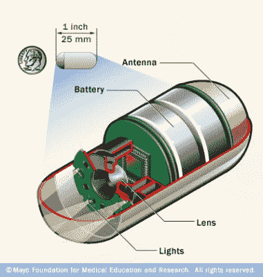

# 吞下医生——我们体内机器人的现在和未来

> 原文：<https://hackaday.com/2015/11/30/swallow-the-doctor-the-present-and-future-of-robots-inside-us/>

我最近读完了休豪伊的)*系列小说，这是一本自我出版的中篇小说集，详细描述了在不久的将来，一个后启示录世界的生活，在这个世界里，人类的所有残余都被塞进了地下的地窖。它有一个伟大的情节，一些有趣的转折和大量的细节，让黑客和科幻迷娱乐。*

 *一个这样的细节是纳米机器人，在该系列的后几卷中，它被用作延长生命的工具和恶毒的特定生物武器。像所有好的读物一样， *Silo* 主要是由角色驱动的，所以 Howey 没有花太多的篇幅来描述这些微观的机器——只是足够的细节来推动情节发展。但这让我想知道纳米机器人的潜力，以及我们今天在这个领域的地位，这个领域可以追溯到理查德·费曼在 1959 年的一次演讲和一篇名为[*的论文中提出的人类有一天会“吞下医生”*](https://en.wikipedia.org/wiki/There%27s_Plenty_of_Room_at_the_Bottom)

### 心脏和内脏机器人

那么在这中间的 56 年里，我们在可消化外科医生的目标上有什么进展吗？还是纳米机器人像悬浮滑板和飞行汽车一样，是一个基本上无法实现的承诺？像几乎所有事情一样，答案取决于你如何看待它。

如果我们将机器人定义为能够感知环境变化并以某种方式做出反应的自主或半自动设备，那么答案是响亮的“是”自 1958 年以来出现的植入式起搏器当然符合这一描述:它们监测心脏天然起搏器的电模式，并在必要时通过电极刺激心脏。自主？检查。感知环境？没错。影响变化？当然——尤其是当你考虑到一些起搏器内置除颤器，可以通过电击使心脏恢复节律时。对我来说听起来像个机器人。

The shrinking pacemaker. Source: [Medtronics](http://www.medtronic.co.uk/wcm/groups/mdtcom_sg/@mdt/@crdm/documents/documents/micra-patient-pdf.pdf).

至于规模，我承认植入式心脏起搏器离纳米尺度还很远，但我们正在接近纳米尺度。小型化已经使我们从一副纸牌大小、需要手术植入胸腔的设备发展到[美敦力的 Micra](http://www.medtronic.co.uk/your-health/bradycardia/device/our-pacemakers/micra/) ，这是一种药丸大小的起搏器，通过微创导管插入术直接插入心脏。它可能不是纳米级的，但趋势是正确的方向。

Capsule endoscopy camera. Source: [MayoClinic.org](http://www.mayoclinic.org/tests-procedures/capsule-endoscopy/basics/definition/prc-20012773)

有些人可能会认为自主意味着在环境中四处移动的能力，但这肯定不是植入式起搏器在最佳条件下做的事情。它的任务不需要机动性，所以它的设计是有意义的。对于一个目前可用的移动机器人的例子，我们必须稍微扩展一下定义，以包括在[胶囊内窥镜检查](http://www.mayoclinic.org/tests-procedures/capsule-endoscopy/basics/definition/prc-20012773)中使用的微型无线摄像机。这是一种替代传统内窥镜检查的方法；药丸形状的相机被吞下，并将整个消化道的视频发送到腰带上的接收器。相机是可移动的，但只能依靠消化肌肉的运动。它无法被操控——它处于无动力的单向行驶状态。顺便说一句，病人的指示是等待相机再次出现，然后冲洗掉；对我来说这听起来很浪费，任何有能力的黑客都会想要收回相机并把它拆开。想想可能性吧！

### 胶囊机器人工具包

缩小的心脏起搏器和微型可摄取电视演播室让人们得以一窥未来移动内置机器人的可能面貌。毕竟，不难想象一个微型设备通过外科手术而不是电动执行器在体内自动导航。加上摄像头，可以将图像发送给技术熟练的外科医生，或者使用机载图像分析，我们已经非常接近能够“吞下医生”

给太空舱大小的机器人增加推进力，可以提供完全自主操作所需的机动性；我的第一个想法是，在太空舱的外面有一个微型的坦克履带，可以抓住机器人所在的任何容器的壁。或者对于设计用于在血管内导航的内置机器人，通过将血液从胶囊的一端泵到另一端的喷射推进可能会有效。

Capsule robot toolkit. Source: [Vanderbilt Univ.](https://my.vanderbilt.edu/stormlab/2015/11/the-nsf-funded-design-environment-for-medical-capsule-robots-goes-open-source/)

为了加速胶囊大小的机器人的开发，范德比尔特大学的一个团队已经开发了一个用于胶囊机器人的开源平台。一个可以卷起来放入胶囊的柔性电路板有空间容纳多个模块，这些模块可以根据手头的工作进行混合和匹配。当前模块包括电源管理和通信子系统；一组传感器，包括加速度计、陀螺仪和磁力计；以及用于致动器和推进的有刷和无刷 DC 电机的驱动器。他们甚至提供了一个基于网络的框架，用于使用该模块设计系统并模拟其功能。适合学生和业余爱好者的精简版系统也将上市。

尽管有这些进步，在 *Silo* 系列中描述的纳米机器人的承诺和威胁仍然是科幻小说的素材。我们倾向于将我们的小工具小型化，所以我打赌我们会继续缩小这些胶囊机器人，直到我们开始推进纳米尺度。在那之前，胶囊机器人仍然很酷，这种规模的机器人有很大的潜力。*