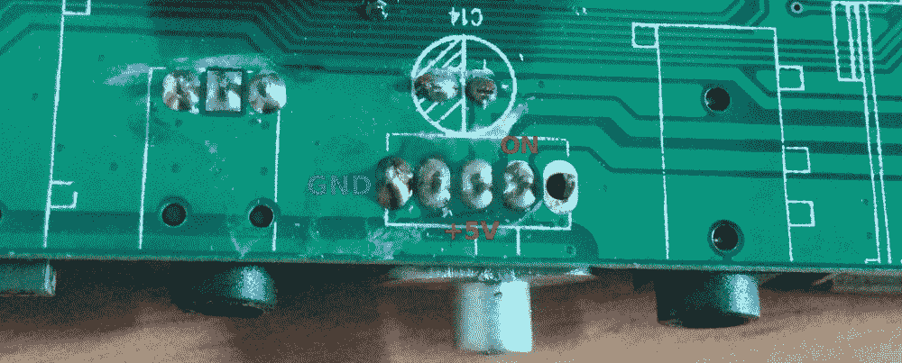
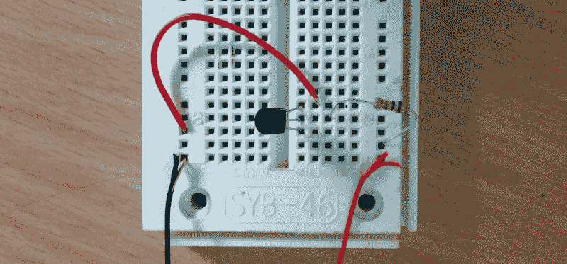
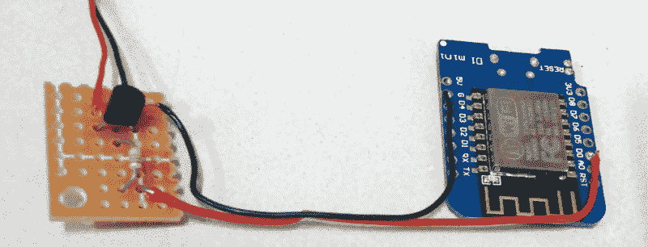

# 开关:从继电器到双极结型晶体管

> 原文：<https://hackaday.com/2017/09/07/switching-from-relays-to-bipolar-junction-transistors/>

你家里有几个遥控器？难道你不希望所有这些东西以某种方式更好地集成，或者你可以给一个随机设备添加遥控功能吗？这是一个项目的常见起点，也是初学者的良好学习体验。

我们看到应用的一个常见解决方案是[将一个继电器并联到我们想要按下的所有按钮](http://hackaday.com/2017/06/04/esp8266-mqtt-remote-gate-entry/)。当继电器被触发时，例如由您选择的微控制器触发，它将被视为按钮按下。虽然继电器确实有效，但对于我们在这些情况下处理的极低电流负载来说，它并不是真正的理想解决方案。

事实证明，有几个简单的方法可以解决这个问题。在本文中，我们将重点关注使用普通双极结型晶体管代替继电器来取代物理开关。简而言之，如何在现有的电子设备中添加晶体管，以新的方式控制它们。

## 重放

在某些情况下，继电器仍然是一个很好的解决方案。当你处理高功率，或当你需要一个完全等同于闭合开关的电器时，继电器是一个合理的选择。想知道为什么你的 USB 数字存储示波器会发出咔嗒声吗？这些是在示波器的不同模式之间切换的继电器——这保持了信号的完整性。

另一方面，继电器通常体积大、价格贵、速度慢、需要很大的功率、在电路中增加很大的线圈(这会引入很多噪声)，并且具有容易发生故障的机械部件。固态继电器确实存在，并解决了其中一些问题，但并不特别便宜。

当电流通过线圈时，继电器闭合，让电流通过。实际上，通常会在电路中添加一个晶体管，以提供足够的功率来控制继电器，而二极管则保护晶体管免受切断继电器电源所导致的反向电压尖峰的影响(存储在线圈磁场中的能量必须转移到某个地方！).如果继电器与某个外部设备(如遥控器)中的开关并联，闭合继电器就像闭合开关一样。

## 双极结型晶体管(BJT)

双极晶体管是一种非常常见的晶体管。它们的功能是放大电流。如果在继续之前快速概述一下它们是如何工作的会有所帮助，[这个简短的指南可能会对](http://www.technologystudent.com/elec1/transis1.htm)有所帮助。

基极和发射极之间的小电流控制集电极和发射极之间的大得多的电流。如果集电极和发射极与一个开路开关并联，则该开关的状态可以很容易地通过微控制器输出引脚来控制。

晶体管需要电流控制，而微控制器 GPIOs 试图输出给定的电压。你需要一个电压电流转换器，也就是电阻。(参见[欧姆定律](https://en.wikipedia.org/wiki/Ohms_law)。)具体值会有所不同，但 10kω是更换按钮的良好起点。一个简单的测试电路(使用开关代替微控制器来提供所需的电流)可能看起来像这样:

如果你用万用表测量晶体管集电极到发射极的电阻，当基极和发射极之间有电流时，电阻会从开路下降到接近零。实际上，当 BJT“接通”时，集电极和发射极之间有一个电压降(大约 0.3 伏，但这取决于晶体管)，但就我们的目的而言，认为它是从无穷大电阻到零就足够了。

一个合理的选择 BJT 是古老的 2N2222。它在世界各地都有，非常便宜，速度相当快，可以消耗高达 500 毫瓦的功率，这在这种情况下绰绰有余。大多数 NPN 型 BJT 将工作良好。

## 特定用例

考虑以下令人担忧的粉红色电池供电的外部扬声器/收音机。它曾经有一个红外遥控器，现在丢失了。这不是一个高质量的设备，但如果有一种方便的方法来打开它，它可能还有点用:

我们的第一步是将其拆开，并确定需要连接“开”开关的哪些引脚来激活设备:

当器件上电且开关设置为“开”时，我们在两个引脚上看到相对于地的 5 V 电压。当器件断电时，其中只有一个引脚处于 5 V，我们首先将导线焊接到这些引脚，给器件供电，然后将导线交叉。设备打开，默认情况下切换到辅助模式。多方便啊！

现在，我们已经隔离了需要连接的开关引脚，我们可以在没有基于 BJT 的开关控制器的情况下试验快速电路并进行测试。

当电阻器的右引线连接到电源时，用万用表测量，集电极/发射极之间的电阻下降到零。如果它下降，但不到零，你可能有你的晶体管在倒退。

既然这样做了，就应该将其焊接到 perfboard 并连接到微控制器，在本例中是 ESP8266 迷你 D1 板。我们不是将晶体管基极连接到电源，而是将其连接到一个迷你 D1 输出引脚(我们选择 D0)。

在这种情况下，当固件从 Android 智能手机应用程序接收到某个 UDP 网络数据包时，它会使 ESP8266 将引脚 D0 拉高。如果我们想控制扬声器的所有功能，我们必须对每个开关重复这个过程。无可否认，这不是一个像逆向工程 IR 协议那样优雅的解决方案，但它是通用的，足够快，不需要大量的经验就可以成为一个下午的项目，而且它工作得相当好。

祝贺您——您现在拥有了最基本的物联网设备:一台连接互联网的交换机。在你疯狂之前，你可能想考虑根据你连接的东西增加一些安全措施。

还要注意这种方法有一些缺点。不是所有的开关都是通过简单的电接触来工作的:一些相对普通的开关依靠电容的变化。此外，在高噪声环境中，BJT 也可能意外触发，不过可以通过将基极电阻尽可能靠近晶体管基极来降低这种情况，必要时可以在 BJT 和附近的走线周围添加一个小型接地金属外壳(法拉第笼)。最后，当 BJT 由于过热而出现故障时，通常会造成短路。换句话说，要注意你的控制系统失灵的后果。