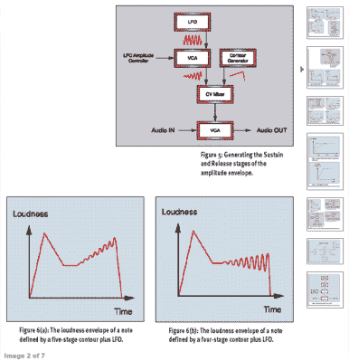

# Synth 秘密曝光！

> 原文：<https://hackaday.com/2015/11/08/synth-secrets-exposed/>

如果你对合成器感兴趣，但还没有深入到你想要的程度，你绝对需要看看 Sound on Sound 杂志的旧[“Synth Secrets”专栏。横跨 63(！)的文章中，作者[Gordon Reid]采用了一种实用的方法来学习合成器:尝试一次复制一个真实乐器的声音，并在一个特定的合成器上构建具体的示例。](http://www.soundonsound.com/sos/allsynthsecrets.htm)

 【戈登】合成的方法很简单，但这正是它有用的地方。前两篇文章向您介绍了许多合成器的常见功能，之后，大多数文章都遵循一个简单的模式:聆听乐器特有的声音，查看声音产生背后的物理原理，然后找出如何根据需要(或可能)复制尽可能多的声音来捕捉乐器的精髓。有时当乐器的声音特别复杂时，[就像这个关于小提琴的系列文章](http://www.soundonsound.com/sos/apr03/articles/synthsecrets48.asp)，他会把这个简单的公式分解成多篇文章。

现在你可能会抱怨你没有 Korg MS-20 或 ARP Odyssey 或任何特定文章中使用的特定旧 synth。但是“秘密”实际上是如此的基本，而且基本上是在这样简单的模拟合成器上完成的，即使你不能发出和[戈登]完全一样的声音，你也会明白他是如何达到他的目标的，你可能会非常接近，并且你会一路上调整你的耳朵。

此外，通过尝试，您将对合成器的特性和功能有更多的了解。即使您只对空间噪音感兴趣，而对复制真实乐器不感兴趣，通过“Synth Secrets”示例也是了解您机架中的新 Synth 的好方法。

但是如果你对太空噪音感兴趣，也可以看看我们自己的 T2 逻辑噪音系列。你不会学到任何关于真实仪器的东西，但是你会学到很多关于 4000 系列逻辑芯片及其滥用的东西。

感谢[Greg Kennedy]提醒我们这颗宝石，并在我们的帽子里重新安装了“合成秘密”蜜蜂！