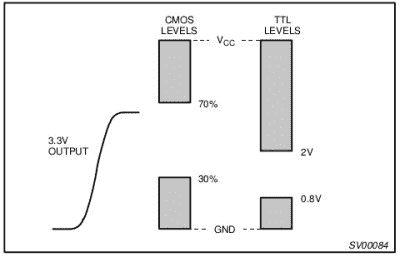
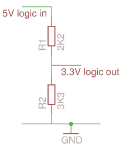
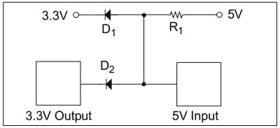
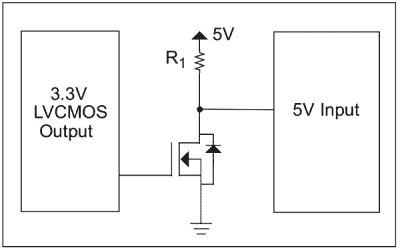
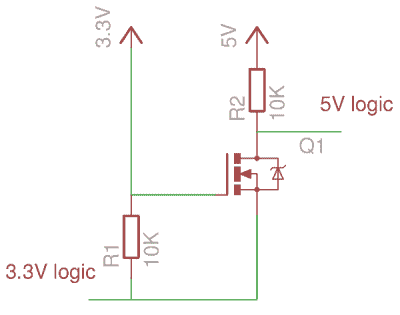

# 更上一层楼:让 3.3V 用 5V 说话

> 原文：<https://hackaday.com/2016/12/05/taking-it-to-another-level-making-3-3v-and-5v-logic-communicate-with-level-shifters/>

如果你对数字电子技术的了解比你愿意提及的要早很多年，那么你很可能是用 5V TTL 逻辑做到的。高于 2V 但通常非常接近 5V 是逻辑 1，低于 0.8V 是逻辑 0。如果你是电子教科书的热心读者，你可能已经读过 4000 系列 CMOS 门所能容忍的不同电压水平，但即使有了它们，你也可能仍然使用熟悉的 5 伏电压。

这种作为爱好者除了 5V 逻辑什么都没遇到的快乐状态没有坚持下来。近几十年来，对更高速度和更低功耗的需求为我们带来了一系列低压器件，现在我们还会经常遇到 3.3V 甚至更低电压的器件。当这些不同的系列需要共存时，例如当与当前的微控制器板接口时，必须小心避免损坏您的芯片。需要一些方法来管理电压之间的转换，因此我们将看看电平转换器，这是我们在与这些不同的电压逻辑系列接口时使用的电路。

### 你需要电平转换器吗？

以这种方式开始一篇关于电平转换的论文似乎有些奇怪，但设计人员在考虑让一个 3.3V 器件与一个 5V 器件对话时，第一个问题应该是:我需要电平转换器吗？

如果 3.3V 部分是输出，5V 部分是输入，则较低电压部分几乎不会因过压而损坏较高电压部分。您也不太可能遇到逻辑输入需要如此大的电流以至于损坏您的输出(如果遇到，请使用缓冲器！).如果幸运的话，两个器件的逻辑电压范围甚至可能一致。例如，3.3V TTL 逻辑与 5V TTL 逻辑共享逻辑 0 和逻辑 1 转换的 0.8V 和 2V 阈值，因此 3.3V TTL 输出可以驱动 5V TTL 输入，而不需要任何额外的硬件。

在另一个方向，从 5V 输出驱动 3.3V 输入，您可能会认为需要电平转换电路，在许多情况下，您是对的。但在使用该转换器之前，有必要先了解一下 3.3V 输入的详细规格。许多器件设计为 5V 容差，您可能会幸运地发现您的电路可以使用 5V 容差，从而避免额外的电路。例如[74 LVC 系列](http://www.nxp.com/pages/lvc:GRP_10408)包含许多 74 系列 IC 的一系列 5V 容差 3.3V 版本。

### CMOS 和 TTL:一个电平转换的警示故事

Comparison of TTL and CMOS logic thresholds with comparison to 3.3V output. [NXP application note 240](http://www.nxp.com/documents/application_note/AN240.pdf) (PDF).

当从 3.3V 输出直接驱动通常使用的 5V 逻辑时，有一个值得注意的警示故事，一个电子故障的个人自白。CMOS 逻辑将其逻辑阈值定义为电源电压的百分比，在 5V 电源下，逻辑 1 阈值比 3.3V 逻辑 1 高 70%。一些 CMOS ICs，如我在 Raspberry Pi 项目中使用的 74HC4053 模拟开关，并不完全符合这一标准，并且将采用 3.3V TTL 输出，因此我被一种虚假的安全感所迷惑，并使用另一个 74HC 器件连接到我的新设计的 Raspberry Pi。正如你所料，它没有工作，当然，我浪费时间寻找其他地方，但我的部分有缺陷的选择。如果这个故事有什么寓意的话，那就是一定要仔细阅读数据手册，并使用 TTL 兼容器件，如本例中的 74HCT，如果有的话。

如果您的 3.3V 器件输入不支持 5V，并且您的 5V 输入缺乏 3.3V 兼容阈值，那么遗憾的是，如果没有转换电路，您将无法跨电压电平连接它们。有许多选择可供您选择，包括一整套专用电平移位器器件，如 TI 的这些器件，但除了个人偏好之外，其中一些将由您的应用决定。会是升压、降压，还是需要双向电平移位器？如果您决定在设计中不使用专用器件或 5V 容差栅极，这里有一些备选方案。

### 降压电平转换器

A simple resistive downshifter.

最简单的降压电路是电阻分压器。将你的 5V 输出驱动到一串电阻中，从那里引出你的 3.3V 逻辑输入。由一个 2.2k 和一个 3.3k 电阻组成的电阻链应该从施加的 5V 输入产生 3V 输出。它不保留 3.3V 输出的扇出特性，您需要注意连接到它的任何逻辑中可能存在的任何电容，以及它们与电阻一起对快速上升时间的影响，但它应该足以满足业余爱好者面临的最简单的电平下调任务。该电路有多种变体，使用二极管而不是电阻来实现所需的压降。

如果分频器不适合您的应用，并且您仍然避开专用移位器，请进一步查看双向移位器。

### 升压电平转换器

A diode logic level step-up circuit. From [Microchip app note DS41285A](http://www.datasheetarchive.com/dl/2679753d00c6f1d41ed2648886ce4ce455a846/P/DS41285A) (PDF).

为了从 3.3V 逻辑升压至 5V 逻辑，并假设您不安全地处于上述 TTL 阈值内，因此您可以不使用移位器，您将需要比上一节中的电阻分压器稍微复杂一些的器件。最简单的电路使用一对二极管，仔细偏置并选择串联电阻，如右图所示。该应用笔记建议，该电阻应显著小于 5V 栅极的输入阻抗，以避免成为电阻分压器的一部分，因为该阻抗会影响输出电压。

An inverting MOSFET logic level step-up circuit. Yet again, from Microchip app note DS41285A.

一个更明显的电路使用 MOSFET 或双极晶体管作为开关，用 3.3V 逻辑驱动栅极或基极，从漏极或集电极获得 5V 逻辑输出。这非常类似于在同一应用中使用集电极开路输出的栅极。这是一个简单可靠的电路，但必须记住，它会反转 3.3V 逻辑电平。

### 双向电平转换器

The bidirectional MOSFET level shifter.

前两节中的电路都只适用于单向逻辑线路，而不适用于双向总线。像以前一样，有许多半导体制造商提供的现成总线电平转换器可供选择，但如果这些不适合您的设计，可以用一个 MOSFET 和几个电阻来代替。还值得指出的是，它不一定要用在双向总线上，它可以作为一个通用电平转换器，成本相当于一个 2N7000 或类似器件，实际上这是个人最喜欢的应用。如果自己制作不吸引人，你可以从几家电子供应商那里买到分线板上的电路。欲了解有关其操作的更多信息，请阅读飞利浦应用笔记 AN97055 (PDF)，其中研究了其在 I ² C 总线上的使用。

当你首先必须确保不同的逻辑电平被安全地连接时，这可能是一件令人担忧的事情。我的 5V Arduino 会伤害这个 3.3V 传感器吗？我们希望读完这篇文章后，你会有更多的信心，我们已经为你提供了足够的知识来理解这个话题。我们没有涵盖所有可能的技术，但如果您阅读一些附带的应用笔记，然后在网上搜索实际应用，它们应该可以填补任何空白。