# 用加速度计驯服机械臂跳跃

> 原文：<https://hackaday.com/2016/06/24/taming-robot-arm-jump-with-accelerometers/>

去年秋天，我在感恩节打折的时候从机器人极客那里抢了一个机器人手臂。手臂使用伺服系统来旋转底座，移动关节和手爪。这些工作足够好，但我发现手臂的一个方面令人沮丧。当您接通电源时，软件命令伺服系统移动到原位。这种运动足够剧烈，可以导致整个手臂跳动。

发生这种跳跃是因为没有位置反馈给 Arduino 控制器，使其无法知道手臂伺服系统的位置，并将其缓慢移动到原位。我思考如何使用传感器来增加这种反馈，并施加限制，即它们不能太大或需要更换现有部件。我决定尝试在每个手臂部分增加加速度计。

加速度计在行星上受到重力的影响，提供了一个绝对的参考，因为它们总是报告向下的方向。有了加速度计，我可以计算出手臂部分相对于重力加速度方向的角度。

在讨论加速度计之前，先看一下手臂的图片。加速计将被添加到控制伺服系统之间的臂的每个部分。

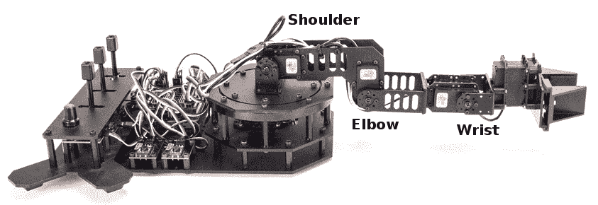

## 加速计

重力把一切都拉向地球的中心。这是一个产生加速度的力，就像当车辆开始移动或停止时你感觉到的一样。重力产生一个 1 g 的加速度，即 9.8 米/秒 ² 或 32.15 英尺/秒 ² 。加速度计测量这个力。

集成电路加速度计是黑客容易使用的廉价小型设备。它们便宜的一个原因是智能手机对它们的高需求。这些小型设备是基于使用一种称为 MEMS(微机电系统)的技术在集成电路内蚀刻机械结构。

MEMS 加速度计的一种设计基本上是可变电容器。一个板是固定的，另一个安装在一段距离以外的弹簧悬架上。当设备被加速时，悬挂的板靠近或远离固定的板，改变电容。另一种使用压阻材料来测量加速度对手臂造成的压力。

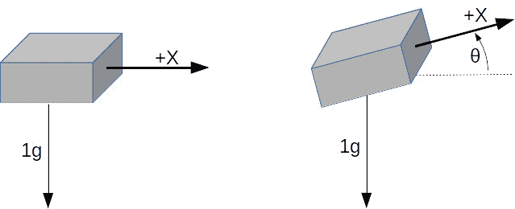单轴加速度计只能测量一个方向的加速度。如果定位成上下方向，它将测量重力，但不会检测水平加速度。当设备在水平和垂直之间倾斜时，重力仅部分影响测量。这提供了测量设备与重力方向的角度的能力。对于倾斜角，沿倾斜轴感觉到的加速度可通过下式计算:


已知加速度计的输出，我们可以通过求输出的反正弦(反正弦)来确定角度:

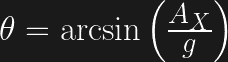

如果将单轴设备旋转 360 °,输出是正弦波。从器件输出零开始，并认为是 0。当它旋转时，当角度为 90°时输出为 1，在 180°时回到 0。继续旋转，输出在 270 度或-90 度时变为-1，在 360 度或 0 度时回到 0。

请注意图表中-60 到 60 之间的输出几乎是线性的。这是测量倾斜度的最佳方向。在曲线的其他部分，倾斜度的增加并不准确。另请注意，45 和 135 (90 + 45)生成了相同的输出，从而产生了歧义。使用单个轴，您无法确定测量的是哪个角度。

[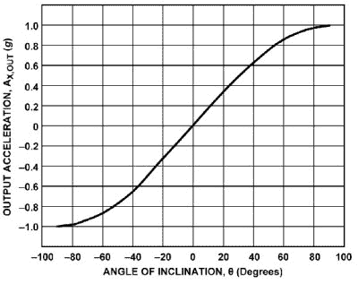](https://hackaday.com/2016/06/24/taming-robot-arm-jump-with-accelerometers/angle-of-inclination-2/)[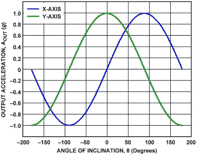](https://hackaday.com/2016/06/24/taming-robot-arm-jump-with-accelerometers/dual-axis-angle-of-inclination/)

将两个加速度计彼此成直角放置，就产生了一个 2 轴装置，解决了模糊问题。当器件旋转 360°时，输出为 90°反相，与正弦和余弦的关系相同。通过组合测量值，360°范围内的每个角度都有一个唯一的解决方案。每个角度的重力加速度由下式给出:

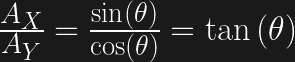

这导致通过下式计算角度:

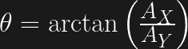

实际上，还需要一个步骤来确定角度的符号。这需要检查 X 和 Y 轴值的符号。这里没有必要深入讨论这个问题，因为标准编程函数会自动处理这个问题。

四轴飞行器的定向需要一个三轴加速度计。对三个球面角度的计算结合了所有三个输入的结果。你需要仔细研究这一点，因为当四轴飞行器翻转时，标准三角方程会导致异常。

## 首次通过解决方案

加速度计容易获得并且相对便宜。你可以在分线板上找到它们，分线板带有电压调节器和所有通常供应商提供的支持电路。它们可用于 1 至 3 轴，各种 g 力，并提供模拟或数字输出。ADI 公司的每个被测轴都需要一个模拟输入。数字输出使用 I ² C 或 SPI 总线进行通信。我决定使用模拟器件，因为数字单元通常只允许两个地址，而 arm 需要三个器件，每个器件一个。

机械臂使用 Arduino 板，因此至少有 6 个模拟输入。最初的电路板是机器人 Geekduino，他们的 Arduino Duemilanove 版本，有 8 个模拟输入。不幸的是，当使用 arm 时，我弄坏了 USB 连接器，所以切换到只有 6 个输入的 Uno 等效设备。

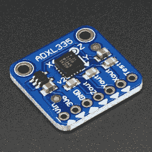我选择的加速度计是 Adafruit 公司的 3 轴、3 g 加速度计分线产品 ADXL335。每个轴都有一个模拟输出。因为我测量的是三个接头，这意味着三块电路板总共有 9 个模拟输出。

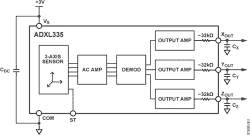

然而，由于手臂的几何形状，这三个关节我只需要 5 个输入。肩关节只能从 0°到 180°运动。这可以通过安装单轴加速度计来实现，0°时读取 1 g 加速度，180°时读取-1g 加速度。这为必要的角度提供了独特的输出。肘关节和腕关节都需要两个输入。不需要第三个输入，因为它们的运动被限制在臂的垂直平面内移动。

## 参照系

下一个问题是*参照系*。这是机器人工作中的标准问题。在一个项目的早期，一个全球参考框架被决定。这将设置机器人将遵循的坐标系的原点和三个轴的方向，通常指定为 X、Y 和 Z。对于手臂，X 是向前的，Y 是向左的，Z 是向上的。零点是肩部的底部。这也为手臂肢体的零度旋转定义了一个全局框架，也是朝向前方。【T2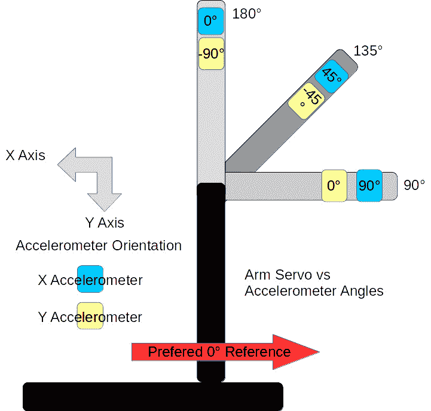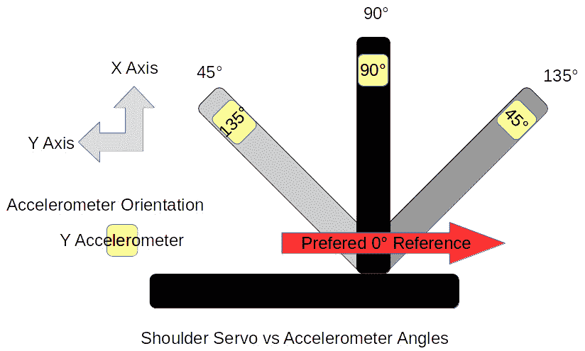

传感器和控制器都有自己的参照系。这些设备和全局框架之间的任何差异都需要在软件中解决。肩部伺服的参考框架是手臂后部的 0°和前部的 180°，顺时针旋转。这是全局框架的反转。肘部伺服与逆时针旋转相反，当肩膀垂直时，向上垂直旋转 180 度，向外垂直旋转 90 度。它与全球参考系相差 90 度。

传感器也有自己的参照系。测量肩部方向的 Y 轴加速度计逆时针工作。测量肘部的加速度计的两个轴都在顺时针方向上工作。这可能看起来很奇怪，但这是因为传感器的不同安装方向。

## 软件

一旦参考框架被整理出来，实际的代码就很简单了。从模拟输入中读取单个轴，并通过下式计算其角度:

```

const int shouldery = shoulderAnalogY.read();
float shoulder_angle = degrees(asin(shouldery_value / 100.0));

```

`read()`方法缩放原始模拟输入值，因此 1g 表示为 100。`asin()`的输入除以 100.0，转换成实际的 *g* 值。这对于肩角来说足够了。

肘部和腕部角度使用两个轴的值，计算如下:

```

const int elbowx = elbowAnalogX.read();
const int elbowy = elbowAnalogY.read();
float elbow_angle = degrees(atan2(-elbowy, elbowx));

```

`atan2()`功能是反正切计算的特殊版本。它检查输入值的符号以确定角度的象限，从而在其结果上设置适当的符号。需要`elbowy`上的负号来设置适当的象限。还有参照系的问题。

## 包裹

增加加速度计很好地解决了启动时摇晃的问题。加速度计是否能用于其他目的还有待观察。

角度测量的精度不好。在某种程度上，这是由于使用+/- 3 g 范围的设备来测量 1/3 的设备范围，1 g。设备输出 0 至 3.3 伏，而 Arduino 采样 5 伏，再次失去精度。这可以通过使用基于 3.3 伏的 Arduino 来改善。我手头有一些会费，所以可以试试。Uno 还提供调节模拟输入的参考电压，因此将其设置为 3.3 伏可能会有所帮助。

模拟值需要小心校准。每个加速度计输出稍微不同的值。校准需要测量每个轴的 1 g 和-1 g 输出，记录这些值，并利用它们将电压输入换算成加速度。考虑到模拟输入的其他问题，这种校准并不准确。

另一个问题是在手臂部分安装加速度计。板子和手臂部分的对齐并不完美。当伺服定位在 90°时，加速度计不一定与地球中心成 90°。当然，伺服系统也不是那么精确。它们并不总是到达同一个位置，尤其是从不同方向接近时。这个项目的另一个目标是使用加速度计信息来更精确地定位伺服系统。

我想我得多考虑一下这个项目，包括决定我到底想用手臂完成什么。但是，仅仅说你有一个机器人手臂就是一个了不起的黑客信誉。