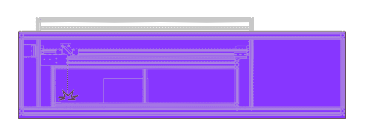
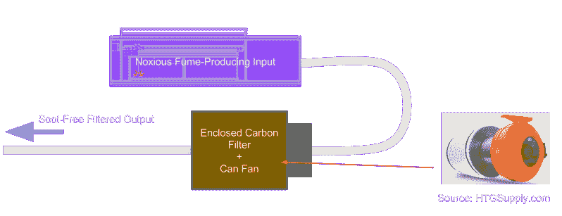
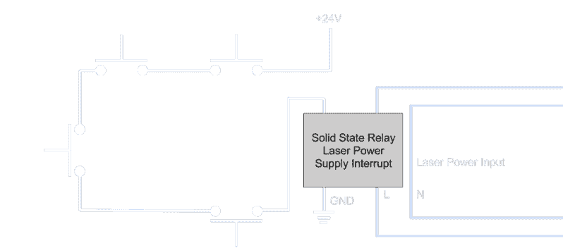

# 驯服野兽:设计安全自制激光切割机的专业技巧

> 原文：<https://hackaday.com/2016/06/29/taming-the-beast-pro-tips-for-designing-a-safe-homebrew-laser-cutter/>

自制激光切割机是很棒的设备，但是烧焦你的朋友，烧掉房子，或者嗅出邻居的气味不是任何人的好主意。让我们面对现实吧。一个 60 瓦的激光可以切割塑料，这比最古怪的 3D 打印机带来的麻烦要多得多(当然，除非我们的 3D 打印意大利面条活了过来，并决定恐吓邻居)。当然，切割时聚焦的激光束通常指向正确的方向，但即使是反射闪亮材料的未聚焦光束也可能引发火灾。更重要的是，由于大多数材料燃烧，而不是简单地熔化，大量可怕的烟雾从每个切口喷出。

尽管有危险，建造一座核电站的诱惑是不可抗拒的。随着[电子管、电源和水冷器](http://www.lightobject.com/default.aspx)现在大量来自海外转售商，这些零件只需用 PayPal 一推就能送到我们家门口。我们也看到了一系列令人兴奋的构建聚集在餐桌上。我们的桌子也可能被激光零件弄得千疮百孔！在梳理了无数激光制造日志之后，我还没有遇到*这个权威指南*，它告诉我们如何在制造我们自己的激光切割机的同时，采取适当的第一步来保证我们自己的安全。也许这些知识对社区来说是隐含的，分散在论坛上；或者可能是每个勇敢的设计师从一次又一次的千钧一发中学会的。这两种选择似乎对激光新手都不公平，所以我决定在这里制定法律。

## 安全激光切割机设计大全

首先，一个简短的免责声明:即使你完全按照这个指南去做，我们也不能保证你不会遇到麻烦。这些安全提示让你更安全、更明智，但并非无懈可击。蚱蜢同伴，请自担风险。

### 升起护盾:保护你最后的眼球

当我们带着完成的激光切割机从车库出来时，我们希望有和开始时一样多的工作眼球。从我个人列出的业余工程潜规则清单中，得出了第一条全能规则:*在业余黑客活动中，你不能伤害自己或你的朋友*

忠于这本书意味着采取正确的措施，不要永久伤害工作场所附近的任何人。对我来说，这意味着在封闭的车库里工作，并多带几副安全眼镜。瞬间伤害眼睛可不是闹着玩的，所以我们要确保选择正确的类型。对于这个项目，论坛上普遍的共识是一副 OD 6+等级的安全眼镜。

透镜的 OD 等级指的是当光从透镜的另一端射出时，有多少光被透射。每一个数字的增加都代表透射光数量级的下降，因此 OD 6+等级在特定波长下透射的*小于* 0.0001%。不过，请记住，我们正在建造一台激光*切割机*。像其他塑料一样，*聚焦*光束穿过这些玻璃没有问题。这些透镜将使我们免受反射和从一面镜子到另一面镜子的未校准透镜的影响，但它们也不能不受聚焦光束的影响。

### 杂散光束消失:完整的外壳

一旦我们的激光切割机完全组装好，我们仍然需要在它准备好开始切割之前进行一些校准。要到达那里，我们需要将镜子对齐。看——这是我们第一次有机会把光束从预期的目标上弹开，在墙上烤出一个漂亮的洞。为了避免碰运气，激光切割机*必须*在完全封闭的环境中操作。

你说全封闭的？什么样的外壳能承受这种热量？

当然，我们*可以*把我们神奇的门架和光学系统藏在金属片后面，以掩盖我们的宏伟工作；但是，从我们这些从小看着 3D 打印机喷射而变得眼花缭乱的人那里，我们知道这一点也不好玩。幸运的是，我们很幸运！我们有一些半透明的选择，而不是把我们的作品藏在金属外壳后面。深入挖掘细节让我想到了我的第二条*业余工程全能法则*，这条法则来自[Mike 的智慧](https://www.youtube.com/user/mikeselectricstuff) : *了解你的敌人。*

在这种情况下，我们最大的敌人是来自海外的 60 瓦、10，600 纳米二氧化碳激光管。稍微读了一下，原来 10600 纳米恰好对一些对可见光半透明的材料不透明；其中包括:即将成为我们最好朋友的丙烯酸树脂。这个小事实是一个黄金。这意味着丙烯酸外壳为我们提供了光束阻挡的所有好处，同时在激光切割时为我们提供了一个可见的窗口。

一个简短的旁白:丙烯酸树脂在聚焦的二氧化碳光束下切割得如此之好，是因为它吸收而不是传输进入其中的光。这也是为什么丙烯酸树脂对于未聚焦的光束或微小的反射是如此有效的光束阻挡器。当然，我们并不是不受丙烯酸外壳的影响，但是在光束离开外壳之前，我们肯定会嗅到麻烦。

最后一点:虽然丙烯酸树脂作为光束阻挡器效果很好，但在切割时盯着工件看仍然不是一个好主意。接受切割的部分往往会发出明亮的荧光，这肯定是在可见光谱范围内。虽然没有激光穿过丙烯酸窗户，但明亮的可见光不会有任何问题穿过并使我们的眼睛疼痛。

### 吸不到的烟

大约一年前，我遇到一个家伙，他用最新的电子设备改装了一台旧的中国激光切割机，花了大约 1000 美元给自己做了一个很好的工作系统。我想，这是一条不错的路。但是作为一个渴望从零开始建立自己的公司的人，我充满了疑问。我脑子里最大的话题:排烟…更好的说法是:如何不死于呼吸你正在切割的东西。

“啊，”他说，狡猾地瞪了我一眼。"你最近研究过水培法吗？"我以为是水培。水培爱好者究竟想和烟雾提取有什么关系呢？他凑过来。

“事实证明，销售水培设备的人很快意识到，他们的狂热爱好者同伴不希望邻居闻到他们车库里发芽的植物，所以他们开始销售廉价的碳过滤器和通风风扇。”我想，谁知道呢，但事实证明:[他是对的](http://www.htgsupply.com/categories/ventilation-odor-control/filters)。几个月后，我自己有了一个碳过滤器和两个罐风扇，在将过滤后的废气排出窗外之前，将烟灰排出激光床。奇怪的是，它附带了一个免费的打火机。去想想。然而，我可以称我的排烟问题为:一个解决了的问题。

### 有故障，但安全:增加安全故障模式

此时，我们已经有了一个漂亮的外壳，一副闪亮的新安全眼镜，甚至还有一个漂亮的碳过滤器；所以我们现在可能觉得很安全。不过，在我们变得过于舒适之前，先考虑一下这个问题:如果我们在切割时移除面板或打开盖子，我们的激光切割机有多安全？希望你和我想的一样:一点都不安全！为了解决这个问题，我们需要某种形式的故障安全或内置紧急停止，以切断我们的外壳保护我们免受的任何东西的电源。在这种情况下，在打开封闭切割区域的盖子或面板时，激光需要关闭。

实现这个概念实际上非常简单。对于任何可能脱落的面板，我安装了一个常开的瞬时开关。面板安装好后，按下开关，将其关闭。通过将这些开关串联起来，并将它们连接到一个中断激光电源的固态继电器上，当面板被移除时，意味着激光也会自动关闭。

很漂亮。但更重要的是，它很简单。与大多数安全系统一样，越简单，越可靠。

## 未来阅读:

像我们中的许多人一样，我发现走出自己的舒适区去创造一些东西的诱惑是不可抗拒的。然而，所有的项目都有一个学习曲线，对于那些可能伤害你或你朋友的项目，我敦促你自学。从你所读和所做的事情中成为专家，并享受犯错误的学习反馈。

但是不要急。制造激光切割机可能是一项壮举，但成为专家的旅程意味着我们在学习新东西的过程中每一刻都是值得的。谁知道呢？也许几年后，我们会成为当地黑客空间的激光专家，乐于用手指梳理花白的头发，同时为年轻黑客的愚蠢计划提供安全建议。

我已经触及了安全激光切割机构建的一些实用要点，但不要让这篇文档成为你的停止点。出于好奇，这里有几个地方可以找到更多的专业建议:

*   [山姆激光常见问题解答](http://www.repairfaq.org/sam/laserco2.htm)
*   [SLAC 3、4 类激光操作要求](http://www-group.slac.stanford.edu/esh/eshmanual/references/laserReqClass3Band4.pdf) [PDF]