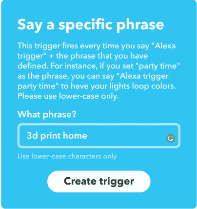
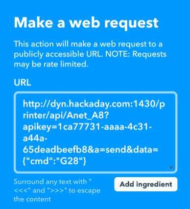

# 教 Alexa 3D 打印

> 原文：<https://hackaday.com/2018/01/05/teaching-alexa-to-3d-print/>

有时候，像 Alexa 或 Google Home 这样的小工具是寻找问题的解决方案。然后你一直在寻找的问题就迎面而来。我以前承认过我的示波器有问题。我也有微控制器开发板的习惯。现在我似乎有太多的 3D 打印机。我最近完成了我最新的一个，一个我在黑色星期五捡到的 [Anet A8](https://hackaday.com/2017/12/08/how-cheap-can-a-3d-printer-get-the-anet-a8/) 。在校准它的时候，我发现自己在摆弄一把螺丝刀，一把钳子，并试图同时操作它。我意识到我必须想出一个更好的方法。

[](https://hackaday.com/wp-content/uploads/2017/12/amazonecho.jpg) 我不知道这算不算上瘾，但我也在每个房间都有一台 Alexa(虽然我称它为“电脑”，因为我是《星际迷航》的粉丝)，几乎到处都有一台 Google Home 设备。为什么我不能让这些助手中的一个帮我操作我的打印机？毕竟，除了给爸爸讲笑话，助理还有什么用？

你可能会认为给 3D 打印机添加语音控制有点困难。有了正确的工具，这其实很容易。幸运的是，这些工具并没有什么特别的…如果你想要一个像我一样的设置，Alexa 控制你的 3D 打印机，请继续阅读。

## 这个计划

显然，Alexa 将成为我的语音控制输入，因此这一部分得到了照顾。你也可以使用谷歌主页。矛盾的是，几年前最困难的部分现在可能是最容易的部分。

谜题的第二部分是[重复服务器](https://www.repetier-server.com/)。你或许可以使用 Octoprint(汤姆·纳尔迪刚刚给[写了一本关于设置 Octoprint](https://hackaday.com/2018/01/03/upgrading-a-3d-printer-with-octoprint/) 的很棒的指南)，但是我用的是 Reptier。如果你还没有使用过，这些程序会创建一个网页，让你从浏览器控制你的打印机。他们还提供了一个基于 Web 的 API。这意味着您只需形成一个有效的 web 请求，就可以远程向您的打印机发送命令。

[](https://hackaday.com/wp-content/uploads/2017/12/ifttt.png) 你也许能猜出这个等式的第三部分:If This Then than or[If TTT](https://ifttt.com/)。你可能以前用过这个。它有点像瑞士军刀，用于将 web 事件路由到不同的 web 服务。

有了这三样东西——一个语音控制助手、一个控制打印机的 web 服务器和一个 IFTTT 帐户，您就差不多成功了。

 [https://www.youtube.com/embed/RTL7epP8cwE?version=3&rel=1&showsearch=0&showinfo=1&iv_load_policy=1&fs=1&hl=en-US&autohide=2&wmode=transparent](https://www.youtube.com/embed/RTL7epP8cwE?version=3&rel=1&showsearch=0&showinfo=1&iv_load_policy=1&fs=1&hl=en-US&autohide=2&wmode=transparent)


## 细节

很容易让 IFTTT 从你的助手那里得到一个触发短语并做些什么。对于 Alexa，你必须说“Alexa，触发咕咕咕”，这将发送“咕咕咕”到 IFTTT。问题是，送什么呢？

要让“Alexa，触发 3D 打印机主页”这样的东西工作，你需要完成三件事。首先，您的 Reptier 服务器需要可以从公共互联网访问。是的，黑客可能会接管你的打印机，但我愿意冒这个险。由于 IFTTT 会从网络外部向您的服务器发送 web 请求，因此您必须这样做才能使用 IFTTT。

其次，您需要一个来自 Repetier 服务器副本的 API 密钥和打印机的“slug”名称。你可能认为这可以让你从热衷于打印的黑客那里得到一些解脱，但事实并非如此。找到密钥和打印机名称是非常容易的。“slug”是每台打印机的内部简称，用户不一定会看到。

第三件事是，你需要你想发送给打印机的命令。比如归位是 G28。你可以发送任何你喜欢的 g 代码，甚至多个 g 代码。

## 履行

您应该使用一些非标准端口将您的打印机服务器连接到互联网。例如，Repetier 服务器通常位于端口 3344 上。您可能需要公开端口 9999。这不是防弹安全，但它不会伤害。如何做到这一点取决于你的网络。检查您的路由器的“端口转发”,并将您选择的端口上的请求定向到 Repetier 服务器的 IP 地址。如果你需要更多的指导，只需谷歌你的路由器的型号和“端口转发”。

因为您的外部 IP 地址可能不是静态的，所以您还需要一些动态 DNS 转发来将 URL 名称与您面向外部的机器相关联。我有自己的 DNS 服务器，但是 [Duck DNS](https://www.duckdns.org/) 运行良好。还有很多其他的。

从 web 浏览器中尝试您的命令，以确保它们正常工作。你能发出的第一个命令只是为了获取信息。举个例子，假设你的服务器在假地址 dyn.hackaday.com:1430。从您的浏览器尝试以下 URL:

```
http://dyn.hackaday.com:1430/printer/info
```

您将看到类似这样的内容(为了便于阅读，将其分解):

```
{"apikey":"1ca77731-aaaa-4c31-a44a-65deadbeefb8","name":"Repetier-Server Free",
"printers":[{"active":true,"name":"Monoprice Select Mini","online":0,"slug":"Monoprice_Select_Mini"},
{"active":true,"name":"Printrbot Plus","online":0,"slug":"Printrbot_Plus1"},
{"active":true,"name":"Anet A8","online":1,"slug":"Anet_A8"}],"version":"0.86.2"}

```

你大概可以推断出大的十六进制字符串是你的 API 密匙(这个是假的)。您可以看到我的三台打印机，服务器称之为 Monoprice_Select_mini、Printrbot_Plus1 和 Anet_A8。

接下来，试着做一个打印机主页。你应该在某个地方轻推打印头，这样当它工作的时候你就能得到一个戏剧性的归位。试试这个(当然，用您的详细信息代替粗体文本):

```
http://dyn.hackaday.com:1430/printer/api/Anet_A8?apikey=1ca77731-aaaa-4c31-a44a-65deadbeefb8&a=send&data=%7B%22cmd%22:%22G28%22%7D
```

“data= "后面的 URL 编码字符其实就是这些字符:`{"cmd":"G28"}`。你可以把它们输入到你的浏览器中，它会根据你使用的浏览器进行转换。Repetier 不会向浏览器发送任何令人兴奋的东西，但如果一切顺利，你的打印机应该会回家。

顺便说一下，将外部端口转发到您的 3D 打印机是一个安全漏洞。对于一个正常的设置，你可以要求 Repetier 对用户进行身份验证，或者用端口敲门、VPN 或其他安全方案来保证服务的安全。问题是如果 TTT——我们将在下一步中使用——需要从外部与打印机对话，它不知道如何验证或打开您的端口。

如果你真的想使用它，并认真考虑安全性，你可以写一个小的 web 服务，它会做一些更智能的事情来验证你的身份，然后将请求转发给 Repetier，它不再是面向外部的。然而，无论您使用哪种身份验证方法，都必须是 IFTTT 能够在不暴露您的秘密的情况下处理的方法(换句话说，仅仅以纯文本形式传递密码不是解决方法)。

就我而言，我并不太担心在我的打印机打开时，有人会扫描我暴露的所有端口来寻找 3D 打印服务器，并开始在我的打印机上打印垃圾邮件。

## 如果那么

一旦您的 web 服务开始工作并可访问，您就可以打开 IFTTT。登录并转到“我的小程序”页面。单击新建子视图。你会看到“if + this then that”，你想点击加号。

从服务列表中，找到亚马逊 Alexa(搜索框效果很好)。当你点击该服务时，选择“说出一个特定短语”。从那里你将告诉 IFTTT 你想要 Alexa 在“Trigger”这个词之后听什么。例如，您可以输入“3d 打印机主页”出于某种原因，文本必须全部用小写字母，有时你必须拼写出它们听起来的样子，这样 Alexa 才能理解。例如，“anet”要求我说“Ahhh-net ”,这太难记了，所以我很快就改了。

 [](https://hackaday.com/2018/01/05/teaching-alexa-to-3d-print/ifttt1/)  [](https://hackaday.com/2018/01/05/teaching-alexa-to-3d-print/ifttt2/) 

按下“创建触发器”，你会看到单词“然后”和“那个”之间有一个加号——按下它。找到名为 Webhooks 的服务并单击它。将有一个名为“发出 web 请求”的选项点击那个。

在 URL 框中，您可以将整个字符串放入浏览器中。您可以在这里使用非 URL 编码的字符。对于方法，选择 GET，内容类型为 application/json。您可以将正文字段留空。单击创建操作，然后单击完成。就是这样！

## 利润

现在，只要说“Alexa，触发 3d 打印主页”就可以让你的打印机回家了如果它在诊断方面没有给你太多帮助，那么如果它不起作用，你将不得不尝试一下。我实际上把我的改成了“3d 打印机”,但是我可能需要再换一次，因为我有不止一台需要我来指挥。

您可以添加任意数量的命令。例如，命令“M140 S50 M104 S190 T0”会将您的床和挤出机加热到 50 和 190 度。你可以打开风扇，启动 Z 轴(我最喜欢的)，或者用 g 代码做其他任何事情。

你也可以做一些 g 代码里没有的事情。为此，你需要阅读 Repetier [API 文档](https://www.repetier-server.com/manuals/programming/API/index.html)。例如，copyModel 命令可以启动一个作业，如果您在房间的另一端并注意到印刷品从床上掉了下来，stopJob 可能会很方便。就此而言，如果你正在通过网络摄像头观看，并且附近有一个 Alexa，那可能真的很方便！

这是为打印机添加语音控制的一种快速简便的方法。你可能会发现这是你的虚拟助手的一个更好的用途。如果有更安全的方法来公开服务就好了。此外，我知道大多数人使用 Octoprint，这应该能够拉同样的把戏。如果你做到了这些，请在下面的评论中告诉我们你是如何做到的。