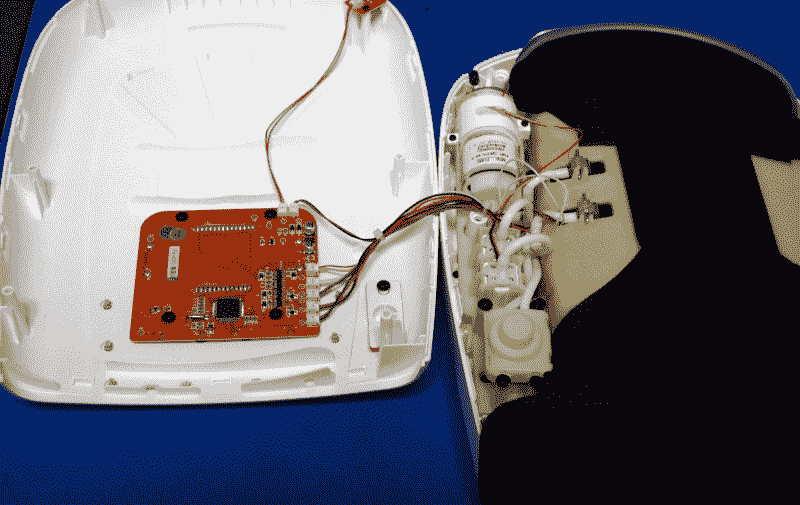
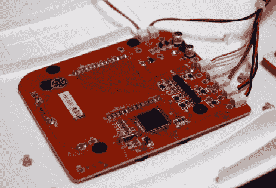
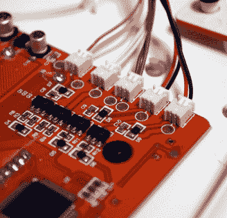
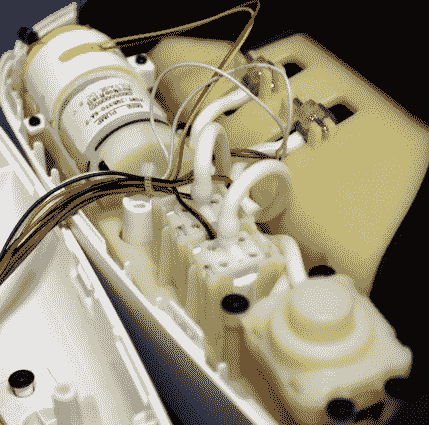
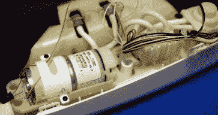
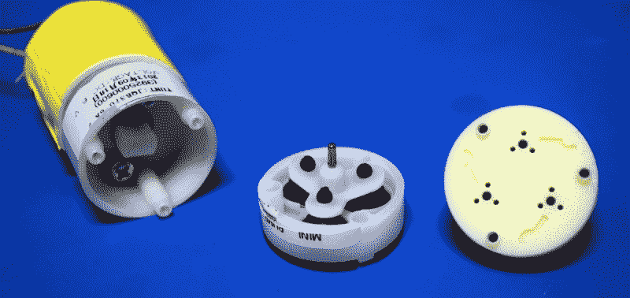
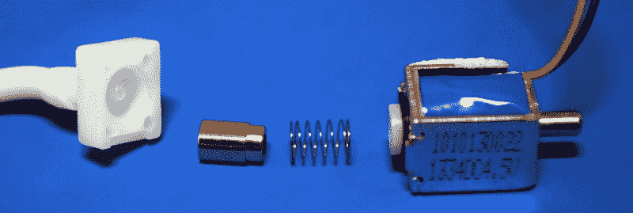
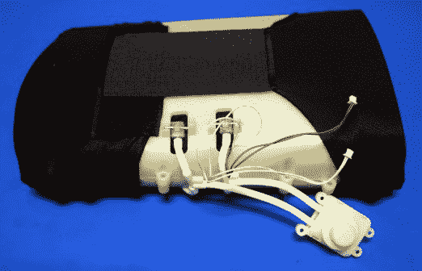

# 拆卸:痛苦之盒(Gom Jabbar 单独出售)

> 原文：<https://hackaday.com/2018/06/20/teardown-box-of-pain-gom-jabbar-sold-separately/>

当我意识到这个东西被称为“Breo iPalm520 指压手部按摩器”时，我立即感到不舒服。你应该把你的手伸进去，通过未知的机制，它完成了某种压力按摩和加热动作。这就像是《沙丘》《T3》中的一个止痛盒。当你意识到那上面的红色按钮是紧急释放时，就更加令人不安了。没错，一旦你的手在这个装置里，你就不能把它拿出来，直到这个东西对你产生了影响，或者你把它取出来。

Press to administer the Gom Jabbar

我每周至少去一次当地的旧货店寻找有趣的东西。我想比“有趣的东西”更具体，但说实话，我从来没有真正知道我在寻找什么，直到我看到它。当然有正常的消费电子类的东西，但我也发现了一些非常好的实验室设备，电脑零件，软件，技术书籍等。你只需要定期去，并留意干草中偶尔出现的针。

亲爱的读者们，我想让你们知道，我确实曾短暂地鼓起勇气把手伸进去打开它。现在我不是人们所说的过于勇敢的人，也许这可以解释我的个人经历。但当它开始嗡嗡作响并变热时，它紧紧缠绕着我的手，以至于我的手指都不能动了，我像个孩子一样尖叫着，用力按下紧急按钮，就好像我是一名试图从一架受了致命伤的飞机上弹射出去的飞行员。就弗兰克·赫伯特而言，我根本不是人。

为了更好地理解这个刑具，让我们打开它，看看在未来的外表下隐藏着什么。

## 拆卸

大卫·林奇从不让我们看盒子里面，但这是真实的生活，我可以做我想做的。很有可能，东西看起来越光滑，在不破坏它的情况下就越难拆开。iPalm520 完全符合这一描述。在你找到螺丝后，它自然地凹进了设备中，以至于我不得不去找出我从未使用过的长柄驱动器，你仍然需要打开外壳。用来把它固定在一起的夹子非常牢固，我敢肯定在我把它拆开之前，它就会裂开。事实上，尽管我尽了最大努力，我还是弄断了几个夹子。

打开箱子，我们可以立即看到这个装置是气动的。可以看到一个气泵，以及一些管道和阀门。但是在我们开始之前，让我们看看左边的控制板。

## 电子学

iPalm520 的大脑非常简单。只有一个芯片运行整个节目，直接连接到液晶显示器和晶体管库，这些晶体管在电机和阀门输出上做着繁重的工作。芯片本身被熟练地抹去了任何识别信息；虽然我可以看到曾经有东西写在上面，但即使在显微镜下我也什么也看不出来。

    

关于电子设备没什么可说的，实际上也没什么可以挽救的。LCD 图像非常好，但很像主芯片，不幸的是没有识别标记来确定是谁制造的或查找任何文档。

## 气动部分

这是设备的真正核心，当然也是最有趣的部分。我们可以看到为系统提供压力的气泵，以及用于选择性地给袖带的不同部分充气的两个机电阀。还有一个手动减压阀，当你临阵脱逃并按下设备顶部的红色按钮时，它就会启动。

      

一个有趣的注意是电解电容器是匆忙添加到电机。我们只能推测，但它可能是在发现有刷电机产生太多射频干扰后添加的电容。

## 泵

气泵的型号是 JQB370，网上查了一下，这好像是常见的海外零件。运行在 6 VDC 和 400 mmHg(约 8 Psi)的能力下，似乎这个小泵通常用于血压监视器等设备。

内部操作相当迷人。一个偏置联轴器在一个偏心圆内移动轴，使三个软橡胶波纹管弯曲。实际上，它是一个三缸活塞泵，但没有复杂的物理活塞、凸轮轴等。非常适合轻型移动设备。

## 阀门

装置中使用的两个阀门特别有趣。[它们本质上是螺线管](https://hackaday.com/2018/05/23/mechanisms-solenoids/)，磁芯用于阻止空气通过设备。线性布局，空气通过线圈部分，使一个非常紧凑的单位。

这些阀门给我的印象是制作得非常好，如果它们是整个设备中最昂贵的元件，我也不会感到惊讶。阀体上印刷的数字似乎与我在网上能找到的任何东西都不相符，尽管在通常的海外网站上搜索“迷你电磁阀”会显示非常相似的产品。

## 手铐

最后，我们来看看袖口本身。外壳异常坚固，无疑可以承受操作过程中的压力，根据标记，外壳由含 10%玻璃纤维的 ABS 制成。四个进气口对应于袖带内的四个独立的气囊。当与凸起的橡胶形状的面板结合时，这些囊状物允许 iPalm520 选择性地将不同的图案推到用户的手上。虽然在这种特殊的设备中还处于初级阶段，但是像这样的气动致动器已经在软机器人中得到应用。

此外，两个连接器向下延伸到袖口织物的口袋中。这里我们可以找到加热元件和温度传感器。这种设置实际上非常类似于圣诞节激光投影仪中用来保持激光二极管温度的[。](https://hackaday.com/2018/01/22/teardown-christmas-laser-projector/)

      

## 回收的零件

虽然控制板是一个失败的原因，但这个设备的气动组件绝对值得未来项目的收获。空气泵和阀门已经成熟，可以重复使用，并且可以成为与空气动力装置一起工作的极好的“启动工具”。

也就是说，鉴于 Breo iPalm520 的零售价为 130 美元，仅仅为了零件而购买它肯定是不值得的。最后，这是一个完美的旧货店发现；它花了我大约 5 美元，对于这个价格我很满意。迄今为止，我的旧货店策略还没有让我失望:如果它有按钮，看起来很酷，它可能值得拆开。

我喜欢写这些拆机的文章，但是我经常被我遇到的古怪设备所支配。如果你有什么建议，甚至是你想送去拆卸的东西，[请通过提示热线](mailto:tips@hackaday.com?Subject=[Teardown])告诉我们！