# 拆卸:圣诞激光投影仪里有什么？

> 原文：<https://hackaday.com/2018/01/22/teardown-christmas-laser-projector/>

在大盒子零售领域，12 月 26 日是一个非常特殊的日子。头顶扬声器播放的圣诞音乐切换回适合家庭的前 40 名，商店的装饰品被扔进了压缩机，所有与节日有一点点关系的东西都被清理掉了。在这个最商业化的节日里，再也赚不到钱了，所以一切照旧。

[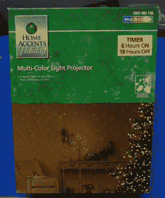](https://hackaday.com/wp-content/uploads/2018/01/xmaslaser_box1.jpg) 正是在这个狭窄的时间走廊里，在节日大卸货和春季新品上市之间，你可以在圣诞装饰品上找到一些奇妙的交易。不久前，对于 Hackaday 的读者来说，这可能不是什么令人兴奋的消息。但是圣诞灯和装饰品已经真正开始推动技术的发展:可寻址的 RGB LED 线，蓝牙控制的效果，以及最近几年的激光。

没错，你在整个社区都见过它们，可能会看到一些杂散光束，你甚至可能拥有自己的光束。在过去的几年里，激光投影仪一直是最受欢迎的圣诞装饰品之一，不难看出其中的原因。只要把投影仪架在你家门前，就大功告成了。没有必要爬上梯子，把灯串在屋顶上，你可以直接把能量射到那里。

鉴于它们是如此受欢迎，我惊讶地看到圣诞节后几天家得宝的清仓货架上有一台孤零零的*Home Accents Holiday Multi-Color Light 投影仪*，售价约为 14 美元。这比正常的建议零售价降低了 75%,正好在冲动购买的价格范围内。让我们看看里面藏着什么！

## 打开它

[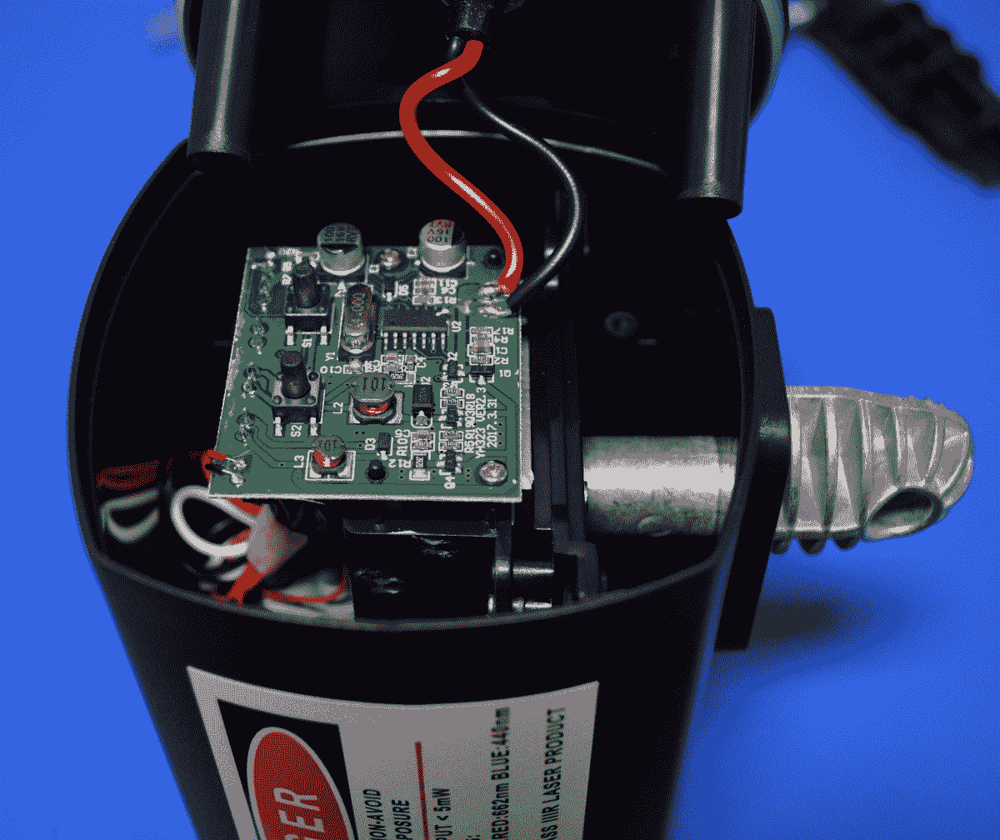](https://hackaday.com/wp-content/uploads/2018/01/xmaslaser_extheat.jpg)

这个特殊的投影仪与我见过的其他投影仪没有太大的不同，除了它实际上内部有三个激光器。通常这些投影仪只是包装红色(662 纳米)和绿色(532 纳米)，但这一个也有蓝色(440 纳米)激光。有趣的是，在该装置的前面只有两个激光孔，这意味着内部必须有某种光束组合器，允许两个激光通过一个窗口射出。据推测，在设计中加入光束组合器比注射成型新外壳更便宜也更容易。

单元背面的四个螺钉允许你拉下盖子，我有点印象深刻地看到边缘有一个像样的橡胶密封，以防止水进入。随着后盖关闭，你会注意到这款投影仪设计的第一个有趣的元素:外部散热器。

我想知道为什么他们在安装桩上使用金属“关节”，并假设该片的鳍状设计只是为了减少所需的材料。但事实证明，转向节是通过一个实心金属圆筒直接连接到主激光散热器上的，他们甚至在配合面上放了一点导热材料。它并不完美，但至少它在密闭体外获得了一些热质量。

## 近距离观察

移除外部散热器后，包含所有内部硬件的“滑板”可轻松滑出背面。该设备的所有组件都很容易接近，甚至大部分组件都使用连接器，而不是直接将所有组件焊接到背面的 PCB 上。好像他们想让我们把它拆成零件。

 [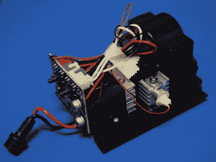](https://i0.wp.com/hackaday.com/wp-content/uploads/2018/01/xmaslaser_sled.jpg?ssl=1)  [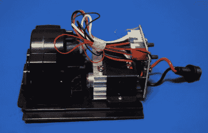](https://i0.wp.com/hackaday.com/wp-content/uploads/2018/01/xmaslaser_sled1.jpg?ssl=1) 

最大的组件是底座前面的电动光学器件，以及后面包含蓝色和绿色激光器的主散热器。红色激光器安装在较小的散热器中，与其他激光器成 90 度角。这种定位对于光束组合器(中间可见的小角度玻璃片)来说是必要的，以便从同一个孔径发出红色和绿色光束。

## 检查激光

显然，激光器本身是这个设备最有趣的部分，所以让我们直接进入好的部分:把它们取出来。主散热器从底座上取下，底部有几个螺丝，这样你就有了一个漂亮的小型双激光模块来做实验。红色激光器和它的散热器也很容易被移除，但是说实话:没有人再对红色激光器感兴趣了。

[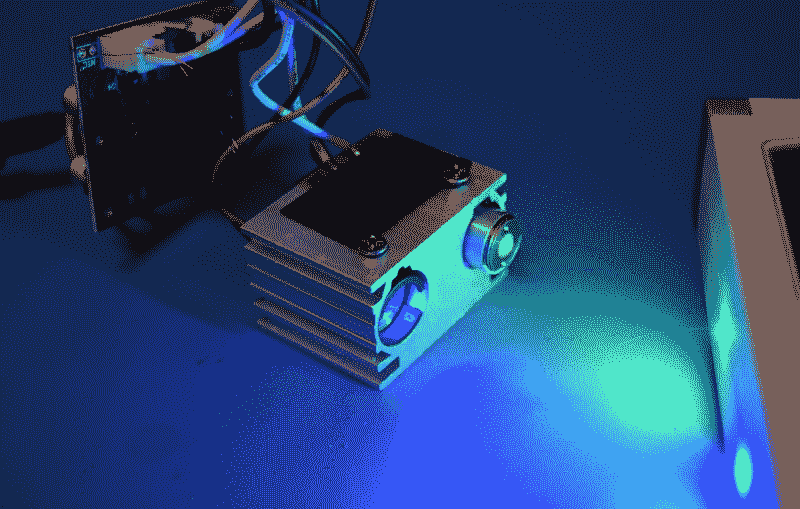](https://hackaday.com/wp-content/uploads/2018/01/xmaslaser_laserfront.jpg)

Note the black ring around the blue laser, we’ll get to that in a minute.

细心的读者可能会从这张照片中注意到，激光远未聚焦:在 3 米处，光点看起来像餐盘一样大。这很容易通过在每个激光器前面的聚焦环上使用一把小钳子来固定。一旦聚焦，很明显这些激光比产品警告标签上列出的小于 5 毫瓦的功率要大得多。

事实上，一旦蓝色激光聚焦，我就可以轻而易举地烧掉纸片，在黑色塑料上打孔。至于绿色激光，它至少是我的绿色激光笔的两倍，它的标签是 50 毫瓦。我没有设备来测量这些激光器的实际功率，但如果它们都至少有 100 mW，我肯定不会感到惊讶。

## 热量(错误)管理

[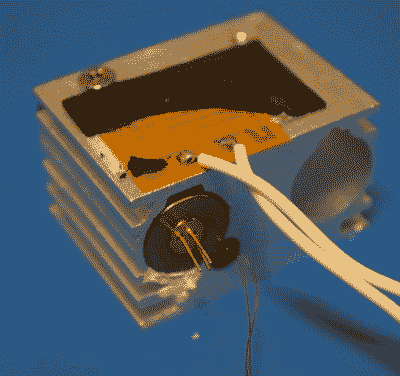](https://hackaday.com/wp-content/uploads/2018/01/xmaslaser_heatsink.jpg) 令人印象深刻的是，这款激光器的设计者在热管理方面投入了相当多的心思。散热器中不仅嵌入了温度传感器来监控热关机，而且实际上还有一个微小的加热垫，用于在极冷的条件下将激光器加热到工作温度。

在特写图像中，您可以看到热传感器(细，红色导线)和加热垫都清楚地集中在散热器左侧位置的激光上，这恰好是绿色激光。奇怪的是，蓝色激光器位于黑色塑料套管中，完全与散热器隔离。

如果你将两个激光器都从散热器中取出，你会发现蓝色激光器在几分钟内就会变热，而绿色激光器仍然感觉像是在环境温度下。从这个简单的测试来看，蓝色激光器似乎需要更多的热量看护。

如果是这样的话，它可能应该安装在散热器的左侧，但不知何故却安装在了右侧。事实上，我敢打赌，蓝色激光在长期使用后几乎肯定会烧坏这些投影仪，因为在目前的配置下，它基本上没有冷却。

## 蓝色激光玩具

如果你从这篇文章中得到的最大收获是家得宝正在出售一种 440 纳米的激光，你可以用它来烧东西，我当然不会责怪你。如果这是你想要的，我建议把蓝色激光放在红色激光的散热器里。两个激光模块大小相同，较小的散热器在户外应该绰绰有余。然后，您可以从控制板断开所有其他设备，只留下蓝色激光。

但是在给它通电之前，你必须焊接一个电阻来代替温度传感器，否则控制板会在几秒钟后切断激光器的电源。该传感器在环境温度下的读数约为 50kω，因此用类似的东西替换它应该会让它满意。在下图中，你可以看到我目前使用的 40kω电阻。

 [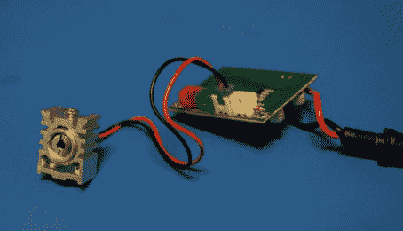](https://i0.wp.com/hackaday.com/wp-content/uploads/2018/01/xmaslaser_blue1.jpg?ssl=1)  [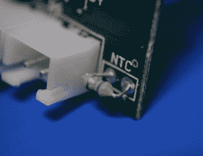](https://i0.wp.com/hackaday.com/wp-content/uploads/2018/01/xmaslaser_blue2.jpg?ssl=1) 

## 有什么值得打捞的？

[我现在已经有一段时间在从事某种打捞工作了](https://hackaday.com/2017/12/07/my-kingdom-for-a-capacitor/)，所以我经常从我能够提取出什么样的有用硬件的角度来考虑这样的购买。对于 14 美元，我不得不说这是一个相当不错的分数:

从光学部分，我们有一个漂亮的小齿轮马达，一个光束组合器，和四个光栅。三个激光模块和一个驱动板，可以同时为它们的任意组合供电。两个散热器，一个集成了温度传感器。一个小小的加热垫，最后是一个坚固耐用的 5V/2A 适配器。

 [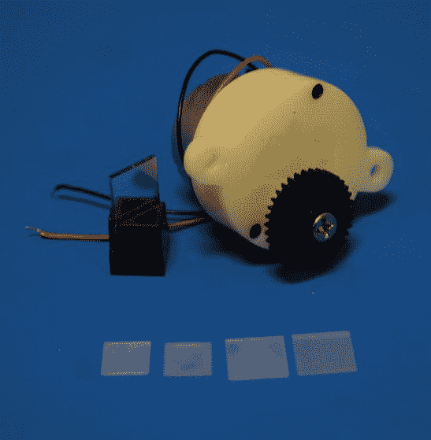](https://i0.wp.com/hackaday.com/wp-content/uploads/2018/01/xmaslaser_sal1.jpg?ssl=1)  [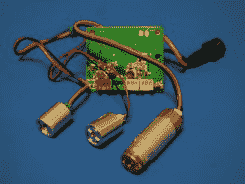](https://i0.wp.com/hackaday.com/wp-content/uploads/2018/01/xmaslaser_sal2.jpg?ssl=1)  [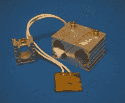](https://i0.wp.com/hackaday.com/wp-content/uploads/2018/01/xmaslaser_sal3.jpg?ssl=1)  [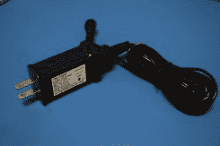](https://i0.wp.com/hackaday.com/wp-content/uploads/2018/01/xmaslaser_sal4.jpg?ssl=1) 

当你读到这封信的时候，你可能已经来不及自己去抢购了，但是总会有下一年。谁知道在 2018 年新年到来之际，哪些令人沮丧的好东西会留在货架上？

你有其他有趣的发现可以让我们拆掉吗？请在下面的评论中告诉我们。