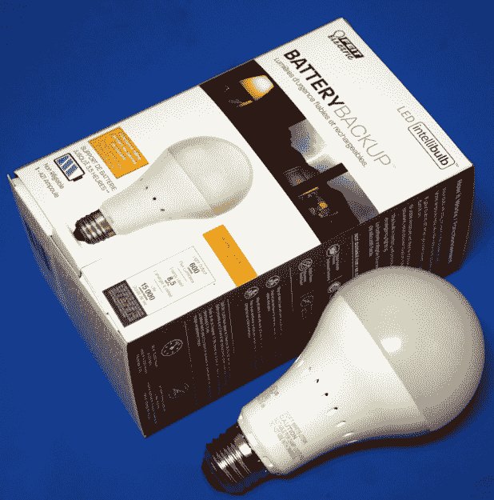
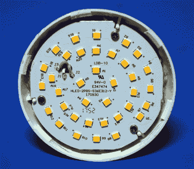
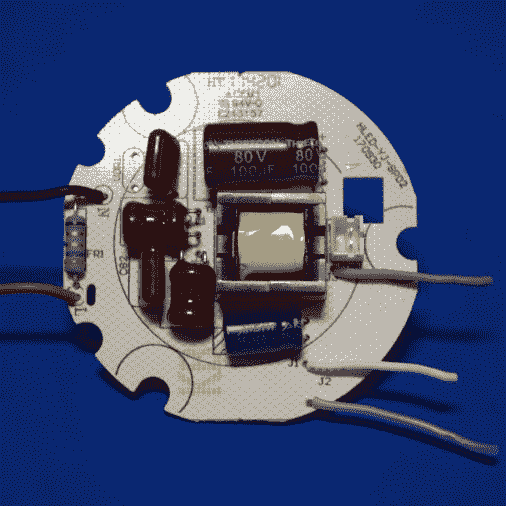
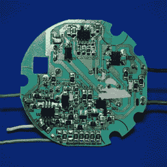
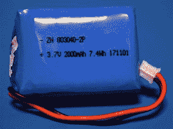
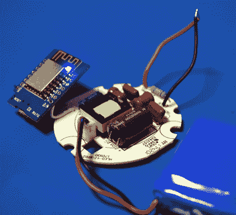

# 拆卸:LED 灯泡产生微小的 UPS

> 原文：<https://hackaday.com/2018/04/23/teardown-led-bulb-yields-tiny-ups/>

偶尔你会碰到一种产品，你知道它好得难以置信。你可能不知道*为什么*，但你有一种预感，包装上夸张的措辞告诉你的并不完全符合现实。这是我最近发现 Feit Electric 的“LED 智能灯泡备用电池”灯泡时的感觉。在家得宝(Home Depot)售价约为 12 美元的盒子承诺，购买者将“再也不会被蒙在鼓里”，而且当断电时，灯泡将继续正常工作 3.5 小时。如果我可以重新利用它来为我自己的微控制器项目制作一个微型 UPS，它可能会更加有用。

 现在，一个底部带电池的 LED 灯泡并不完全是火箭科学，我们一眼就能从概念上理解这个产品。但正如他们所说，细节决定成败。盒子声称灯泡消耗 8.5 瓦，但有足够容量运行 3.5 小时的电池对灯泡来说太大了。很明显，事情远不止如此。

在盒子的侧面，用整个包装上最小的字体，我们得到了线索。当处于电池备用模式时，灯泡的亮度会降至 200 流明，大约相当于一个廉价的 LED 手电筒的亮度。现在事情开始变得明朗起来。甚至不用打开设备，我们就可以相当肯定它将包含两个独立的 led 阵列:一个低组用于电池，一个更亮的组用于当灯泡有交流电源时运行。

不过，我倾向于认为，任何低于 20 美元左右的东西都值得打开，看看是什么让它滴答作响。即使产品本身并不起眼，内部组件也有可能是有用或有趣的。记住这一点，让我们看看备用电池灯泡里有什么，以及我们可以用它做什么。

## 拆卸

我完全预料到必须切开灯泡，但令人惊喜的是你可以无损拆卸它。当然，这并不是制造过程中的意图，但这是一个很好的副作用，一些可怜的灵魂可能不得不手工组装这些东西。

如果你挤压磨砂塑料圆顶，最终用于固定它的胶水会弹出，从那里只需轻轻撬开即可释放。一旦穹顶被关闭，你会看到 LED 阵列。led 外围的三个螺丝可以让你将所有的电子设备从灯泡中取出。两条电线向下延伸到底座，不幸的是，底座似乎被永久压入塑料中。因此，要取出电子元件，你要么需要剪断电线，要么将它们从电路板上拆下来。

## LED 阵列

 不出所料，阵列中有两个同心的 led 环，根据灯泡是使用交流电源还是 DC 电源来打开或关闭。当使用 DC 电源时，内环的指示灯和中间的五个指示灯会亮起，当交流电源可用时，外部的指示灯会亮起。值得注意的是，与 DC 相比，中央的 led 灯在交流电下并没有变得更亮，但是外侧的 led 灯比内侧的要亮得多。

根据包装盒上的信息，这是有道理的:如果灯泡的总输出是 600 流明，但电池电源只有 200 流明，我们知道外部 LED 环本身必须输出大约 400 流明。

该阵列看起来制作合理，并附在一个相当不错的圆形铝制散热器上。虽然电线没有标记，但不难看出中间的电线是负的，两条外部的电线对应于两个 led 环。这个模块很容易在一个项目中重复使用，在这个项目中，你可能需要可变的亮度，而不需要担心 PWM。

## 电源

如果你以前曾经看过 LED 灯泡的内部，那么这块板应该看起来很熟悉。这是一个双面 PCB，布局相当简单:变压器和电容位于顶部，用于交流到 DC 转换，另一面则是操作的大脑。电路板顶部的白色连接器连接到 3.7V 2000mAh 电池，这顺便占用了灯泡的大部分内部体积。

      

## 操作理论

关于这种灯泡，要记住的一点是，它不像应急灯；它不会在断电时自动开启。毕竟这是个灯泡，当你扳动开关或者拧开它的时候，它需要熄灭。

相反，灯泡检测它所连接的电路何时断电。它通过在断电时测试其交流端子之间的电阻来实现这一点。如果有“无限”的电阻，它就知道已经被关掉或拔掉了电源。

有趣的是，灯泡中的电路非常敏感，如果你徒手握住灯泡，它会将其视为无电电路并点亮。根据你的幽默感，这可能值 12 美元。

我想弄清楚灯泡是如何工作的，因为我认为它为硬件的再利用提供了一些有趣的可能性。如果发光二极管在 3 V 下工作，并且无论是否连接到交流电源，灯泡的电路都能够保持该电压，我们基本上就有了一个低压不间断电源(UPS)T1。

## 概念证明

 电源可能相当“脏”，在交流电源开关时可能会出现尖峰。至少在电路板的 DC 一侧应该有一个大电容。但作为一个快速演示，我可以将 LED 电线直接插入 Wemos D1 的 3.3 V 侧。同样，这不是一个好主意，但表明基本前提是可行的。

如果我们假设 D1 的功耗为 250 毫安，这个小小的黑客 UPS 应该能够运行至少 5 个小时左右。鉴于宣传的 3.5 小时运行时间数字，以及电池上印刷的 2000 mAh 容量，该板应该能够在 3 V 下提供至少 400 mA 的电流，使用升压转换器，您可以获得 5 V 的电压，但可能没有足够的电流来运行。

很多人都不愿意摆弄交流电路，所以这一事实提供了一个交钥匙解决方案，让你专注于 DC 方面是一个很大的优势。加上交流侧的外壳和灯线，这可能是一个有趣的“穷人的 UPS ”,用于完全由家得宝(Home Depot)提供的零件构建的微控制器项目。能够在不离开当地大商店的情况下设置这样的东西有一定的要素。

## 值得吗？

灯泡中有一些不错的硬件，可能值得入场费，特别是当这些灯泡总是以 6 美元左右的价格进入清仓区时。首先，双亮度 LED 阵列和相对结实的电池可以很容易地重新利用。这不是我们从家得宝看到的最好的挽救交易，但你可以做得更糟。

但就个人而言，将这些灯泡用作廉价的 DC UPS 最吸引我。这当然需要进一步的调查，看看社区能拿出什么合适的负载来替换 LED 阵列将会很有意思。我将对这个概念做更多的工作，所以请留意未来关于这个主题的帖子。