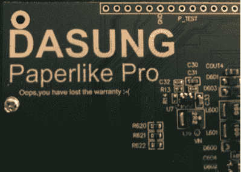

# 拆掉价值 1000 美元的 E-Ink 展示品

> 原文：<https://hackaday.com/2018/02/14/tearing-down-a-1000-e-ink-display/>

早在 2016 年，中国公司 Dasung 就超过了他们的 Indiegogo 目标，资助了 Paperlike:世界上第一个通用 E-Ink 显示器。不像以前的显示器那样被卡在你最喜欢的 DRM 供应商的阅读器里，这种纸质的可以和你想要的任何设备一起使用；尽管是黑白的并且刷新率相对较低。它承诺允许在不需要背光的情况下在你的电脑或平板电脑上读写。13 英寸显示器的价格高达 800 美元，但显然有足够多的人有兴趣让这种设备成为现实。

At least they have a sense of humor about it.

你可以把凯文·泽特勒算作纸一样的爱好者。他是这项技术的狂热爱好者，以至于他正在使用最新一代的类纸 Pro 构建一台 DIY E-Ink 笔记本电脑。但是在他这么做之前，[他必须把这个东西拆开，看看它是如何运转的](https://kevzettler.com/2018/02/11/dasung-paperlike-pro-teardown)。虽然让显示器工作的许多专有魔法仍然是一个谜，但他尽最大努力为我们这些有点害羞而不敢拿螺丝刀去拿价值 1000 美元的显示器的人记录了内部原理。

看起来 Paperlike Pro 的设计(有意或无意)有点像亚马逊 Kindle，不幸的是构造方法也是一样的。前面板是粘在一起的，需要用锋利的东西在下面小心撬开才能剥离。对于一个 100 美元的电子阅读器来说，我们可以处理这个问题，但对于像纸一样的 Pro 来说，这种拆卸让我们不寒而栗。

他已经确定裸露的显示器模块是一个 [13.3 英寸的 ED133UT2](https://shopkits.eink.com/product/13-3˝-epaper-display-ed133ut2/) ，这使他走上了一条有趣的道路，调查同一家族中的其他显示器。原来达松用的是低端产品。显示屏存在眩光问题，并且永久性地粘合在一块玻璃上，而同一系列的其他型号不仅具有灵活性，还具有防眩光涂层。甚至还有一个集成触摸屏的。[Kev]提到这些显示器中的一种会更适合他的 E-Ink 笔记本电脑项目，但我们认为他不会因为有更好的选择就把它扔进垃圾箱。

除了显示器本身，还有一个定制的 Dasung 控制板，[Kev]说对他来说有点太复杂，难以破译，因为芯片的标签已经被移除。不过，一个有趣的发现是，官方认为只是用于供电的 USB 端口的四根电线都连接到了主板上，这增加了未来一些软件黑客攻击的可能性。

你可能不知道，但是[黑客绝对喜欢 E-Ink](https://hackaday.com/tag/e-ink/) 。我们过去报道过一些利用这种类似纸张的技术的非常令人印象深刻的项目，[从我们 2017 年 Hackaday 奖的一个参赛作品](https://hackaday.com/2017/09/01/hackaday-prize-entry-an-e-ink-calendar/)到参与自制你自己的显示器的[化学](https://hackaday.com/2017/04/12/can-you-build-an-e-ink-display-from-scratch/)。