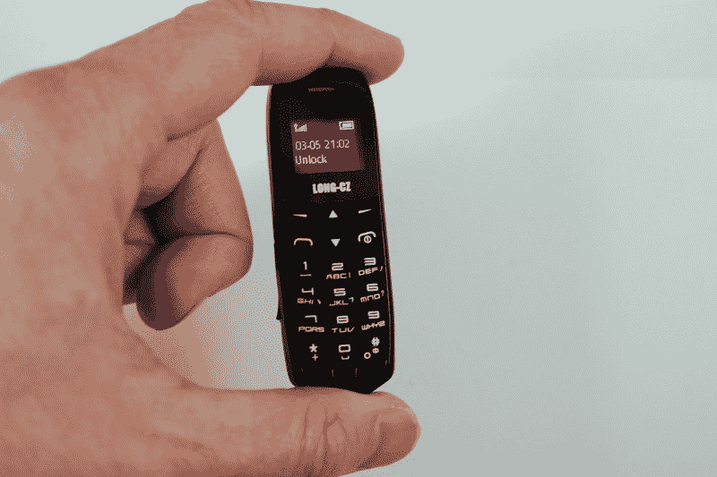
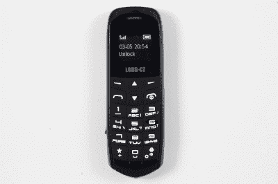
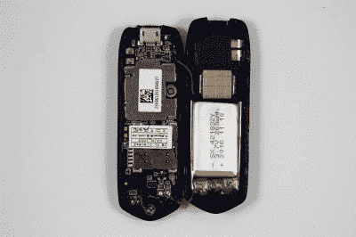
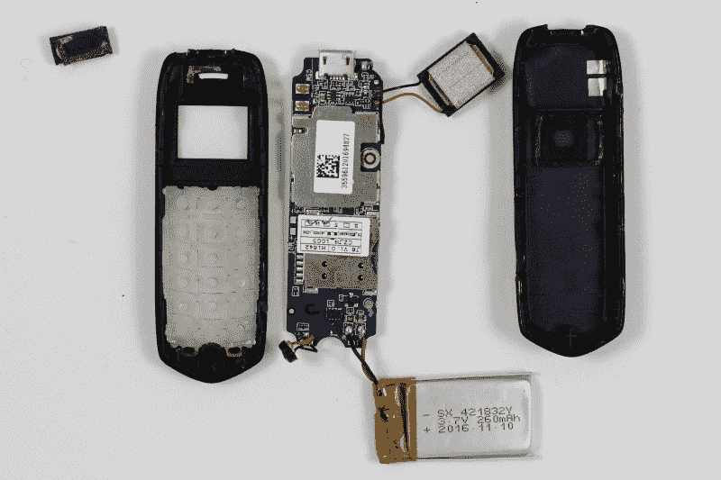
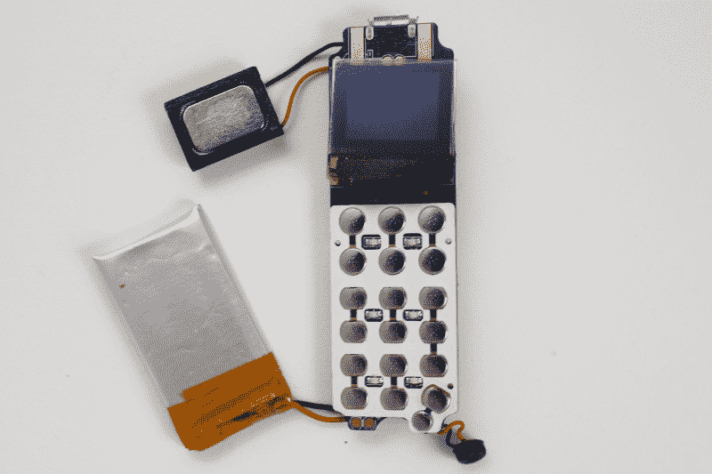
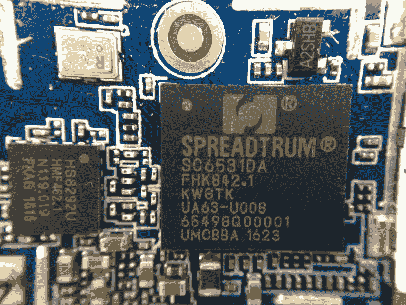

# 拆掉老板的电话

> 原文：<https://hackaday.com/2017/05/11/tearing-down-the-boss-phone/>

逛逛全球速卖通、阿里巴巴，尤其是淘宝——这个面向中国的网站越来越多地被西方人用来寻找难以采购的零部件——你会发现一些有趣的事情。Long-CZ J8 就是其中之一，它长 2.67 英寸，重 0.63 盎司，内置于蓝牙耳机中。

几个月前，[科利·多克托罗重点介绍了这款微型手机](http://boingboing.net/2017/02/27/ring-ring-buttphone.html)，他是因为市场营销才选择它的。这款菱形手机被明确宣传为可以“击败老板”。这里的老板是 [B.O.S.S .主席](http://bodyorificescanner.com)——一种扫描技术已经在英国的监狱中广泛使用，试图阻止向囚犯走私手机。

The Long-CZ J8 is just 2.67 inch (6.8cm) long.

我对它是否能通过人体扫描仪或内置变声器并不特别感兴趣，这是手机目标市场的另一个线索。然而，这个东西的大小已经足够吸引人了，我想我应该拿起一个看看里面。所以我从亚马逊订了一个。

很难理解这款手机有多小，68 毫米×23 毫米×11 毫米，只有我的拇指大小，重量只有 18 克。

The Long-CZ J8 mobile phone.

The inside of the Long-CZ J8.

用[金属扳手](https://www.ifixit.com/Store/Tools/Metal-Spudger-Set/IF145-017-1)撬开手机外壳相当容易，因为没有螺丝。虽然如果你想自己尝试，你应该小心地从远离 SIM 卡插槽的一侧开始，因为原来手机的两半是通过一些飞线连接的。

打开手机可以看到 260 毫安时的电池，可以提供长达 5 小时的通话时间，或 3 天的待机时间，充电是通过手机顶部的微型 USB 端口进行的。电池用两根线连接到主板上。在手机的同一侧是一个扬声器，当手机像蓝牙耳机一样挂在耳朵上时使用。

蓝牙天线只不过是一小段电线，可以在射频屏蔽的右侧看到，就在扬声器下方。

将这些从后壳中梳理出来又是一个金属 spudger 的工作，并不存在问题。将主板从外壳的另一半中弹出还需要在主板上施加任何力之前将麦克风从外壳中撬出。

The disassembled Long-CZ J8.

前壳包含作为独立插件的橡胶键帽，以及位于屏幕上方的另一个小扬声器，可以用工艺刀撬出——它粘在外壳中，但胶水不是特别坚固。

主板大部分被射频屏蔽罩覆盖，micro-SIM 卡插槽就在它的下面。把它翻过来，我们可以看到小 TFT 屏幕，键盘，和一些在手机使用时照亮键帽的 led。如果你愿意，你可以用指甲撬起白色键盘盖，露出下面的电路板。

屏幕本身粘在主板上(更准确地说是钉在主板上),可以用指甲轻轻撬起，露出焊接在主板上的连接器带状电缆。电路板上几乎没有连接器，所有东西都直接焊接或粘合到 PCB 上。

The front of the main board of the Long-CZ J8.

将电路板翻转过来，用我们方便的金属定位钳撬开电路板背面的射频屏蔽，露出电路板上仅有的两片硅。

主芯片是一款[展讯 SC6531](http://www.spreadtrum.com/en/SC6531.html) ，这是一款基于单芯片的基带收发器，直接面向低端功能手机市场。基于 ARM926EJ-S 处理器——入门级 ARM，尽管它仍然能够运行完整的操作系统，如 Linux 或 Symbian。实际上，这款手机的功率过大，芯片支持 2MP 摄像头。你可以[在全球速卖通](https://www.aliexpress.com/wholesale?catId=0&initiative_id=SB_20170507163955&SearchText=SC6531)买到 SC6531，价格约为 3.00 美元一个小批量。

The only two pieces of silicon on the Long-CZ J8 main board.

手机上的另一个芯片是 hunter sun hs 8292 u T1。这是一款用于 850、900、1800 和 1900MHz 四频段 2G GSM/GPRS 蜂窝手机的 RF 芯片。你可以在全球速卖通买到[，每件不到 2 美元。](https://www.aliexpress.com/wholesale?catId=0&initiative_id=SB_20170507164038&SearchText=HS8292U)

将这款手机与 Bunnie Huang 几年前在深圳童鸣数码商城买到的价格为 12 美元的“龚开”手机进行比较真的很有意思。构建质量和设计非常相似，只是小了很多，这也许显示了技术栈在过去几年中是如何成熟的。

Long-CZ J8 本身可以在全球速卖通以大约 20 美元的价格买到，大约是其在亚马逊上销售的价格的一半，我相当肯定它在深圳的价格要低得多，可能与邦尼的“龚开”手机价格相同。所以如果你在深圳见过它，我很想知道它在市场上卖多少钱。