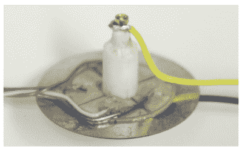
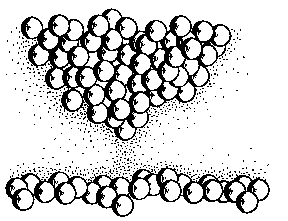
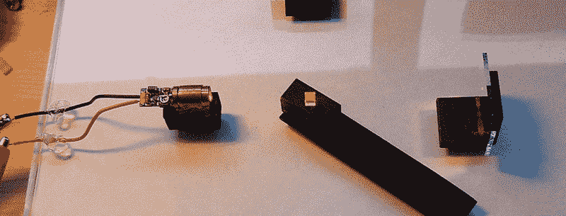
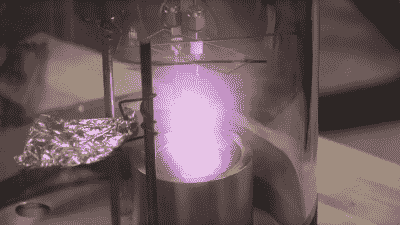

# 极小极小——原子分辨率和家庭爱好者

> 原文：<https://hackaday.com/2015/09/30/teeny-tiny-very-small-atomic-resolution-and-the-home-hobbyist/>

原子很小。真的很小。你不会相信它们有多小。我的意思是，你可能认为这是去药店的一条捷径，但那对原子来说只是微不足道。

原子真的很小。碳原子的原子半径大约是 0.1 纳米，也就是 0.0000001 毫米。与我们通常遇到的物体相比，很难理解这有多小，但作为起点，我建议看看下面的“十的幂”视频，自 1977 年发表以来，它传达这一概念的能力一直是无与伦比的。

术语纳米可能是半导体行业最熟悉的，它似乎不可阻挡地向更小的特征尺寸进军。特征尺寸目前徘徊在 10 纳米左右。因此，虽然这些数十亿美元的设备可以达到 10 纳米的精度，但对于黑客爱好者来说，亚纳米特征尺寸定位和制造技术的成本相对较低，这有点令人惊讶。

在这篇文章中，我们将回顾一些业余爱好者通过使用尖端但低成本的技术在非常非常小的领域中展示的令人惊叹的工作。

 [https://www.youtube.com/embed/0fKBhvDjuy0?version=3&rel=1&showsearch=0&showinfo=1&iv_load_policy=1&fs=1&hl=en-US&autohide=2&wmode=transparent](https://www.youtube.com/embed/0fKBhvDjuy0?version=3&rel=1&showsearch=0&showinfo=1&iv_load_policy=1&fs=1&hl=en-US&autohide=2&wmode=transparent)

## 纳米定位

A homebrew Piezo actuator by Nebojsa Jaksic, Colorado State University-Pueblo

我们工具包中的第一项技术是亚纳米精确定位。压电材料响应于施加的电压而收缩。你很可能熟悉贺卡中的廉价压电蜂鸣器或廉价小玩意中的蜂鸣器。然而，在纳米定位中，它们的精确运动被用来提供定位。这些致动器通常采用压电堆或管的形式，形成成本为数百到数千美元的 XYZ 级。然而，从[约翰·亚历山大的设计](http://web.archive.org/web/20121110152444/http://www.geocities.com/spm_stm/Disk_Scanner_Exp.html)开始，爱好者已经从廉价的压电蜂鸣器开发出精确的致动器。使用这些亚美元设备，切割成象限亚纳米精度运动可以实现在 X，Y 和 Z 轴超过约 10 微米的行程。

## 原子级尖端

A sharp point is formed from a single atom

虽然能够以原子精度移动物体很棒，但在你有制造纳米特征的方法之前，这没有什么价值。这被证明是非常简单的，通过简单地[切割铂铱丝](http://webphysics.davidson.edu/alumni/jocowan/stm/stmtip.htm)同时使用一对钛断线钳拉动它，金属丝可以被夹紧并拉成一个锋利的尖端。虽然这个尖端会有些不规则，但在尖端会有一个原子稍微领先于所有其他原子，提供了一个微小的纳米级特征。

## 原子尺度成像和测量

光学显微镜受到光波长的限制，因此最多只能提供大约 200 纳米(2000 个碳原子)的分辨率。然而，我们可以使用一些简单的技术来进行原子尺度的测量。

通过结合纳米定位和原子级尖端，我们可以开始建造扫描隧道显微镜(STM)。这些显微镜在表面上扫描针尖，测量针尖和表面之间的隧道电流(通常使用跨阻抗放大器)。IBM 著名的原子分辨率电影“一个男孩和他的原子”中使用了这种技术的一个版本。

 [https://www.youtube.com/embed/oSCX78-8-q0?version=3&rel=1&showsearch=0&showinfo=1&iv_load_policy=1&fs=1&hl=en-US&autohide=2&wmode=transparent](https://www.youtube.com/embed/oSCX78-8-q0?version=3&rel=1&showsearch=0&showinfo=1&iv_load_policy=1&fs=1&hl=en-US&autohide=2&wmode=transparent)

像约翰·亚历山大和丹·贝拉德这样的黑客已经成功地花费数百美元构建了这些系统。然而，隧道显微镜仅限于对导电表面成像。与此相反，原子力显微镜利用范德华力来偏转针尖。因此，非导电材料也可以成像，这在生物应用中特别重要。丹已经开始研究利用这种技术的便宜方法使用负担得起的和有效的方法。

A Home Built Interferometer

另一种避开光学极限的测量技术是激光干涉测量法。在这种方法中，一束激光被两个反射镜分开并反射，然后重新组合。通过移动一面镜子并测量两束光之间的干涉，可以测量距离。基本干涉仪的测量分辨率仍然会受到可见光波长的限制。然而，更先进的技术(如将光束循环并反射两次)甚至可以测量纳米级的距离。黑客还利用蓝光激光部件和廉价的激光二极管[开发了干涉仪。其中，干涉测量可以帮助校准，或者向压电致动器提供反馈。](http://hackaday.com/2015/07/24/self-built-interferometer-measures-nanometer-displacement/)

现在，有了纳米尺度的成像和测量技术，我们要看什么呢？

## 原子级平坦、规则的表面

Carbon (HOPG) Atoms Imaged by Dan’s STM

我们描述的扫描显微镜的另一个局限性是它们只能在平面上工作。原来大自然已经为我们完成了工作。两种流行的材料是 HOPG(高度有序热解石墨)和云母。两种材料都是平面的。原子级平坦的表面可以很容易地被劈开，最常见的是用透明胶带撕下来！HOPG 具有导电性和规则性。因此，STM 产生了非常好看的 HOPG 图像。虽然这本身很有趣，但我们也可以用这些材料作为基底。感兴趣的分子可以在平面上展开，并在已知的背景下成像。

## 原子级薄膜

Ben Krasnow’s Sputtering machine at work

溅射机器可用于将薄层材料施加到基底上。该技术广泛应用于半导体工业中，以建立构成集成电路所需的材料层。但是我们也看到黑客在试验这种技术。像[本·克拉斯诺的](https://www.youtube.com/watch?v=9OEz_e9C4KM)在玻璃上溅射 [ITO](https://en.wikipedia.org/wiki/Indium_tin_oxide) 制造透明导电涂层。溅射机器需要真空，但这并不特别难实现，并且有无数种涂层可供实验。

如你所见，过去几年已经为纳米级测量和制造的廉价技术打下了坚实的基础。大多数情况下，这些解决方案都是由一系列勤奋的黑客开发出来的。我们希望这能激励你在他们的工作基础上更进一步，深入原子领域！我们希望在评论中听到你的意见，你认为在未来的几年里，什么样的项目将会在这个框架上建立起来？