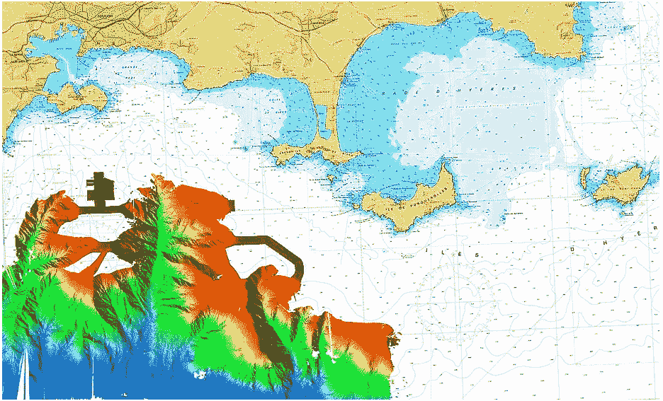
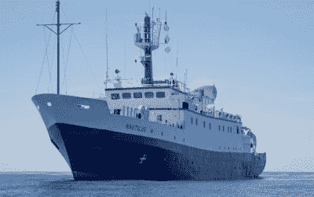
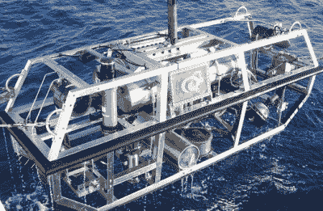
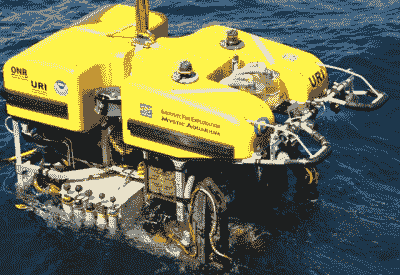

# 海底远程呈现机器人 2000 联盟

> 原文：<https://hackaday.com/2017/07/27/telepresence-robot-2000-leagues-under-the-sea/>

远程呈现机器人现在已经成为现实，你可以在办公室里转来转去，与人交谈，参加会议，看东西，碰到你的同事。但是想象一下，如果远程呈现应用于深海探索。今天，我们可以通过[鲍勃·巴拉德](https://en.wikipedia.org/wiki/Robert_Ballard)(因定位泰坦尼克号、发现深海地热喷口等而闻名)和他在[内部空间中心](https://www.gso.uri.edu/inner-space-center/)的团队创建的远程呈现系统成为海洋学家。戴上你的潜艇手表，因为是时候让我们所有人在家里或办公室舒适地探索海洋深处了。

## 深海远程呈现是如何工作的

鲍勃·巴拉德和他的团队创造了一个深海远程呈现探索系统。该系统由作为“母船”的勘探船(E/V) Nautilus 和 Hercules ROV 组成。鹦鹉螺号是一艘驶往感兴趣区域的水面船只，利用船上传感器进行所有初步测绘。她携带所有必要的设备和人员。传感器包括海底剖面仪、多波束声纳和其他绘制水温和各种属性的传感器。E/V 将扫描底部以获得粗略的地图来指导探索。

EM302 multibeam echosounder image.

鹦鹉螺号还拥有卫星通信链路，允许她将实时数据传输到罗德岛大学的内部空间中心。从这里，来自任务的视频和通信反馈被实时转播给研究机构。这是由内部空间中心接收的相同的馈送。不仅如此，这种反馈还会在网上重播，这样任何人都可以收听这一行动。换句话说，你也可以在舒适的办公室或家中成为深海探险家。

鹦鹉螺号无法独自获取深水中目标的光学或高分辨率声纳图像。她必须部署遥控车辆来捕捉高分辨率图像。

Argus, the ROV that services Hercules.

为此，E/V Nautilus 将两种不同的遥控潜水器放入水中。第一个是 Argus，这是一个服务 ROV，其工作是管理 Nautilus 的引线电缆的张力，通常负责管理名为 Hercules 的仪器 ROV。换句话说，阿格斯被一条沉重的钢缆拴在鹦鹉螺号上，钢缆上也有数据和电力。Nautilus 的船舶运动可以通过电缆直接传输到 Argus。Argus 的主要工作是为第二个 ROV Hercules 提供较轻系绳的松弛度，以执行其高精度任务。Argus 还包含一个照明系统来照亮大力神操作的区域，以及一些额外的摄像设备来监控任务。

大力神通过一根包含电源、光纤数据链和附加控制线的轻质电缆与阿格斯相连。大力神是一个高稳定性平台，包含高分辨率相机、大功率灯、一套复杂的机动推进器、制导、机械臂、其他传感器，如成像声纳或科学家要求的特定任务传感器。它甚至有机械臂来抓取东西和收集样本。这个系统获得的大部分不可思议的图像都是由赫拉克勒斯拍摄的。

鲍勃和他的团队指导来自罗德岛大学的鹦鹉螺号船员。鹦鹉螺从表面控制大力士和阿格斯。数据通过系绳发送到阿格斯，从阿格斯到鹦鹉螺，然后从鹦鹉螺通过卫星，通过互联网，到 URI。由于服务器设在 URI，这项任务可以在世界任何地方进行控制。任何感兴趣的人都可以在世界任何地方看到它。

## 一个典型的探险季节

去年春天，我开始观看直播，经常让它在后台播放。这一季发生了几件值得注意的事情(这里有一个 94 集的视频列表供你欣赏)。一艘在 1951 年原子弹试验中被蓄意摧毁的二战航母被重新发现并接受调查。一些不寻常的生命形式被发现，如[这个神秘的紫色组织](https://www.youtube.com/watch?list=PLRk9nnqFxr29G_W0VmFhp6daOKHjkBeCu&v=gPVTagictAs)。还有很多与深海生物的互动。下面我们看到了在加拿大海洋网络水下观测站修理电缆时与章鱼的拔河比赛:

 [https://www.youtube.com/embed/GhYflI7RBrU?version=3&rel=1&showsearch=0&showinfo=1&iv_load_policy=1&fs=1&hl=en-US&autohide=2&wmode=transparent](https://www.youtube.com/embed/GhYflI7RBrU?version=3&rel=1&showsearch=0&showinfo=1&iv_load_policy=1&fs=1&hl=en-US&autohide=2&wmode=transparent)

## 加入 2017 赛季的乐趣

你可以浏览上面贴的视频列表，重温去年看到的内容。但是看到事情发生时更有趣。2017 年的时间表已经公布，我们目前正在探索海峡群岛海洋保护区，下周将探索加州中部的海岸线。

我们很多人都记得《国家地理》封面，泰坦尼克号沉船就是在那里被发现的。我们翻阅了茶几上的书籍，上面有战舰停靠在[铁底音响](https://en.wikipedia.org/wiki/Ironbottom_Sound)上的图片。我们惊叹于生命是如何在深海[地热喷口](https://en.wikipedia.org/wiki/Hydrothermal_vent)附近生存甚至繁衍的。通过 Nautilus Live，您可以在家中享受乐趣，亲身体验科学家实时看到的情况。