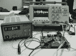
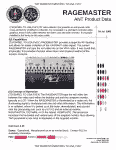
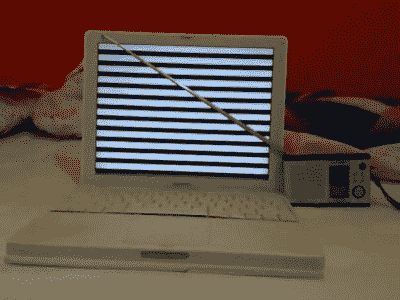

# 暴风雨:一顶锡纸帽，装着你的电子产品和它们的秘密

> 原文：<https://hackaday.com/2015/10/19/tempest-a-tin-foil-hat-for-your-electronics-and-their-secrets/>

电子泄漏波，如果你知道你在做什么，你可以利用这一现象窃取人们的数据。你的锡纸帽子有多厚？你确定够厚吗？事实证明，所有这些都有一个[(秘密)政府标准](https://www.nsa.gov/applications/ia/tempest/TEMPESTLevel2.cfm):[《暴风雨》](https://en.wikipedia.org/wiki/Tempest_(codename))。是的，全大写。不，这不是首字母缩写。这是一个秘密的代号，大声喊出来的代号更有趣！

简单来说，TEMPEST 的想法是，电子设备在做一些事情时会泄漏电磁波，比如将比特从 1 转换到 0，或者移动电子束以在 CRT 屏幕上成像。如果对手可以远程监听这些无意的广播，他们就有可能知道你的计算机内部发生了什么。请继续阅读，了解《暴风雨》的历史、现代研究，以及如何在家中亲自尝试！

[](https://hackaday.com/wp-content/uploads/2015/10/bell_laboratories_logo.png) 暴风雨并不是什么新鲜事。[这份《暴风雨》(NSA，PDF，SFW，FTW)](https://www.nsa.gov/public_info/_files/cryptologic_spectrum/tempest.pdf) 的解密介绍讲述了二战期间贝尔实验室一名无名技术人员致力于信号情报(无线电材料)的故事。据说他注意到他的示波器上出现奇怪的间歇性尖峰信号，然后设法追踪到来源于一台在“实验室遥远的一部分”工作的不相关的加密机器。然后，他设法从尖峰信号中提取足够的信息，以读取输入密码机的明文。找到了。

作为工程师，贝尔实验室的人想出了一个完整的解决方案。屏蔽和过滤来自所讨论的 crytpo 混频器的信号的组合，以完全消除明文的任何外部痕迹。暴风雨诞生了。仅仅几个星期后,《暴风雨》遭遇了第一次死亡。

为了屏蔽所有外部信号，加密混频器必须完全封装(读作:[法拉第笼](https://en.wikipedia.org/wiki/Faraday_cage))，这使得它过热。你够不到控制旋钮。当事情出错时，很难修复。

更糟糕的是，所有部署在现场的搅拌机都必须召回和改装，这是非常昂贵的。所以通信兵发布了一个指令来控制密码混合器周围 100 英尺的区域，就是这样。毕竟，正如美国国家安全局的论文所指出的，这是一场战争。

### 暴风雨再次乘坐:范埃克 Phreaking

战争结束后，中情局出于自身目的开始调查《暴风雨》。此后不久，很明显苏联也在做同样的事情:1954 年，电传打字机和其他通信设备的电磁辐射标准比原则上噪音更大的马达的标准要严格得多。

在 20 世纪 60 年代，我们发现每个人都在监视我们，从指向东京美国密码中心的高增益天线到发现隐藏在美国驻莫斯科大使馆的 40 个麦克风。怪异的东西，但很大程度上仅限于机密世界。

TEMPEST 在 1985 年通过[Wim van Eck](http://cryptome.org/jya/emr.pdf)的这篇论文(PDF)进入了流行的黑客文化。从你的计算机发出的相对较小的逻辑电压信号进入阴极射线管监视器，被放大到数百伏，以便偏转电子，使荧光物质发光，拼出你正在阅读的内容。很快被称为“van Eck phreaking”的方法很简单，使用无线电接收来自 CRT 的辐射，将无线电信号与本地生成的水平和垂直[同步信号](https://en.wikipedia.org/wiki/Video_Graphics_Array#signal_timings)重新组合，然后在显示器上重放。瞧，远程屏幕的完美复制。

范·埃克的论文发表时，间谍世界已经沉寂了至少 20 年。尽管如此，远程监控能力的图形演示(双关语)在 80 年代末和 90 年代初抓住了公众的想象力。这个复古壮观的 [BBC 电视节目，《明日世界》报道了《暴风雨》](https://www.youtube.com/watch?v=HYYm9Lin8X4)，搭建了一个范埃克装置，并将其指向房间对面的 BBC 微型电脑。尼尔·斯蒂芬森通过在 *Cryptonomicon* (任何极客必读) 中点名范·埃克来展示他有多酷。不祥的装有电信设备的白色货车开始在全国的电影中出现。

更多大风暴的信息可以在 cryptome.org 的风暴文档集合中找到。

### …在茶壶里

那么，如今《暴风雨》真的重要吗？如果非要问，答案是“大概不适合你”。这份关于 TEMPEST 的综合资源报告了美国军方的一个共识，即在美国没有太多与 TEMPEST 相关的违规风险来保证这笔费用。例如，国家侦察局在 1992 年取消了国内风暴要求。与此同时，液晶显示屏的阴极射线管已被逐步淘汰，计算机由于无间谍干扰的原因，辐射也普遍降低。

另一方面，《暴风雨》太酷了，不能死。目前我们最喜欢的《暴风雨》研究者是马库斯·库恩，他的论文基本上是关于《暴风雨》的。(他还提出了一个很棒的技巧，你可以在一个有 CRT 显示器的房间里观察[反射的光](http://www.cl.cam.ac.uk/~mgk25/emsec/optical-faq.html)，并在屏幕上回放产生该时间序列的图像。)在他的“soft-TEMPEST”项目中，库恩博士建议使用稍微模糊的字体来消除辐射信号的高频边缘，从而在软件中解决以前硬件中的 TEMPEST 问题。

### 后 TEMPEST 和 EMSEC

SANS 写了一份关于 TEMPEST 的[白皮书，对于安全专家来说，这是一份很好的读物。(虽然使用没有](https://www.sans.org/reading-room/whitepapers/privacy/introduction-tempest-981)的[漫画让它看起来像一部糟糕的漫画！是的，桑斯，我们明白这个笑话，但是真的。)根据 SANS 的说法，TEMPEST 这个代号已经过时了，也不清楚 TEMPEST 指的是问题还是解决方案。知情人士现在将该领域称为发射安全(EMSEC ),它涵盖的范围远远超过 CRT 显示器发射信号的直接接收。](http://bancomicsans.com/main/)

[](https://hackaday.com/wp-content/uploads/2015/10/l_f2_img_1228.jpg) 从更广泛的角度来看，TEMPEST 只是众多[旁道攻击](https://en.wikipedia.org/wiki/Side-channel_attack)中的一种，攻击者试图从辐射、功耗、响应延迟等方面获取设备内部状态的信息。[这篇最近的论文](http://www.tau.ac.il/~tromer/radioexp/)使用发射的类似暴风雨的辐射和软件定义的无线电来确定 [GPG](https://www.gnupg.org/) 中的加密例程在哪里花费时间，通过向 GPG 例程发送某些密钥并监控响应，他们可以破解加密。

有传言说(例如在[“完整的，非官方的暴风雨信息页面”](http://www.jammed.com/~jwa/tempest.html))有新的和改进的代码字:劫持和直达。这些似乎是暴风雨般的利用，其中一个设备被带入目标计算机，本质上是重新广播发射，以产生更强的信号。

[](https://hackaday.com/wp-content/uploads/2015/10/nsa_ragemaster.jpg) 在这种情况下，斯诺登泄密给我们带来了 [RAGEMASTER](https://upload.wikimedia.org/wikipedia/commons/2/2a/NSA_RAGEMASTER.jpg) (警告:泄露的机密文件——如果你有安全许可并且讨厌填写文件，请不要点击那个链接)，这是一个嵌入显示器视频电缆的转发错误。相当狡猾。类似技术的开源工作在 Playset.org 国家安全局进行。迈克尔·奥斯曼的[康加夫洛克](http://www.nsaplayset.org/congaflock)让你成功一半。

所以也许你真的想买那台昂贵的 TEMPEST 笔记本电脑。

### 黑风暴！

《暴风雨》不仅仅是用来吓人的。你也可以在家里用无意排放来娱乐。 [Tempest for Eliza](http://www.erikyyy.de/tempest/) 是一个快速的 Linux hack，通过在显示器上以合适的频率显示交替的黑白像素，在你选择的收音机上播放音乐。这是为那些将暴风嗅探天线指向你的显示器的联邦调查局人员播放的音乐。如果你目前没有被监视，你可以用手持调幅收音机为自己播放音乐。

要为伊莱扎使用 Tempest，你需要了解一些关于显示器的刷新率和像素布局等方面的知识。例如，对于我们的 LCD 显示器，`xrandr --verbose`输出如下一行:

```
1280x1024 (0x4d) 108.000MHz +HSync +VSync *current +preferred
      h: width  1280 start 1328 end 1440 total 1688 skew    0 clock  63.98KHz
      v: height 1024 start 1025 end 1028 total 1066           clock  60.02Hz
```

您需要的数字是像素时钟(108 MHz)、高度和宽度(1280×1024)以及包括屏幕边缘停滞时间在内的总像素数(1688)。然后你选择一个你想传送的频率。1000 千赫= 1 兆赫，这是在一个正常的收音机调幅拨号的中心，或尝试其他频率，如果你有一个业余无线电，可以在更高的频率进行调幅解调。

[](https://hackaday.com/wp-content/uploads/2015/10/tempest_laptop.jpg) 为 1 MHz，用上面的参数，命令看起来像:`./tempest_for_eliza 108000000 1280 1024 1688 1000000 songs/forelise`。[这是 YouTube 上的一个演示](https://www.youtube.com/watch?v=F-O1QWWmVmg)它的样子。

现在，您可以将 Tempest for Eliza 用作粗略的 Tempest 泄漏量规。你听音乐最清楚的地方，就是你辐射的地方。我们可信赖的老式液晶显示器的背面播放声音响亮而清晰，尽管它似乎只从一侧的一个非常小的孔中发出。我们的猜测是:到处都有屏蔽，但电缆必须以某种方式出去。我们还注意到，“Für Elise”在显示器后面播放的声音比前面大。

根据 Kuhn 博士在这篇关于 LCD 显示器(PDF) 的论文中的结论[，我们从 DVI 电缆中获得了一些信号，尽管它不如 LCD 显示器背面的近场那么强。我们还注意到来自电缆的一些周期性点击型噪声，我们认为这是像素时钟与调谐频率(1MHz)混合的一个因素。或者类似的东西。](http://www.cl.cam.ac.uk/~mgk25/pet2004-fpd.pdf)

相比之下，我们的笔记本电脑(Thinkpad X220)似乎相对安静。你仍然可以听到音乐，但在笔记本电脑的显示器上比大显示器上更安静，而且你必须将天线放在屏幕上。我们在某处读到过，显示器电缆穿过的铰链噪音特别大，但我们无法从经验上证实这一点。似乎到处都一样。

### 反馈

从一开始，《暴风雨》就是一部伟大的作品。van Eck 接收信号和重建同步信号的方法非常棒，而且技术含量很低。但随着今天我们指尖上的计算能力大幅降低，包括开源软件定义无线电的进步，甚至更复杂的暴风雨式攻击也触手可及。最后，仍然有许多泄漏的电子设备存在，我们敢打赌，它们大多没有得到充分研究。

因此，为伊莱扎下载并运行 Tempest，并从您的显示器发出的无线电信号中获得乐趣。如果这能让你更上一层楼，看看这个关于类似 SDR TEMPEST 的想法的视频，你可以便宜地尝试一下。或者从幽灵那里得到灵感；毕竟，他们是这方面的专家。当你得到一些很酷的东西时，[通过提示热线](http://hackaday.com/submit-a-tip/)告诉我们。快说吧！