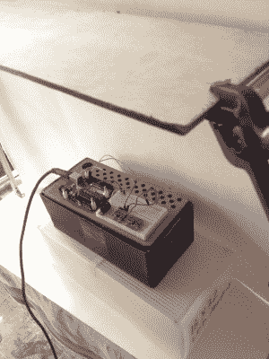

# 测试距离传感器

> 原文：<https://hackaday.com/2017/08/11/testing-distance-sensors/>

我正在做一个项目，这个项目需要根据到物体的测量距离来精确地移动工具。好的，是的，[是数控铣床](http://wp.me/pk3lN-17px)。无论如何，我听说过战斗时间传感器，并决定弄一个来测试，但为了彻底，我还想包括其他距离传感器:一个敏锐的数字距离传感器以及一个更复杂的接近/光线传感器。我把它们都插在试验板上，用一个由铝梁制成的框架将目标材料固定在特定的高度，让它们按部就班地进行测试。

## 反射光传感器

我从 Pololu 分线板中的 [Sharp GP2Y0D810Z0F 数字距离传感器](https://www.pololu.com/product/1134)开始。它支持 400 Hz 的采样速率，这似乎已经足够了——我认为我的项目不需要那么快。

它基本上是基于光的接近传感器的小型替代品，它的工作方式相同，通过照射红外光并寻找它的反弹。缺点是它不会向微控制器返回距离——它是二进制的，只有当物体进入其视野 2 厘米至 10 厘米时才会触发。如果我的工具架上有这个传感器，它可以判断是否有东西挡住了光束，但它不能判断工具离材料有多近。

接下来，我在 Adafruit 的分线板上查看了 [VCN4010](https://www.adafruit.com/product/466) 。像夏普一样，它更像是一个近程传感器，而不是距离传感器。Adafruit 的测试人员发现，它在大约 10 毫米到大约 150 毫米，或者大约 7.5 英寸及以下时效果最好。与夏普相比，VCN4010 的一个优势是内置了一个光传感器。它有一些不错的功能，比如产品现在支持 I2C 和中断，但我仍然发现它不适合应用程序。

当您使用传感器时，它会返回两个数字:环境和邻近。该板的芯片有一个光传感器(环境号码)和一个红外接近传感器(另一个号码)，基本上连续 pings 两个传感器，数据可在串行监视器上查看。

## 飞行时间

忘记红外线和视差， [VL53L0X 飞行时间距离传感器](https://www.adafruit.com/product/3317)使用实际的激光，并测量光反弹需要多长时间。Adafruit 将它放在一个带有电平转换器和 lux 传感器的电路板上，但你可以从易贝或[找到分线板来构建自己的](http://hackaday.com/2017/06/27/tiniest-control-board-fits-inside-an-n-gauge-model-train/)。

它应该提供高达 1200 毫米(约 4 英尺)的精确测量，这显然超过了我的需要。另一方面，VL52L0X 不能测量小于 50 毫米或两英寸的尺寸。我不认为这是一个交易杀手。如果我把传感器安装在工具架上并向下照射，用一个卡盘和一点在中间，两英寸可能没问题。Adafruit 还有另一个突破，只有 5 毫米到 200 毫米之间的尺寸。老实说，我永远不会把传感器放在需要 4 英尺空间才能工作的位置。

两个飞行时间传感器都具有非常紧密的测量锥。忘了超声波到处传播声音的倾向，从错误的东西上反弹回来，理论上污染了其他超声波。ToF 发射出一点激光束，它非常有方向性；它只感知它面前的东西，别的什么都不感知。

不利的一面是，你还需要将激光指向能正确反射它的东西。我用各种材料测试了 ToF，它肯定喜欢白色和灰色。对于我的项目，我可能需要确保有一个样本的东西反射，但不太反射，在激光瞄准。环境照明和反射白色表面可以将精确度提高到+/-3%左右，而不太理想的环境会将精确度降低到 10%以下。对于我的项目来说，精度很重要，10%可能意味着工具接触到材料和它完全丢失之间的差异。

另一个缺点是，你只能将一个传感器连接到你的 I2C 总线，因为它们只有一个硬编码地址。有一些方法可以解决这个问题，甚至有一个[专用的 I2C 地址转换芯片](http://hackaday.com/2017/02/17/ltc4316-is-the-i2c-babelfish/)可以让你摆脱这个困境。好消息是，我不打算使用一个以上的传感器。

我从测试传感器中获得了很多乐趣，并感受到了它们的能力。虽然我对 Sharp 和 VCN4010 的近程传感特性很感兴趣，但我觉得我的应用需要更高的精度。我需要准确地知道工具架降低到什么程度，ToF 的精度似乎完全符合我的目的。