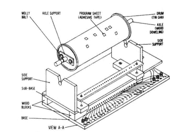
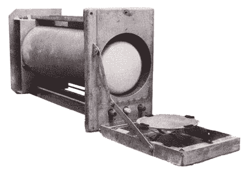
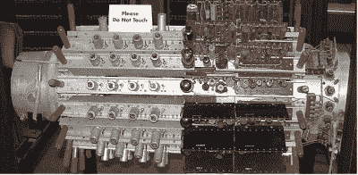
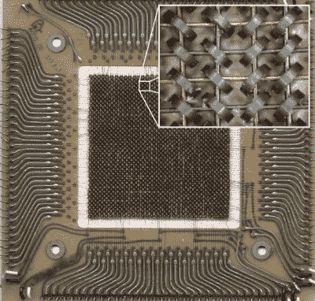

# 感谢回忆:游览旧的令人敬畏的随机存取

> 原文：<https://hackaday.com/2016/03/08/thanks-for-the-memories-touring-the-awesome-random-access-of-old/>

前几天我买了一台新笔记本电脑，不得不在 4GB 内存和 8gb 内存之间做出选择。我还记得当一台 TRS-80 从 4K(如果你算上的话，那就是 000004 GB)涨到 48K 时，那是多么大的一件事。今天，几乎所有的 RAM(至少在个人电脑中)都是动态的——它依靠微小的电容器来保持电荷。这样做的缺点是，当电容刷新时，RAM 有时不可用。好处是你可以在一个小空间里廉价地装入大量的比特。你插在电脑主板上的所有普通内存——DDR、DDR2、SDRAM、RDRAM 等等——都是动态内存。

另一种常见的 RAM 是静态的。这或多或少是一个触发器阵列。它们不需要刷新，但是静态 RAM 单元比动态存储器的同等位大得多，所以静态存储器比动态存储器密度小得多。静态 RAM 也存在于你的电脑中，作为高速缓存，速度是很重要的。

至少目前，这两种 RAM 技术主导了快速随机存取读写存储器市场。当然，有一些新技术可能会得到更广泛的应用。还有像闪存这样有用的东西，但由于速度、耐用性或复杂的写入周期，无法取代常规 RAM。然而，计算机并不总是使用静态和动态 RAM。事实上，他们相对来说是新人。早期的计算机用什么来进行快速读写存储？

## 鼓

令人惊讶的是，磁鼓存储器——一种与现代硬盘类似的技术——首次出现于 1932 年，用于穿孔卡片机。尽管后来的计算机使用该技术作为二级存储(像现代硬盘驱动器)，但一些早期的机器将其作为主存储。

像硬盘一样，磁鼓存储器是铁磁性材料的旋转表面。硬盘使用盘片，磁鼓使用金属圆筒。典型的磁鼓具有多个磁头(每个磁道一个),并且简单地等待，直到所需的位在磁头下面，以执行读或写操作。一些磁鼓的磁头可以在几个磁道上移动，这是现代磁盘驱动器的前身，通常每个表面只有一个磁头。

最初的 IBM 650 有一个 8.5 kB 的磁鼓存储器。阿塔纳索夫-贝里计算机使用了一种类似于磁鼓存储器的设备，但它没有使用铁磁材料。相反，像现代动态 RAM 一样，它使用电容器。

多年来，鼓式存储器作为大容量存储器一直很有用。如果您曾经使用过 BSD Unix，您可能会注意到/dev/drum 是默认的交换设备，这与 PDP-11 上的分页存储很可能是 drum 的时代相呼应。在下面的视频中，您可以看到计算机历史博物馆中的鼓储物单元示例。

 [https://www.youtube.com/embed/eIpoA7Ir9p8?version=3&rel=1&showsearch=0&showinfo=1&iv_load_policy=1&fs=1&hl=en-US&autohide=2&wmode=transparent](https://www.youtube.com/embed/eIpoA7Ir9p8?version=3&rel=1&showsearch=0&showinfo=1&iv_load_policy=1&fs=1&hl=en-US&autohide=2&wmode=transparent)

 另一个明显受鼓内存影响的设计是[1968 年《打造你自己的工作数字计算机》一书中的自制计算机](http://hackaday.com/2015/10/19/diy-computer-1968-style/)。主程序存储器是一个用箔和纸覆盖的燕麦片容器，上面印有指令(见右图)。

## 威廉姆斯电子管

存储信息的第一个电子装置是威廉姆斯(或威廉姆斯-基尔本)电子管。追溯到 1946 年。该设备实际上是一个阴极射线管(CRT ),屏幕上覆盖着一层金属板。虽然许多威廉姆斯电子管存储器使用现成的屏幕上有荧光粉的阴极射线管，但这是不必要的，一些电子管省略了它。

 在阴极射线管的某个 X 和 Y 位置上创建一个点，由于二次发射，会使相关区域产生轻微的正电荷。这也导致了周围区域变得略微带负电。将一个点放在一个点旁边可以消除正电荷。如果一开始就没有正电荷，试图擦除会导致另一个区域的电荷。

通过在写入这些探测点的同时监控板，您可以确定屏幕上该位置之前是否有电荷。虽然你通常认为阴极射线管是从左到右和上下扫描，但没有理由一定是真的，所以威廉姆斯电子管可以执行随机存取。

当然有两个问题。一个是，像动态存储器一样，CRT 上的电荷最终会逐渐消失，所以 CRT 需要定期刷新。另一个是读取威廉姆斯管会破坏该位中的信息，因此每次读取都必须有相应的写入才能将数据放回。

一个典型的管道可以容纳 1K 到 2K 位。有趣的是，曼彻斯特 SSEM 计算机实际上只是为了测试威廉姆斯电子管的可靠性而建造的。调试的一个有趣的特性是，你可以将一个普通的 CRT 与存储管并联，并实时观察内存。

尽管威廉姆斯电子管在一些商用计算机中得到了应用，但它往往会老化，需要经常手动调整才能正常工作。你能想象每次启动电脑都必须手动校准内存吗？谷歌制作了一个关于 SSEM 和威廉姆斯地铁的精彩视频，你可以在下面找到。

 [https://www.youtube.com/embed/SpqayTc_Gcw?version=3&rel=1&showsearch=0&showinfo=1&iv_load_policy=1&fs=1&hl=en-US&autohide=2&wmode=transparent](https://www.youtube.com/embed/SpqayTc_Gcw?version=3&rel=1&showsearch=0&showinfo=1&iv_load_policy=1&fs=1&hl=en-US&autohide=2&wmode=transparent)

美国无线电公司努力生产一种更实用的威廉姆斯电子管，称为选择管。目标是制造比威廉姆斯电子管更快更可靠的东西。1946 年，RCA 计划生产 200 个单位的电子管，可储存 4096 个位元。然而，生产比预期的更困难，为了避免进一步的延误，唯一的客户选择了威廉姆斯电子管。后来，RCA 确实生产了 256 位版本(每辆 500 美元——所以 5 辆车就能买一辆新的 1954 年 Corvette)。它们只用于兰德公司的 JOHNNIAC(尽管，公平地说，这台机器使用了 1000 多根管子——相当于 200 艘新巡洋舰的费用)。

## 水银延迟线

 老式计算机中另一种常见的内存形式是水银延迟线。我几乎没有在这里包括它，因为它真的不是随机存取。然而，许多旧的计算机系统使用它(包括一些也使用威廉姆斯管),它被用于 UNIVAC 一号

这种存储器的 1953 年专利实际上并没有将延迟介质限制在水银上。关键是要有某种能延迟信号一段时间的元件。这也可以通过其他方式实现(包括使用旋转玻璃盘的提议)。

水银又贵又重，而且有毒。然而，它是石英压电晶体的良好声学匹配，尤其是在保持加热时。这很重要，因为延迟线就是这样工作的。基本上，位元是由水银长管一端的脉冲表示，另一端接收。到达的时间取决于声音在水银中的速度和管子的长度。

显然，在管道末端读取数据会删除它，因此有必要将位路由回管道的另一端，以便整个过程可以重复。如果您不想写入任何新数据，您可以想象所有的位都在水银中传输，输出的第一位，随后是每个后续的位，所有的位都以相同的速度传输(大约每秒 1450 米，取决于温度)。根据位脉冲的长度和列的长度，在实际的电子管中可以存储 500 或 1000 位。

为了读取数据，输出端的石英晶体将脉冲转换成电能。为了写入数据，计算机可以在数据流中插入一个新的位，而不是循环一个旧的位。EDSAC 使用 32 条延迟线来保存 512 个 35 位字(实际上，水银管保存更多的数据，但有些用于内务处理，如跟踪数据的开始；后来的一个项目将计算机的内存增加了一倍)。UNIVAC I 每行有 120 位，使用了许多水银柱来存储 1000 个字。你可以在下面的视频中看到 UNIVAC 的记忆。

 [https://www.youtube.com/embed/kignGE77l_I?version=3&rel=1&showsearch=0&showinfo=1&iv_load_policy=1&fs=1&hl=en-US&autohide=2&wmode=transparent](https://www.youtube.com/embed/kignGE77l_I?version=3&rel=1&showsearch=0&showinfo=1&iv_load_policy=1&fs=1&hl=en-US&autohide=2&wmode=transparent)

## Dekatron

[德卡龙](http://hackaday.com/2013/07/26/drive-bay-form-factor-dual-dekatron-readouts-for-ram-and-cpu-usage/)如今在想要转向不同事物的数码管钟制造商中很受欢迎。顾名思义，电子管有 10 个阴极，内部有一种气体(通常是氖，但有时是氢)。通过向设备发送脉冲，电荷可以从一个阴极移动到另一个阴极。电子管可以作为十进制计数器，但也可以存储十进制数字。

实际上有两种迪卡侬。一个计数管与所有阴极只有一个连接。这使得它像一个分频器，阴极的数量(不一定是 10)决定了分频比。计数器/选择器电子管有单独的阴极引脚，因此您可以将它们用作内存或可编程分频器。

就像一个威廉姆斯电子管，德卡龙是你可以看得见的记忆。哈威尔计算机是 20 世纪 50 年代的一种中继计算机，使用迪卡龙作为存储器。英国国家计算博物馆修复了这台机器，并利用其内存的视觉特性向参观者演示计算机概念。你可以在下面的视频中看到这台机器在运转。

 [https://www.youtube.com/embed/vVgc8ksstyg?version=3&rel=1&showsearch=0&showinfo=1&iv_load_policy=1&fs=1&hl=en-US&autohide=2&wmode=transparent](https://www.youtube.com/embed/vVgc8ksstyg?version=3&rel=1&showsearch=0&showinfo=1&iv_load_policy=1&fs=1&hl=en-US&autohide=2&wmode=transparent)

## 磁心存储器

 最成功的早期记忆无疑是核心记忆。每一位内存都由一个小小的铁氧体圆环组成，导线穿过圆环。通过控制通过导线的电流，环形物(或核心)可以有顺时针或逆时针的磁场。感应线允许内存控制器确定特定内核包含的方向。然而，阅读领域也改变了它。你可以在下面的 1961 年美国陆军训练电影中了解更多关于它是如何工作的。

 [https://www.youtube.com/embed/X0WnddW5gZI?version=3&rel=1&showsearch=0&showinfo=1&iv_load_policy=1&fs=1&hl=en-US&autohide=2&wmode=transparent](https://www.youtube.com/embed/X0WnddW5gZI?version=3&rel=1&showsearch=0&showinfo=1&iv_load_policy=1&fs=1&hl=en-US&autohide=2&wmode=transparent)

核心内存的一个优点是它是非易失性的。当你重新打开电源时，记忆的状态就是你离开时的状态。它还非常耐辐射，这就是为什么航天飞机计算机使用核心内存，直到 20 世纪 90 年代。

核心内存的价格很高。最初，成本约为每比特 1 美元。最终，该行业将价格压低至每比特 0.01 美元。为了客观地看待这个问题，我在新蛋上做了一个快速搜索。没有寻找最低的价格，我随机挑选了一对 8GB DDR3 1600 MHz 记忆棒，售价不到 69 美元。这相当于每千兆比特 0.54 美元。即使以每比特 0.01 美元计算，1 千兆位的核心内存也要花费 1000 万美元(还不算放进去的巨大空间)。

磁芯存储器成本高的主要原因之一是手工制造过程。尽管进行了几次自动化生产的努力，但组装核心内存的大部分工作都是手工完成的。你认为人们对此很在行，但这是一项艰巨的任务。不信？看看下面的 Magnus Karlsson 制作他自己的核心内存板的视频。

 [https://www.youtube.com/embed/P7gtFQs2g38?version=3&rel=1&showsearch=0&showinfo=1&iv_load_policy=1&fs=1&hl=en-US&autohide=2&wmode=transparent](https://www.youtube.com/embed/P7gtFQs2g38?version=3&rel=1&showsearch=0&showinfo=1&iv_load_policy=1&fs=1&hl=en-US&autohide=2&wmode=transparent)

磁芯存储器的一种变体是镀线存储器。这在操作上是相似的，除了它用保存磁性状态信息的镀线代替了磁性圆环。另一种变体，twistor，使用缠绕在电线上的磁带代替电镀。所谓的薄膜存储器(用于 UNIVAC 1107)在玻璃基底上使用微小的磁性材料点，也像磁心一样工作。所有这些的优点是自动化生产是可行的。然而，廉价的半导体存储器淘汰了磁芯、电镀导线和扭线晶体管。

你可以在下面的美国电话电报公司视频中看到 twistor memory 是如何制作的，这几乎就像 1976 年版的“它是如何制作的”

 [https://www.youtube.com/embed/CJ7eWZBBnhs?version=3&rel=1&showsearch=0&showinfo=1&iv_load_policy=1&fs=1&hl=en-US&autohide=2&wmode=transparent](https://www.youtube.com/embed/CJ7eWZBBnhs?version=3&rel=1&showsearch=0&showinfo=1&iv_load_policy=1&fs=1&hl=en-US&autohide=2&wmode=transparent)

## 泡泡

在扭转存储器的开发过程中，贝尔实验室的研究人员注意到他们可以移动磁带上的磁场。对这一效应的研究导致了磁泡的发现。将这些放在石榴石衬底上，可以创建非易失性存储器，这几乎是延迟线的微观版本，使用磁泡代替水银中的声波。

当磁泡存储器出现时，它显然会接管计算机行业。快速而密集的非易失性存储器可以作为主存储器和大容量存储器。许多大公司都全力以赴，包括德州仪器和英特尔。

如你所料，这并没有持续多久。硬盘和半导体存储器变得更便宜、密度更大、速度更快。对于需要高可靠性大容量存储或在磁盘存储不实用的环境中工作的公司来说，磁泡存储器成了一种选择。

然而，在 1979 年，正如你在下面的视频中看到的，贝尔实验室宣布了“泡沫时代”的开始。

 [https://www.youtube.com/embed/iEub5U9UeX8?version=3&rel=1&showsearch=0&showinfo=1&iv_load_policy=1&fs=1&hl=en-US&autohide=2&wmode=transparent](https://www.youtube.com/embed/iEub5U9UeX8?version=3&rel=1&showsearch=0&showinfo=1&iv_load_policy=1&fs=1&hl=en-US&autohide=2&wmode=transparent)

## 下一步是什么？

我敢肯定，有一段时间，核心内存似乎是内存技术的极致。然后别的东西来了，完全取代了它。很难想象什么会取代动态内存，但我不怀疑会有什么东西取代它。

我们已经开始看到的一个东西是 F-RAM，它几乎就像芯片上的核心存储器。它(或其他新贵，如相变内存)会取代当前的技术吗？还是都会步泡泡内存芯片的后尘？如果说历史教会了我什么，那就是只有时间能证明一切。

## 信用

由 Sk2k52 通过[维基共享](//commons.wikimedia.org/wiki/)在 [GFDL](http://www.gnu.org/copyleft/fdl.html "GNU Free Documentation License") 的许可下生产的。

水银延迟线 [CC BY-SA 3.0](http://creativecommons.org/licenses/by-sa/3.0/ "Creative Commons Attribution-Share Alike 3.0") ，【https://commons.wikimedia.org/w/index.php?curid=64409】T2

迪特·瓦赫特拍摄的德卡龙图片-[http://www . tube-tester . com/sites/谢妮/datdekat/Z303C/z303c.htm](http://www.tube-tester.com/sites/nixie/datdekat/Z303C/z303c.htm) ，署名，【https://commons.wikimedia.org/w/index.php?curid=22846430】T2

[铁氧体磁芯存储器](https://commons.wikimedia.org/wiki/File:Ferrite_core_memory.jpg#/media/File:Ferrite_core_memory.jpg)由[猎户座 8](Orion_8)——由[磁芯存储器 card.jpg](Magnetic_core_memory_card.jpg "File:Magnetic core memory card.jpg")和[磁性 core.jpg](Magnetic_core.jpg "File:Magnetic core.jpg")组合而成..2.5 通过[维基共享](//commons.wikimedia.org/wiki/)在 [CC 下授权。](http://creativecommons.org/licenses/by/2.5 "Creative Commons Attribution 2.5")