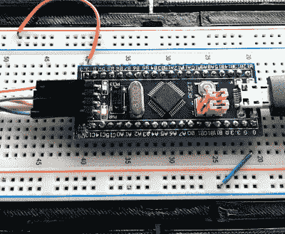
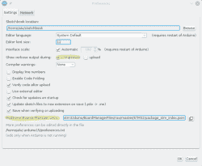
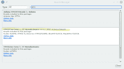
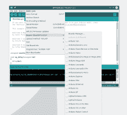
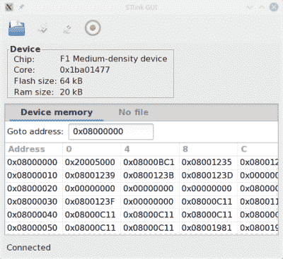
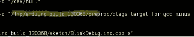
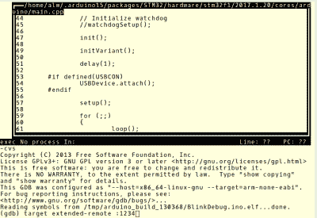

# 售价 2 美元的 32 位 Arduino(带调试功能)

> 原文：<https://hackaday.com/2017/03/30/the-2-32-bit-arduino-with-debugging/>

我对 Arduino 有点又爱又恨。但是，如果我对最初的产品有两个严重的不满，那就是 8 位 CPU 和缺乏适当的调试支持。现在 Arduino IDE 中有大量的 32 位支持，所以这解决了第一个大问题。然而，拥有一个真正的调试器有点棘手。我最近开始使用一种便宜的“蓝色药丸”STM32 ARM 板。这些通常只需几美元就能从中国渠道买到。我花了大约 6 美元买了我的，因为我想在一周内拿到它，而不是一个月。这还是很便宜的。该芯片具有许多出色的调试功能。我们能解锁吗？你可以，如果你有正确的方法。

## 那个角色

为了几块钱，你不能抱怨硬件。STM32F103C8T6 板载是一款运行频率为 72 MHz 的 Cortex-M3 处理器。有 64K 的闪存和 20K 的内存。有一个 ~~mini~~ micro-USB 可以充当编程端口(但不是一开始)。虽然这是一个 3.3 V 器件，但也有许多 5 V 兼容引脚。

你可以在这个 wiki 上找到更多的信息。这块板子或多或少是一辆[枫木迷你](https://www.leaflabs.com/maple/)的克隆版。事实上，这是你使用它们的一种方式。您可以使用串行或 ST-Link 端口对 Maple bootloader(全部开源)进行编程，并像 Maple 一样使用它。也就是说，您可以通过 USB 电缆对其进行编程。

[](https://hackaday.com/wp-content/uploads/2017/03/blue.png)

不过，从我的角度来看，我不想尝试通过串行端口进行调试，如果我已经设置了 ST-Link 端口，我不在乎引导加载程序。你可以便宜地买到充当 USB 到 ST-Link 设备的硬件，但我碰巧有一个 STM32VLDISCOVER 板。大多数 STM32 演示板都有一个 ST-Link 编程器，可以在没有原始目标硬件的情况下使用。在一些较旧的电路板上，你必须切断走线，但大多数新电路板只有两个跳线，当你想用编程器驱动另一个器件时，你可以移除它们。

“蓝色药丸”的名称只是一个常见的昵称，指的是矩阵，而不是你在电视广告上看到的药物。电路板的一边有四个引脚，以容纳 ST-Link 接口。引脚顺序与 STM32VLDISCOVER 上的四个引脚不匹配，因此您不能只使用四引脚直电缆。你还需要给电路板供电，因为它也要给程序员供电。我从 STM32VLDISCOVER 板(从 USB 获得电源)获得电源，并将其连接到我的试验板，因为这样很方便。

## 这个计划

编写开发板的程序很容易——我知道社区已经做了很多工作来为它创建一个支持包。你需要一个最新版本的 Arduino IDE(不是默认 Ubuntu 库中显示的版本)。我从 Arduino 网站下载了 1.8.1 版本，以防万一。这是我总的进攻计划的第一步:

1.  加载最新的 Arduino IDE
2.  将编译消息设置为详细
3.  使用板管理器安装 STM32 F1 软件包
4.  获取更多工具
5.  捕获构建目录
6.  运行 GDB 的正确版本

Arduino IDE 的最新版本允许您使用“板管理器”(可从“工具”|“板”菜单中获得)来选择平台。然而，如果你看，你不会在列表中看到这个板。您需要告诉 IDE 从哪里获得第三方支持包。为此，您可以转到首选项菜单项(在 Windows 和 Linux 的文件菜单上；我知道它在 Mac 的 Arduino 菜单上)。第二步也需要同样的首选项对话框。

[](https://hackaday.com/wp-content/uploads/2017/03/pref.png) 第二步并不是绝对必要的，但它会让第五步更容易。只需选中“编译期间显示详细输出”您真正需要知道的是 IDE 用于构建的临时目录，正如您将看到的，这是最简单的方法。

在首选项屏幕的更下方是“附加董事会经理 URL”条目如果已经有了，你应该点击这个小按钮来编辑列表。如果它是空的，您可以添加以下 URL:

```
https://github.com/stm32duino/BoardManagerFiles/raw/master/STM32/package_stm_index.json
```

[](https://hackaday.com/wp-content/uploads/2017/03/boardm.png) 现在你可以回到工具|电路板菜单，选择电路板管理器，并搜索 STM。你可能会看到一些包装(我有三个)，但 F1 的一个将特别提到蓝色药丸。点击按钮安装，并等待它做它的事情。

安装完成后，你的面板菜单上会有一些新条目。当你选择了蓝色药丸，你就可以选择几个上传选项，包括我们想要的:ST-Link。

## 编码

[](https://hackaday.com/wp-content/uploads/2017/03/board.png) 这个包里有你需要的所有东西，可以用各种方法构建和下载程序，包括 ST-Link。然而，它没有你需要做调试的特殊工具。

构建工具非常简单。GitHub repo 有代码和一些简单的构建指令。你确实需要 libusb 和 CMake，但是这个页面解释了所有的东西，一旦你有了所有的部分，构建就会很快。对于许多操作系统选择，您也可以使用预构建的二进制文件。

您还需要知道 ST-Link 板的 USB ID，并将其添加到 Linux 的 udev 规则中。如果你不这样做，你将需要根编程设备，这不是一个好主意。但是，根据您使用的 ST-Link 接口，它可能已经存在于其他软件或 Arduino 安装中。我会先尝试一个测试，如果它只作为根用户工作，你需要更新 udev。

如果您自己构建，我建议运行工具 stlink-gui 来执行测试。您也可以运行`st-info --descr`

如果运行 stlink-gui，在 ST-Link 和蓝色药丸通电并连接的情况下，按下 connect 按钮。你应该得到关于设备的信息。如果没有，请以 root 用户身份尝试。如果这有效，你需要更新 udev。我创建了一个文件，/etc/udev/rules . d/45-stlink . rules。

```
ACTION=="add" SUBSYSTEM=="usb", ATTR(idVendor)=="0483", 
     ATTR(idproduct)=="3744", MODE="0666", GROUP="usbusers"
```

您需要为您的特定接口修改 USB ID(我的是 0483:3744；lsusb 命令会有所帮助)。该模式允许所有用户读写设备。我将组所有者设置为 usbusers，但是因为每个人都可以访问设备，所以严格来说这可能不是必需的。

[](https://hackaday.com/wp-content/uploads/2017/03/gui.png)

一旦你能做到这一切，试着运行 IDE 例子中的闪现草图。确保从 Arduino IDE 的工具菜单中选择“上传方法:STLink”。如果它不起作用，你可能需要使用你刚刚构建的工具，而不是 Arduino IDE 自带的工具。我的可以工作，但是调试需要定制版本(因为 Arduino 包没有附带那个特定的工具版本)。

## 查找工具和构建目录

Arduino IDE 非常友好，所以它并不试图为所有用户安装电路板之类的东西，因为那需要 root 用户。您加载的板包位于您的主目录中的~/. arduino 15/packages/STM 32/tools 下。有一个 STM32Tools 目录，再往下几层，您会找到 ST-Link 工具的副本。如果它们不起作用，您可以手动运行您在上一步中构建的工具来进行上传。当我们调试时，我们无论如何都要这样做。

但是真正重要的是，在 STM32/tools 目录下是另一个目录，其中有 IDE 用来编译代码的编译器。还有一个 GDB 的匹配版本 GNU 调试器——你必须使用它。

如果你加载了一个例子，确保你把它保存到你自己的目录下(我讨厌说 sketchbook)。如果不这样做，IDE 将会为您所做的任何更改创建一个私有副本，事情会变得混乱。

进行构建(复选标记图标),假设您在步骤 2 中选中了复选框，您将从构建工具中获得大量输出。您可能会验证正在使用的编译器就是我们上面提到的那个。您还会看到您的程序被添加到其他东西中，并放在一个名为/tmp/arduino_build_XXXXXX 的目录中，其中 XXXXXX 是一个数字。您的源代码将位于这个名为 sketch/Blink.ino 的目录中。顶层目录中是可执行文件 Blink.ino.elf。这是您需要调试的内容。

[](https://hackaday.com/wp-content/uploads/2017/03/tmpdir.png)

如果你愿意编辑你的 Arduino 设置文件(只要确保 IDE 没有首先运行)，你也可以使用 build.path 键强制一个构建目录。IDE 确实有一个“导出二进制文件”命令(在“草图”菜单上)，它可以编译到您的草图文件夹中。但是，这个。bin 文件没有足够的信息供调试器使用。

## 终于调试成功了

最后可以调试了。使用 arm-none-eabi-gdb 可执行文件，该文件与用于编译程序的 GCC 位于同一目录。这很重要。如果版本不匹配，你会得到奇怪的错误，即使许多事情似乎工作。将 elf 文件的名称作为参数提供给 GDB。

如果您愿意，可以使用-tui 标志来 GDB，以获得一种基于文本的 GUI。不管怎样，你还有一步要走。您之前构建的 st-util 工具可以监听 ST-Link 接口，并提供一个 GDB 可以用来进行调试的套接字。

像这样开始:

```
st-util -p 1234
```

这将使它侦听端口 1234。如果您已经将该端口用于其他用途，请选择另一个端口。请记住，在 Linux 上，只有 root 用户可以监听 1024 以下的端口，所以选择一个更大的数字。

运行之后，您用您的 elf 文件名启动 GDB 并发出命令:

```
target extended-remote :1234
```

或者，我最近开始使用:

```
target remote :1234
```

您可以在不同的计算机上运行这两个部分，所以如果需要的话，可以使用主机名(即 devbox21:1234)。大多数时候，这些程序都在同一个盒子里，你可以像我一样使用 localhost 或者省略它。remote 和 extended-remote 的区别在于，服务器不会在 extended-remote 会话结束时自行关闭。它经常工作，但我见过无论如何都必须重启服务器的情况，所以最近我一直使用普通的遥控器来强迫我在每次会话时重启它。

[](https://hackaday.com/wp-content/uploads/2017/03/gdb.png)

一个“加载”命令到 GDB 现在会闪存你的程序到董事会。加载后的典型会话可能是:

```
break main
continue
list
n
n
n
```

“n”命令跳到下一条指令。你可以在更早的帖子中找到更多关于使用 GDB 的信息。您可能还会发现观看本视频中的演练更容易:

 [https://www.youtube.com/embed/D-MbC9N5U7o?version=3&rel=1&showsearch=0&showinfo=1&iv_load_policy=1&fs=1&hl=en-US&autohide=2&wmode=transparent](https://www.youtube.com/embed/D-MbC9N5U7o?version=3&rel=1&showsearch=0&showinfo=1&iv_load_policy=1&fs=1&hl=en-US&autohide=2&wmode=transparent)


一些警告。首先，优化会导致您的代码行乱序执行，甚至倒退。这还会导致变量在优化后不可见。另一件要注意的事情是，在某些情况下，调试器在内部单步执行。例如，这会导致延迟例程的执行非常缓慢。您可以在调试时减少或消除延迟，或者在尝试单步执行而不是放置断点时要小心。

## 最后的想法

如果 Arduino IDE 允许你在里面调试，那就太好了。然而，使用 Eclipse(和 GDB)或 Visual Studio(如果你使用 Windows)有办法做到这一点。如果你像我一样喜欢命令行，你可能会考虑使用 Arduino 的[makefile 来代替 IDE。如果您对命令行不满意，可以尝试 GDB 的 GUI shells。如果你更愿意黑掉 ST-Link 固件，我们](https://hackaday.com/2015/10/01/arduino-development-theres-a-makefile-for-that/)[也看到过这样做的](https://hackaday.com/2016/12/10/reverse-engineering-an-st-link-programmer/)。如果你错过了做 printf 的，你可能想要尝试一个[黑魔法探针](https://hackaday.com/2016/12/02/black-magic-probe-the-best-arm-jtag-debugger/)，它应该和 ST-Link 接口工作的差不多，但是也为 printf 和其他恶作剧提供了一个串行端口。

顺便说一下，Arduino 并不是这款主板的唯一选择。可以使用 mBed 和其他开发工具。但这是未来文章的主题。