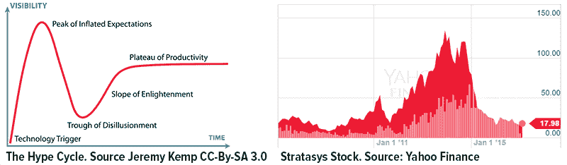
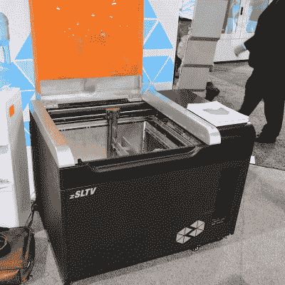
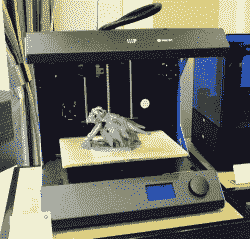
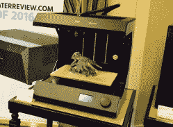
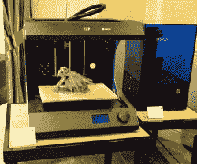
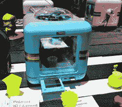
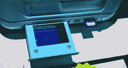

# 消费电子展上的 3D 打印机

> 原文：<https://hackaday.com/2017/01/10/the-3d-printers-of-ces-2/>

CES 已经结束了，现在我们可以退一步，远离贸易展览摊位，并找出明年 3D 打印的发展方向。

炒作周期是解释时尚和技术进步趋势的一个好方法。虚拟现实和自动驾驶汽车现在还处于炒作周期的早期*。智能手机正处于生产力的停滞期。3D 打印在幻灭的低谷中低头。*

对于今年的 CES 来说，3D 打印甚至不是一个产品类别。事实上，我在 Prusa 的展位上找到的官方文件将他们的公司列入了“辅助技术”类别。对于公众对 3D 打印的看法来说，现在是黑暗的日子。这种感觉的来源可以在一对图表中清楚地呈现出来:

3D 打印的概念已经不可阻挡地与 Makerbot 联系在一起。Makerbot 在*展示了唯一的 3D 打印机《科尔伯特报告*。只有 Makerbot 的 3D 打印店面出现在 CNN 上。这种情况已经持续了五年，希望情况会有所好转。

这并不意味着 3D 打印没有进步。事实上，这是有史以来最好的一次。CES 拥有我多年来见过的最具创新性的打印机。我瞥见了今年最畅销的打印机(将于 4 月上市)。树脂机器很快就会非常受欢迎。CES 提供了什么？下面来看看吧。

### 大型机器

大型 3D 打印机已经存在多年了。这并不是说建造一台大型 3D 打印机很容易，材料的强度并不是线性增长的，伽利略在 400 年前就发现了这些东西。我只需要指出[部分爸爸](http://hackaday.com/2014/09/20/nyc-makerfaire-a-really-really-big-printer/)作为制造一台真正巨大的打印机有多难的证据。

 然而，今年我们看到了一些制造更大打印机的有趣方法。[泰坦机器人公司的克洛诺斯](http://hackaday.com/2017/01/08/ces2017-really-fast-3d-printing-for-large-builds/)是一台五刀架机器，使用非常先进的切片算法来更快地打印大型物体。克洛诺斯是基于 [Autodesk 在项目 Escher](https://vimeo.com/157523884) 上的工作(在 9 号码头有一个克洛诺斯)，使用多个挤压机和喷嘴打印一个物体。这是非常，非常令人兴奋的东西，在野外看到它真是太棒了。

大型细丝打印机是一回事，但如果你真的想要一个令人难以置信的构建，你需要从 UniZ 查看 zSLTV。

zSLTV 是一种树脂打印机，但与其他树脂打印机不同的是，它要么将零件拉上来，要么将零件沉入池中，而是横向打印。基本上就是一个带 Z (X？还是 Y？)平台浸没在树脂中。浴缸的一侧是一个液晶显示器和几个紫外线发光二极管。它体积大，速度快，分辨率非常高。是的，你需要 60 或 70 加仑的树脂，但如果你需要这种能力，你可能不太在乎成本。

### 便宜的机器

去年，随着一款非常便宜的细丝打印机和一款便宜得令人难以置信的树脂打印机的发布，Monoprice 掀起了一阵波澜。树脂打印机是一个失败的实验，从未发布，[但 Monoprice MP Mini Select 真的非常非常好](http://hackaday.com/2016/06/13/review-monoprice-mp-select-mini-3d-printer/)。

今年，Monoprice 在价格低廉的机器[上加倍下注，推出了 150 美元的 delta 打印机](http://hackaday.com/2017/01/07/ces2017-monoprice-unveils-expanded-line-of-3d-printers/)，这可能是我们见过的最便宜的树脂打印机。将会有 MP Mini Select 的第二个版本，改进直接来自社区的修补程序。下个月，Monoprice 将发布他们的顶级树脂打印机，价格与市场上的 Form1s 和其他高端 STL 打印机相当。在 Monoprice 套件中值得注意的还有 MP 系列商业打印机，Monoprice 团队称之为“3Mill”。这将在几个月后以 800 美元的价格上市。

一两年前，似乎每个公司都在 CES 上展示 3D 打印机。今年？没有那么多。博世展台上没有展出 Dremel 打印机，但宝丽来确实有这种微型打印机:

The Polaroid printer

The Polaroid printer, with slide-out control panel

### 软件

没有驱动硬件的软件，硬件是没有任何用处的，今年 Lulzbot 率先发布了一些伟大的公告。软件堆栈一直是树脂打印的弱点，现在 Lulzbot 正在与 [Monkeyprint](http://robotsinthesun.org/aleph-objects-tests-monkeyprint-dlp-printer-software/) 合作，改善 SLA 打印的状态。他们正在研究他们自己的 Cura 版本，Blender 基金会得到了 Lulzbot 的一些帮助。

### 材料

MarkForged 展台正在展示一些令人印象深刻的金属印刷零件。他们的系统使用灯丝中的粉末金属。印刷完成后，塑料被溶解，零件被烧结。这是一台大约 10 万美元的昂贵机器，但它仍然是一项非常有趣的技术。

所有细丝 3D 打印机都有一个基本问题，即它们生产的零件的强度。零件在 X 和 Y 轴上很坚固，但在 Z 轴上不坚固，因为层间结合是薄弱环节。 [Essentium Materials](http://essentiummaterials.com/) 有解决方案。他们正在生产一系列包有一层非常薄的碳的灯丝。一旦零件被打印出来，就用射频加热，将各个层相互粘合起来。这是一个聪明的解决方案，在现有打印机上实现起来相对简单。

 [https://www.youtube.com/embed/DmL5hN4Okjc?version=3&rel=1&showsearch=0&showinfo=1&iv_load_policy=1&fs=1&hl=en-US&autohide=2&wmode=transparent](https://www.youtube.com/embed/DmL5hN4Okjc?version=3&rel=1&showsearch=0&showinfo=1&iv_load_policy=1&fs=1&hl=en-US&autohide=2&wmode=transparent)

### 期待 2018 年

3D 打印的未来会怎样？普通大众需要一段时间才能意识到你可以做的不仅仅是印刷低利润的口袋妖怪。在那之前，我们很乐意坐下来享受 3D 打印所能提供的最好的东西。技术从未如此之好，从现在开始只会越来越好。