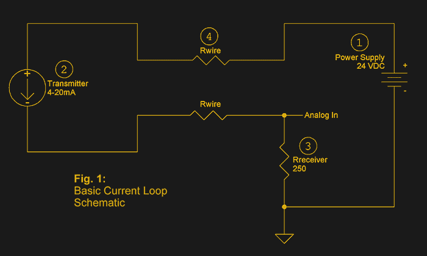

# 4-20 MA 电流环路

> 原文：<https://hackaday.com/2017/07/19/the-4-20-ma-current-loop/>

大多数微控制器内置的 I/O 功能使得测量模拟世界变得很容易。假设您想要构建一个温度数据记录器。你需要做的只是获得某种具有线性电压输出的传感器，它可以代表你需要监控的温度范围——零到五伏代表 0 到 100°C。将传感器连接到模拟输入，编写一点代码，就大功告成了。简单的东西。

现在来个转折:你需要把传感器安装在远离微控制器的地方。电线越长，电压降就越大，直到你的代表 100 范围的 5 伏摆动更像 1 伏摆动。此外，您的长传感器导线将像一个很好的天线一样拾取各种噪声，这将使挖掘可用的电压信号变得更加困难。

幸运的是，工业过程工程师很久以前就通过使用电流环路进行检测和控制，找到了解决这些问题的方法。最常见的标准是 4mA 至 20mA 电流环路，这里我们将了解它的由来、工作原理，以及如何在微控制器项目中利用这一基本的过程控制技术。

Basic 4-20mA current loop. Source: [Building Automation Products Inc.](https://www.bapihvac.com/application-note/the-science-of-4-to-20-ma-current-loops-application-note/)

### 从空气到电子

现在用于过程控制的标准 4-20 mA 电流环路直接源自工业自动化的早期创新——气动过程控制。在电气控制普及之前，数英里长的气动管线蜿蜒穿过工厂，不仅提供了移动致动器的动力，还提供了感知条件的能力。工艺工程师使用基于压力的气动信号系统——传感范围的一端为 3 PSI，另一端为 15 PSI。这种传感器将基于过程变量改变管线中的压力，并且可以用作图表记录器的输入，以直接控制阀，或者甚至通过复杂的气动逻辑控制器与其他气动传感器和致动器协同作用。

虽然气动系统今天仍在大量使用，特别是在电力行业，但 4-20 mA 电流环路系统在 20 世纪 40 年代和 50 年代成为事实上的标准。在当前的回路系统中，传感器监控一些过程变量——温度、压力、流量等。—连接到变送器。变送器与 DC 电源串联，在工业环境中通常为 24 伏。变送器负责将传感器的输出转换为 4 mA 至 20 mA 之间的电流。

基尔霍夫电流定律告诉我们，无论电压是多少，电路中每一点的电流都是相同的。因此，如果因为连接到变送器的电线有半英里长而导致电压大幅下降，或者因为工厂其他地方的一台大型电机启动而导致回路电压发生变化，这都无关紧要——对于给定的过程变量，变送器会保持电流恒定。

当然，电流回路不仅限于传感器。从阀门到电机驱动的各种执行器都可以由一个 4-20 mA 环路控制。数据采集和显示也是可能的，图表记录器、仪表和指示器都可用于循环。

但是为什么 4ma——或 3 PSI——是环路的下限，而不是零？简单:因为它提供了固有的错误检测。如果回路电流的底值被设置为零，则不可能区分传感器上的合法下限读数和断开的回路导线之间的差异。

### 一个电阻器

那么，如何将 4-20 毫安的设备整合到您最新的 Arduino 项目中呢？只需在回路中放入一个电阻，测量电阻两端的压降，就能把电流变回电压。[AvE]通过数学计算告诉我们，一个 250 欧姆的电阻为我们提供了 1 伏到 5 伏的摆幅，这对于下面视频中的 Arduino 模拟输入来说是完美的(警告——前面有点 NSFW 语言)。

 [https://www.youtube.com/embed/6di24oIdISs?version=3&rel=1&showsearch=0&showinfo=1&iv_load_policy=1&fs=1&hl=en-US&autohide=2&wmode=transparent](https://www.youtube.com/embed/6di24oIdISs?version=3&rel=1&showsearch=0&showinfo=1&iv_load_policy=1&fs=1&hl=en-US&autohide=2&wmode=transparent)

您可能不像工业自动化领域的工作人员那样容易接触到电流环路传感器和执行器，并且您的项目可能无法真正利用所有 4-20 mA 标准提供的优势。但是很高兴知道当你需要它的时候它就在那里。