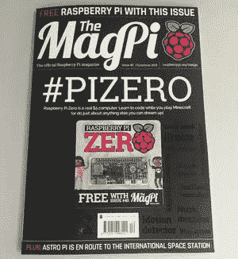

# 5 美元的树莓派零

> 原文：<https://hackaday.com/2015/11/25/the-5-raspberry-pi-zero/>

在过去一周左右的时间里，关于新的树莓派的谣言一直在互联网上流传。猜测范围从升级的 Model A 或计算模块到带有千兆以太网、USB 3.0、SATA 和 CPU 的巨型主板，甚至还没有投入生产。现在是时候了，真正的新闻甚至更有趣:这是一个 5 美元的树莓派零。这是迄今为止最小的 Pi，同时仍保持核心体验。

最近几个月，微型 Linux 主板跟随技术的发展，变得越来越强大，越来越便宜。对此最纯粹的表述是 c . h . I . p . T1，这款售价 9 美元的单板 Linux 电脑仅仅因为它的便宜就引起了轰动。树莓派 Zero 更便宜，看规格表，更有能力。

Raspberry Pi Zero 的核心是 Broadcom BCM2835，与最初的 Raspberry Pi 中的片上系统相同。这一次，它的运行速度为 1GHz，比 Raspberry Pi 1 快 40%。该板有 512 MB 的 RAM，当然，像所有 pi 一样，还包括标准的 40 针插头。

The December issue of MagPi includes a Pi Zero on the cover

构建这样一个小平台意味着 Raspberry Pi 基金会需要从零开始削减一些端口。以太网和 Pi 型号 B+中的四个 USB 端口都不见了；根本没有地方放它们。相反，Pi Zero 包括一个迷你 HDMI 插座和两个微型 USB 端口——一个用于电源和数据，另一个用于 USB OTG。复合视频保留在未填充的标头上，通过 microSD 卡插槽存储。

自从树莓 Pi 发布以来，它已经成为事实上的微型 Linux 电脑。尽管出现了一些王位竞争者，但最有趣的是最小的。虽然 Raspberry Pi 计算模块不太成功，但我们已经看到了许多像 ODROID-W 和杨桃这样的小电路板进入了最酷的项目。部分原因是这些模块的大小，能够适应任何东西是一个很大的好处。Pi Zero 的价格只有 5 美元，而且没有因运费而受到批评的 20 美元，这将是一款非常非常受欢迎的主板。

从今天开始，树莓 Pi Zero 应该可以从常见的供应商那里买到——elements 14、Pi Hut、Pimoroni、Adafruit 和 Micro Center。如果你订阅了官方杂志《树莓派》Magpi，你很幸运:12 月刊的封面上将会有一本《零圆周率》。