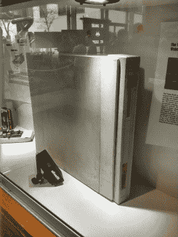

# 橡子阿基米德 30 岁

> 原文：<https://hackaday.com/2017/07/17/the-acorn-archimedes-at-30/>

作为后来改变世界的事情开始的偶然见证人的麻烦在于，当时你很少意识到你所看到的。以 Acorn Archimedes 为例，第一台 ARM 处理器就是为它开发的家用电脑[，它刚刚过了 30 岁](https://www.youtube.com/watch?v=rh7kpkwXnwA)。如果你是 1987 年的一名英国小学生，在学校计算机实验室的一排英国广播公司的微型计算机旁发现了一对新机器，那肯定是一件令人兴奋的事情，毕竟这些机器是每个人都在谈论的。但是，他们独特和创新的处理器可能会继续产生一系列继任者，最终在 30 年后为世界上这么多地方提供动力，这可能是 80 年代的青少年从未想到的事情。

[Computerphile]在休息时间下面的视频中，看看第一批阿基米德机器。我们了解了一些操作系统的历史和描述，还看了一个仍然在盒子里的早期模型和阿基米德线的最后一个。对于这个硬件时代的所有者来说，熟悉的是翻阅一堆软盘以找到一个仍然工作的那一刻，然后我们看到了平台的定义游戏，[大卫·布拉本]的*着陆器*，它成为了商业 *Zarch* ，并为他的*病毒*和*病毒 2000* 游戏提供了模板。

The Trojan Room Coffee Cam Archimedes, on display at the Cambridge University Computing Department.

我们看到 RiscOS 操作系统从 rom 中以闪电般的速度启动，即使在 20 年后的老式飞利浦复合显示器上仍然表现良好。如果你是 1987 年的那个孩子，当你进入大学，坐在早期的 Windows 版本面前时，你会大吃一惊，主流计算机要过好几年才能与你的第一个图形用户界面相匹配。

阿基米德线和它的后继者一直持续到 20 世纪 90 年代中期，但是在这十年中随着 Acorn 一起消失了。即使是一个被用来为著名的[木马房间咖啡摄像头](https://en.wikipedia.org/wiki/Trojan_Room_coffee_pot)供电的摄像头也无法拯救它免于灭绝。我们被告知，它们仍然可以在广播行业找到，直到最近，它们为英国铁路上的许多电子标牌提供动力，但除此之外，机器的原始来源已经消失了。然而并没有失去一切，因为我们当然都知道他们的武器合资企业一直持续到今天。如果你想体验类似阿基米德的东西，你可以用另一台来自剑桥的计算机来实现，因为 [RiscOS 可用于树莓派](https://www.riscosopen.org/content/downloads/raspberry-pi)。

坐下来欣赏这段视频，如果你是 1987 年的那些孩子中的一员，你应该为自己在其他人之前领略了未来的一小部分而感到自豪。

 [https://www.youtube.com/embed/rh7kpkwXnwA?version=3&rel=1&showsearch=0&showinfo=1&iv_load_policy=1&fs=1&hl=en-US&autohide=2&wmode=transparent](https://www.youtube.com/embed/rh7kpkwXnwA?version=3&rel=1&showsearch=0&showinfo=1&iv_load_policy=1&fs=1&hl=en-US&autohide=2&wmode=transparent)

感谢[AJCC]的提示。

阿基米德头像:mikkohoo，( [CC BY-SA 4.0](https://commons.wikimedia.org/wiki/File:Acorn_Archimedes_A310_with_mouse_and_keyboard.jpg?uselang=en-gb) )。