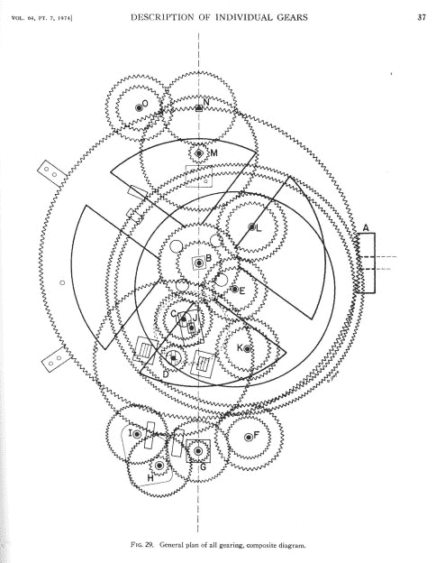
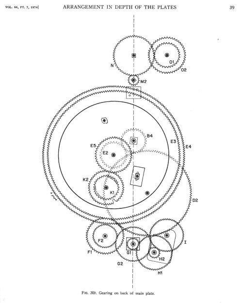
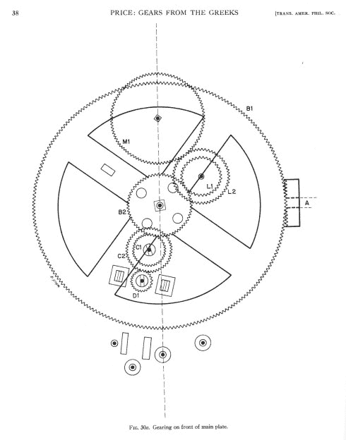
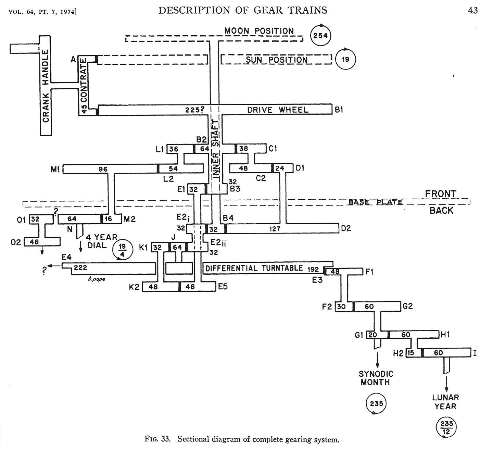
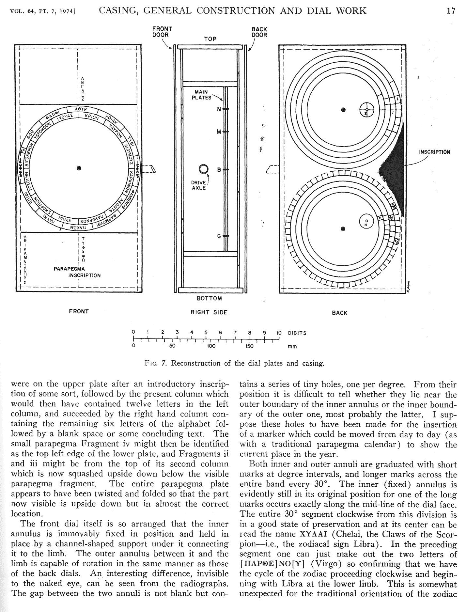

# 安蒂基西拉机制

> 原文：<https://hackaday.com/2015/11/23/the-antikythera-mechanism/>

众所周知，古希腊人向西方文明传授了大量知识。他们革新了数学和几何学，同时发展了天文学。他们建造了华丽的雕像，美丽的神庙，以及拥有惊人音响效果的露天剧场。古希腊人的影响塑造了人类知识的几乎每一个领域，从艺术和建筑到政治、哲学、科学和技术。

This article was written for the Omnibus vol #02
[Order yours now](http://store.hackaday.com/products/hackaday-omnibus-2015)

像巴比伦人一样，希腊人密切关注夜空。从规划的角度来看，离我们最近的天体邻居月球对他们来说尤其重要。例如，债务可能在新月时到期。通过留意月相和月蚀周期，他们发现他们的收成更好，海上事故也更少。

尽管古希腊文化看起来精明而全面，但不难想象希腊人可能创造了某种计算机来简化他们以月亮为中心的日程安排。根据 1900 年发现的一艘沉船的碎片，他们似乎确实是这样做的。根据沉船中发现的硬币和陶器的科学年代测定以及青铜残件上的铭文，历史学家和科学家认为希腊人创造了一种能够计算任意一天太阳和月亮位置的机械计算机。这个神奇的装置被称为安提基西拉机械装置。

这个机械装置装在一个木箱里，用一侧的旋钮控制。人们认为盒子的正面是一个由一组带有刻度的同心圆环组成的显示屏，每个圆环对应一个天体。当旋钮转动时，垂直连接到输出齿轮的指针绕着圆环移动，显示这些天体随时间的路径和位置。这个以地球为中心的天文馆还展示了月亮的相位以及古希腊人所知的五大行星——水星、金星、火星、木星和土星的位置。

Gearing // Composite Plan

如果在沉船中发现的硬币和陶器的科学年代是正确的，Antikythera 机械装置也标志着差动齿轮的最早出现。据信，设计者使用销和槽的布置来连接两个不同齿数的齿轮，以便模拟和补偿月球不规则的椭圆形轨道。通过一系列复杂的齿轮比，这台古老的计算机可以预测日食和月食，在用户的指尖显示它们的模型，就像它们在天空中发生一样。

### 风暴和海难

安蒂基西拉机制被发现真是个奇迹。1900 年，一群希腊海绵潜水员正驾船返回希腊南部罗德斯地区的一个岛屿 Symi。他们的船在克里特岛北部的一个海峡里，靠近安提基希拉小岛。他们遭遇了一场风暴，被迫在该岛的主要港口 Potamós 避难。一旦风暴过去，他们决定在回家之前在该地区寻找海绵。

潜水员在安蒂基希拉海岸没有发现任何海绵，但他们发现了宝藏。在下面陡峭的岩石架中，躺着一艘大船的残骸。分散在古老的木材中，部分被岩石和淤泥掩盖，潜水员可以看到大型青铜和大理石雕像的头部，手臂和腿。在收回了他们能拖的东西后，船长记下了他们的方位，两艘船向赛米起航了。

安提基西拉岛占地 8 英里，面积只有克里特海中与之相对的基西拉岛的一小部分。由于其规模、位置和低水平的人类活动，该岛长期以来一直是候鸟的主要停留地。在过去的几千年里，安蒂基西拉的使用经历了很多波动，现在的人口大约是 50 人。由于其惊人的悬崖表面和崎岖的海岸线，这个小岛对所有的海洋历史来说都是一个巨大的威胁。

海绵潜水员和工作人员花了接下来的六个月时间，想出如何处理他们发现的宝藏。他们决定将他们的发现通知常设机构，而不是洗劫残骸现场。船长带着他的船员在沉船中找到的一只青铜手臂去了雅典。几乎立刻，政府批准了一项官方的恢复任务。

人们同意，发现这一发现的海绵潜水员将重访该地点，并将他们发现的任何东西交给希腊政府。他们最终恢复了迄今为止最大的古典文物收藏。他们带回了几十件古希腊时期的珍宝，包括一些他们无法辨认的被腐蚀的青铜碎片。所有的文物都被送到了雅典的国家考古博物馆。

信不信由你，在探索结束后的八个月里，组成安蒂基希拉机械装置的青铜碎片或多或少地在博物馆里无人注意。这是因为从沉船中带进博物馆的青铜数量巨大。这需要大量的分类和重新分类，因为雕像和其他作品是由工作人员分类和重建的。在一次重新洗牌的过程中，有人注意到其中一个碎片上的铭文和毕业标记，它们开始受到关注，这与已知最古老的机械计算机相称。

在 1901 年探索沉船后不久，据报道，神秘物体的碎片包括某种星盘，一种用于定位天体位置的倾斜仪。一位名叫康斯坦丁·拉多斯的海军历史学家对这一理论提出质疑，他认为这是一种过于复杂的仪器，不可能仅仅是一个星盘。研究古代语言和文本解释的学者阿尔伯特·雷姆粗略地把它比作阿基米德球体，阿基米德球体是古希腊数学家用来计算球体相对于圆柱体的体积和表面积的装置。

### 希腊人的齿轮

英国科学历史学家、耶鲁大学教授德里克·德·索拉·普莱斯首次对安蒂基西拉机制进行了深入分析。他从 20 世纪 50 年代开始研究碎片，利用静态照片和 x 光照片来理解齿轮比。普莱斯的研究一直持续到 20 世纪 70 年代。1974 年 6 月，他和美国哲学协会在一篇名为《来自希腊的齿轮:安提基西拉机制:来自加利福尼亚的日历计算机》的专著中发表了他的发现。公元前 80 年。72 页的《爱的劳动》是普莱斯对此事的全面调查，从沉船发现的偶然事件和对机制的早期探索，到他发现的关于其起源、内部运作、意义和可能创造者名单的所有结论和非结论。

Gearing // Back of Main Plate

普莱斯没有留下任何未经检验的片段，但他受到当时可用技术的限制。在《希腊人的齿轮》一书中，他写道，每一个可见的齿轮都被腐蚀得如此严重，以至于没有一个齿轮能够精确地计算出齿数。尽管如此，他还是接下了这个任务，与艺术家贝弗利·波普一起创作了你在这里看到的重印的复杂线条画。

通过广泛使用射线照相术，普莱斯得出结论，该机制包含至少 27 个齿轮。现在人们认为完整的机械装置至少包含 30 个齿轮。

普莱斯确信，如果他能精确地计算出齿轮的齿数，他就能开始解开机械装置的秘密。这是一项非常艰巨的任务，因为他正在处理齿轮的二维 x 射线，这些齿轮以非常紧密的结构在这里啮合，在那里重叠。他毫不畏惧，真的绕着齿轮数了数齿数。普莱斯认为最大的齿轮有 223 或 225 个齿，代表太阳。他不确定这个齿轮的确切意义，并提出代表日食周期的齿轮将有 223 个齿，而代表 Metonic 周期的齿轮将有 235 个齿。

普莱斯还数出了一个有 127 个齿的齿轮，并推测它可能被用来跟随月球绕地球的运动。这个数字意义重大，因为它相当于 19 年太阳周期中月球轨道数量的一半。科学家认为，该机制的创造者这样做是为了简化操作，一个乘数齿轮将数字转换为 254。

自从 1901 年首次疏浚以来，没有人去过沉船现场。1976 年，雅克·库斯托率领的探险队发现了更多的物品，有助于提供安提基西拉机制时代的线索。在船木和青铜雕像中，库斯托和他的团队发现了来自小亚细亚殖民地佩格蒙和以弗所(现在是土耳其的一部分)的青铜和银币。一位名叫 Panagiotis Tselekas 的硬币专家能够确定这些硬币是在公元前 70 年至 60 年之间铸造的。库斯托的团队还发现了陶器碎片和许多大酒瓶，专家们能够确定这些东西的年代为公元前 65-50 年。

所有可用的证据都表明，这艘船很可能是一艘属于罗马帝国的巨型商船。当时，地中海只有几个港口像这三个港口足够大，可以容纳一艘巨轮，这艘巨轮可能正从小亚细亚驶回罗马。船上满载着物品，许多研究者认为这些物品是罗马人从别迦门、以弗所和罗德斯掠夺来的。

### 新技术，新发现

几年后，一位名叫迈克尔·赖特(Michael Wright)的机械工程师和伦敦科学博物馆的前馆长在 25 年的时间里对 Antikythera 机制进行了自己的广泛研究。赖特研究了德里克·德·索拉·普莱斯的专著，最终得出结论，普莱斯对机制的重建是根本不正确的。事实上，Wright 甚至称之为怪异和不完整，暗示 Price 采取了一些创造性的自由来填补空白，并根据他的齿轮齿数进行天文计算。

但是迈克尔·赖特不只是扔石头。除了撰写大量关于机械装置的论文外，他还与澳大利亚计算机历史学家 Allan Bromley 合作，利用他的机械知识和工艺技术历史，用青铜和木头制作了一个完整的设备重建。赖特还自己拍摄了碎片的照片，并用他发明的一种装置进行了射线照相术，这种装置是为了适应 X 射线设备。他们一起为模型制定了计划，从动手检查和他们自己对精致碎片的测量中收集数据。

Gearing // Front of the Main Plate

莱特模型的正面展示是一个以地球为中心的天文馆，上面有太阳、月亮和古希腊天文学中五大行星的指示器。在重建过程中，赖特试图保持 x 光照片所能证明的真实性。他用厚度在 1 到 2 毫米之间的薄青铜加工齿轮，他认为这是制造机械装置所有金属部件的原料。

几年后，一个拥有更先进成像技术的国际科学家小组证实，最大的齿轮确实有 223 个齿。这个特殊的齿轮对于协调 12 个月的太阳年和 29.5 天的太阴月至关重要——19 个太阳年的周期正好等于 235 个太阴月。这个数字 235 表示希腊人所说的美托涅循环，在机械装置背面的一系列独立刻度中重复出现。在迈克尔·赖特的模型中，一个带有可复位臂的螺旋槽作为内部齿轮的输出函数预测了日食和月食的日期。

莱特对该设备最有见地的推测之一是，驱动背面显示器的传动装置，也就是日食预测发生的地方，似乎有一个销和槽机制。他改编的 x 光片显示了一个槽和里面一个圆形碎片的影子。莱特最终确定了销齿轮和槽齿轮在稍微偏置的轴上转动。两者都连接到 223 齿的齿轮，该齿轮跟踪月球的轨道。这意味着销和槽机构是一种差动齿轮解决方案，旨在补偿月球围绕地球的不规则椭圆轨道。

莱特的另一个贡献是他在主片段中发现了一个固定的 boss。这表明，Antikythera 机制旨在显示子系统围绕中心齿轮运动的周转运动。Wright 认为 Antikythera 机制很可能在它被制造出来后的一个或多个点上被改变或被破解。首先，他认为设备背面的两个螺旋输出显示器是从其他设备重新利用的，后来添加的，引用了外壳残骸的外观。

大约在迈克尔·赖特研究这种机制并进行重建的时候，一个由科学家、天文学家和数学家组成的团队聚集在雅典，进一步研究古代日历计算机。他们与 Antikythera 机制研究项目(AMRP)合作，继续对该机制进行研究，并在 2006 年发表了一篇文章，详细介绍了他们关于该机器的发现。

出版后不久，AMRP 的英国数学家和电影制作人托尼·弗里斯与纽约大学古代世界研究所的古代精确科学史教授亚历山大·琼斯合作。他们一起提出了一个 Antikythera 机制的计算机模型，其中包含了关于该设备的更新知识。

2005 年，托尼·弗里斯聘请了来自惠普公司的科学家，他们发明了一种特殊的技术来增强绘画表面和细节的图像。在拍摄一系列静态照片的同时，一个覆盖着灯的圆顶从不同的角度向物体发出闪光。弗里斯说服他们去雅典，用这个设备拍摄机械装置上的微小铭文。这些图像为加深团队的理解创造了奇迹。他们一劳永逸地证实了最大的齿轮肯定有 223 个齿。另一个铭文直接提到了数字“235”以及背面与 Metonic 循环相关的螺旋显示。

弗里斯和琼斯能够利用月份铭文来帮助确定安蒂基西拉机械装置的制造地。海难发生时，每个希腊城邦都使用自己的历法。碎片上的月份铭文指向科林斯，或者科林斯的一个殖民地，比如西西里岛上的锡拉丘兹。

### 工作原理–当前模式

几个人经过多年的研究、测量、拍照和有根据的猜测，对这个机制的结构有了越来越清晰的了解。从本质上来说，它是一个齿轮的集合，很可能被装在一个木箱里，用旁边的手摇曲柄操作。当曲柄转动时，前面的指示器会旋转，每个都模拟古希腊人所知的主要天体之一的轨迹。当时已知的太阳、月亮和五大行星都有独立的指示器。该设备的最小指示器是一个小球体，被后来制作它的人染成一半黑一半白。这个小球独立于它的指示器臂旋转，显示了月亮在太阳历中每一天的相位。

Gearing // Side View

根据迈克尔·赖特的说法，内部工作包含多个日历年的齿轮系，包括真太阳和平均太阳。这列火车上有两个子系统，一个基于太阳，一个基于月球。太阳面包含计算泛希腊奥林匹克运动会四年周期和十九年周期的齿轮装置，十九年周期是太阳年和太阴月的公倍数。它还计算了七十六年的卡利皮周期，这是米东周期的四倍，是希腊天文学家卡利普斯在公元前 330 年左右提出的，是对米东周期的改进。

古巴比伦的天文学家发现了埃德蒙·哈雷后来称之为萨罗周期的东西，它描述了太阳和月亮之间日食活动的完整周期。巴比伦人发现每 223 个月，太阳、月亮和地球回到相同的相对几何位置，导致相同类型的日食。

月球齿轮系连接到月球异常平台和 eclipse 齿轮系，显示 223 个月的 Saros 周期及其拟议的改进，669 个月的 Exeligmos 周期。古希腊人所知的五大行星体:金星、水星、火星、木星和土星，还有额外的周转齿轮机构。

这些内部齿轮系统通过两个螺旋槽在设备背面输出它们的计算结果。一个是分开的，以显示奥运会的日历周期，Metonic 周期和 Callippic 周期。另一个作为月食预测器，以 223 个月的 Saros 周期运行，显示日食和月食的日期。指针横跨凹槽的每个环的半径，而附加的指针骑在槽中。这种设计使得通过抬起指针来重置输出成为可能，就像人们抬起电唱机的手臂一样。

### 安蒂基西拉机制是谁做的？

德里克·德·索拉·普莱斯认为有几个人可以创造出这个技术奇迹。其中一个是安德罗尼库斯·克伊鲁斯特，一个马其顿人，他建造了一种叫做风塔的古代气象站。他的八角形结构的特点是风向标和复杂的日晷。围绕在塔外的中楣向八个风神表达敬意。塔内有一个漏壶或水钟，由卫城的水驱动。

如果不是 Kyrrhestes，Price 推测 Antikythera 机制是由一些罗兹工程师在 Posidonios 的指导下构思的，Posidonios 是一位著名的哲学家和气象学家，他对测量月亮和星星的距离有很大的兴趣。如果 Antikythera 机械装置是阿基米德的作品，普莱斯相信他的名字肯定会出现在历史记录中，紧随其后的是对发明差动齿轮的大量赞扬。在他的书《共和》中，西塞罗描述了他在罗兹学习时看到的一种装置。这是由波西多尼奥斯建造的天文馆。在他的作品中，西塞罗描述了这个新的天象仪和他非常欣赏的早期天文仪器阿基米德球体之间的一些新奇的差异。

### 安蒂基西拉机制的未来

直到最近，只有两次官方批准的安蒂基希拉沉船打捞任务:最初的疏浚和 1976 年雅克·库斯托的探险。但在 2014 年 9 月和 10 月，一群潜水员、考古学家和科学家与希腊海军合作，重返该遗址。在一些尖端潜水设备的帮助下，他们能够回收更多的物品，从普通餐具到古代珍宝，如真人大小的战士雕像的巨大青铜矛。

Enclosure Theory

这个团队对这次探险有很多目标。其中之一是用 3D 数字蓝图绘制沉船的完整范围。一艘名为 Sirius 的亮黄色自主水下航行器(UAV)通过提供高分辨率立体图像解决了这一问题。天狼星是由悉尼大学澳大利亚野外机器人中心的海洋机器人分部建造的。

因为船的残骸在水下很深，潜水到现场并停留超过几分钟是非常危险的。该小组的另一个主要目标是测试一种名为 Exosuit 的新潜水服技术，该技术允许潜水至 1000 英尺。有了这些宇航服，潜水员每天可以安全地在沉船处停留 30 分钟以上。

### 安提基希拉崇拜

迈克尔·赖特的实物青铜模型和托尼·弗里斯的机械装置计算机模型都极大地推动了对其内部工作原理和创作原因的理解。Wright 并不是唯一一个被该机械装置的机械奇迹所感动的工匠。2010 年，一位名叫安德鲁·卡罗尔的苹果工程师完成了一个机械装置的工作复制品，他完全是用乐高技术块建造的。

卡罗尔的模型比原始设备大得多，主要是因为定制加工黄铜齿轮和用预成型 ABS 齿轮建模相同的奇数齿轮之间的差异。它还使用了两倍于原版的齿轮，主要是因为卡罗尔不得不考虑过去 2000 多年来日历的变化。

2014 年初，一名南加州大学机械工程专业的学生使用 Solidworks 对 Antikythera 机制进行建模。他的文件基于托尼·弗里斯和亚历山大·琼斯的齿轮传动方案。他通过自己的网站 theshamblog.com 分享了这些 CAD 文件，并指出这些文件在目前的状态下不太适合 3D 打印。2014 年 12 月，他对自己发布激光和木材版本的计划发表了评论。

### 包裹在谜中的秘密

安蒂基西拉机制的神秘有许多层面。例如，它可能是独一无二的，或者它可能是许多这样的计算机中从古代幸存下来的唯一一台。

安提基希拉机制在克里特海底做什么？它是与数百件艺术品和珠宝一起从希腊殖民地掠夺来的，还是碰巧出现在罗马沉船的残骸中？德里克·德·索拉·普莱斯(Derek de Solla Price)在他的专著中讨论了作为历史文献的安蒂基希拉机制，提出了古希腊社会遗留下来的许多东西是更坚固的证据，如建筑、珠宝和陶器。还没有发现像安提基西拉机制那样复杂的希腊艺术品。在它被发现之前，现存最早的类似复杂的物体可以追溯到公元 1000 年。d——由波斯学者 al-brūn 创造的星盘。

在古希腊文明衰落后，人们认为这种机械所代表的工艺和技术通过拜占庭帝国向东传播，在君士坦丁堡衰落后传到了阿拉伯人手中。中世纪末期，规模较小的复杂机械发条装置开始在中欧出现，而大部分现代技术都是在维多利亚时代出现的自动机。

### 经许可重印的图表

经许可转载的图表
来自希腊的齿轮:Antikythera 机械装置——来自加利福尼亚的日历计算机。公元前 80 年
作者德里克·德·索拉·普莱斯(ISBN 9780871696472，1974 年 11 月出版)【http://www.amphilsoc.org/node/191】
T3

* * *

这篇文章是专门为黑客日综合卷#02 写的。[订购《Hackaday》的限量版印刷本](http://store.hackaday.com/products/hackaday-omnibus-2015)。