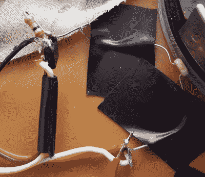

# 开源的焦虑:为什么我们努力把它放在那里

> 原文：<https://hackaday.com/2018/05/01/the-anxiety-of-open-source-why-we-struggle-with-putting-it-out-there/>

你刚刚完成了你的项目。嗯，没有完成，但它的工作，你已经解决了所有值得解决的问题，你有一个为你工作的东西。然后你考虑与世界分享你的创作。你认为这很酷。“其他人可能也会觉得这很酷。”所以你必须拍摄照片和视频，你希望你已经记录了更多的组装步骤，你必须做书面记录，评论你的代码，并为它创建一个存储库，也许考虑许可。突然之间，实际的项目只是一个开始，现在你正在为告诉其他人你的项目所涉及的所有其他事情而感到紧张，因为从过去的经验中你知道有很多讨厌的人会破坏它，除非它是完美的，或者即使它是完美的，即使人们喜欢它，他们也会向你寻求帮助或者为他们做一个， 现在 7 年过去了，人们仍然在向你索要你刚从大学毕业时做的一些快速的小事情的源代码，当然这不会再有用了，因为那是在人们还在使用 Java 的 Windows XP 上。

深呼吸。我们都经历过。这是一篇关于找到一个好的解决方案来分享你的工作而不处理麻烦的文章。如果你读了前一段，并以两倍于开始时的心率结束，你就知道问题了。你只是想和这个世界分享一些东西，却不想一辈子支持那个项目；你想转向新的、更好的、更有趣的项目。这里有一些提示。

## 完美是好的敌人

如果你曾经拆开过一个产品，发现了设计上的缺陷或弱点，你可能会想“这是哪个白痴做的？他们应该用另一种方式来做。”也许你是对的，或者也许有些东西你没有想到，但至少他们做出了可以出货的东西。有很多纸上谈兵的专家，他们忙着批评别人的工作，没有时间把自己的东西放在那里。这里的统计数据非常有说服力。一个存在的网页比一个不存在的网页被浏览的几率要高得多。你永远不会让每个人都满意，所以接受你的工作必须足够好的事实，无论如何，把它推出门外。

## 基本原则:为自己做文档

更好地记录你的作品从帮助你自己开始。当你在写东西的时候，你总是按保存键以确保你的工作不会丢失。你训练自己这样做是为了避免以后的麻烦。你可以用其他的记录实践做同样的事情来帮助未来的你。

有了代码，您就有了 git 存储库，这样您就可以恢复到以前的工作状态。如果您正在编写代码，**创建一个文本文件来描述所使用的开发环境**以及如何编译和运行代码。我经常运行某个程序，并想“它存储在我的 bash 历史记录中，所以当我需要再次运行它时，我只需浏览一下”，但当我移动到另一台计算机时，却被它咬了一口。

This is a terrible blurry photo that doesn’t make much sense, but **I** know that I was trying to use a photoresistor in a voltage divider with a 30k resistor to control an N-Channel MOSFET (it didn’t work well enough).

当你在建造实物时，最接近的等价物就是照片。**在构建过程中一直拍照**不仅仅是为了记录，这样当你把事情搞砸了，你可以去看看以前的照片，看看以前是什么样的。照片不需要完美，但你应该拍一堆，因为当你回去查看它们时，一半会模糊不清，四分之一会有错误的照明，八分之一会太近，看不清发生了什么。养成在整个构建过程中拍照的习惯，因为如果您试图在以后整理文档，您将无法重新创建该过程。记住，你这样做是为了你自己，而不是为了世界上的其他人。

**少写**。你不需要就项目的每个方面写一篇长篇论文。你写的越少，就越有可能有人看。这听起来有些倒退，但略读是现在人们阅读在线内容的正常方式。快速记下重要的事情，花了你一段时间才弄明白的事情，或者你探索了几个分支但决定选择一个特定分支的事情。当你回过头来看时，你会想“为什么我要这样做？”你想省去重复实验或挠头的痛苦。

## 出版:把它放出来！

在这一点上，考虑一下你在网络上成名的目标。如果你的目标是主要媒体的数百万次观看和报道，你不会通过一篇博客帖子来实现，而是通过专业编辑的短视频、精心制作的网站和完整的媒体包来实现。如果你的目标只是发布一些东西，以便像你一样的其他人可以检查它，考虑将你的项目发布在 [Hackaday.io](https://hackaday.io) (不要脸的插件)上，因为那里是许多硬件人发布、阅读和谈论项目的地方。你的目标应该与你投入的精力一致。不过，在大多数情况下，以下内容对于讲述项目的完整故事非常有帮助:

*   演示该项目的短片。
*   一个图片库，最好有标题，最好有一些不同长宽比的迷人照片(一个广角镜头，一个方形镜头和一个高镜头)。
*   包括背景故事、设计考虑、构建过程和结果的书面报告，最好是一些关于遇到的有趣问题或巧妙解决方案的片段，或者是一些值得注意和独特的事情。这应该不会太久。
*   链接到适当的存储库/文件/库。
*   许可证(让人们知道你是如何工作的，并且不需要先联系你就可以被重用)

我们已经建立了 Hackaday.io 来简化所有这些步骤，但还有无数的选项，如 imgur 用于图片库或托管自己的网站。关键是，把你的努力表现出来，这样别人就能看到你做了什么以及你是如何做到的！同样，这将有助于未来——如果你选择十年后的项目，你会找到所有相关的信息。

## 长尾理论

在你把你的项目放上去几年后，人们仍然在看着它并联系你问问题。你付出了多少努力并不重要，有时候付出的努力越多，你就越有可能被不读书就提问的人挫败。假设有人会写信给你，不管你在那里放了什么，他们的问题会让你烦恼，他们会让你做更多的工作。你需要弄清楚一些一般的规则和界限。以下是一些有用的方法:

*   **忽略巨魔**。这很难，几个小时以来我都有这种感觉，但你应该试着只和积极支持你的人交往，他们会让你对自己的工作感觉良好。
*   **回应赞**。如果有人写信告诉你一些积极的事情，感谢他们。他们努力让你的生活变得更美好，我们需要更多的支持。
*   **简要回答问题**，并提供文档中相应位置的链接。不是被动地、积极地说“如果你读过文档，你就会知道……”而是更像“好问题”。简而言之，你逆时针方向把加密狗放进 framulater。我在这一部分的项目页面上有更多详细信息。”
*   **不要试图回答懒惰的问题**。“行不通”只配“扫兴”。你试过什么？”如果他们不努力去问一个聪明的问题，你就不能指望他们去回答这个问题。
*   人们会要求功能升级，建议你应该做这个或那个，或者要求你让它在不同的平台上工作，或者合作制作一个商业产品。你可以在闲暇时考虑这个问题，但要记住，当这种情况发生时，你为自己做的项目正在变成你为别人做的项目。你可能想对他们作为合作伙伴的价值进行尽职调查，并检查你的价值观，看看继续为别人做这个项目是否符合你的利益。如果没有，你可以考虑向他们收取你的时间费用，因为你要做的事情已经变成了工作。你可以对人们说不，并祝他们好运。毕竟，通过将它发布为开源，你已经为他们的项目做出了贡献。

## 管理你的情绪

当我在社交媒体上发布一些东西时，接下来的几天我会定期查看它的表现。大多数人寻求他人的认可或肯定。积极的反应让我们感觉良好、有价值、有才华，消极的反应让我们感觉像在一个洞里爬，没有反应让我们感觉不被欣赏，浪费我们的努力。我们不太可能对任何数量的浏览量感到满意，因为我们看到 YouTube 明星试戴不同帽子的视频点击率高达数百万，而我们最多只能获得几千分。我们可以量化观点和评论，所以它们成为衡量我们成功的标准，它们几乎从来都不是让我们满意的数量。很粗糙，很糟糕，不公平。

然而，在一开始，这个项目并不是关于点击。这个项目是关于做一些很酷的事情，并且把它放在那里是事后的想法。我的墙上还挂着这条很酷的会说话的鱼。不要被你的项目的受欢迎程度所吸引；受欢迎程度在开始时不是一个重要的指标，在结束时也不应该是。相反，把注意力放在积极的反馈上，以及亲手制作一件东西的满足感上。

## 不要保守秘密

为公开发布项目信息设定一个最低目标是添加到您的工作流程中的一件大事。从一个自私的角度来看待它:这是你自己在将来的某个时候重新启动项目所需要的信息。将您的设计文件、图片、视频和笔记集中到一个地方，您将能够非常轻松地再次使用它们。

这对从事类似工作的每个人都有好处。你并不总是知道你的设计中最精彩的部分是什么，你可能会惊讶于别人抓住的细节。而且看到一个真的很牛逼的衍生作品感觉太棒了！通过为你的作品选择一个许可证，告诉别人你在使用你的开源作品时的偏好，让这成为可能。(怎么能归因呢？是商用还是非商用？衍生作品也应该分享吗？)

抓住这些建议中的一些，将会缓解你在将项目付诸实践时有时会感到的焦虑。建筑材料很酷，炫耀也很酷。深呼吸，分享你工作的故事，感觉棒极了！

我很想听听你在让你的项目走向世界时的习惯和经验。请在下面的评论中分享你的故事。