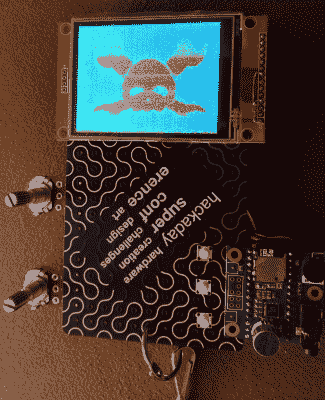

# 超级警察的最佳徽章

> 原文：<https://hackaday.com/2015/12/09/the-best-badges-of-the-supercon/>

几周前，我们在 hack aday super co 上看了看[最佳徽章黑客。这些是人们见过的最好的徽章破解，包括 DEF CON 和最新 CCC 的 SDR 徽章。我把这完全归因于徽章的自由形式性质；给人们一张空白的画布，你肯定会得到一个多样化的构建领域。现在是时候看看这种作物的精华，听听开心果的声音，以及如何在徽章中放置 1000 伏电压。](http://hackaday.com/2015/11/20/the-best-conference-badge-hacking-youve-ever-seen/)

SuperCon 的徽章黑客比赛有三个类别——最佳死 bug、最佳 blinky 和最过分。令人惊讶的是，许多人成功地将一些组件焊接、粘合和粘贴到我们用作会议徽章的 FR4 上，但最终只有三人获胜。

### 最过分的

super co 最夸张徽章的获胜者直接来自 super co 的一个工作室。[【Paul stoff regen】的微控制器音频研讨会](https://hackaday.io/project/8292-microcontroller-audio-workshop-had-supercon-2015)向几十个人介绍了 Teensy 3.2 的音频处理能力。

这个工作室使用一个小小的音频适配板、麦克风、按钮和罐子将一个微型微控制器变成一个相对强大的音频处理板。[Nate Quillin]参加了这个研讨会，他想出的徽章破解是一个音频和视频的享受。

[Nate]很友好地把他的徽章放在了 hack aday . io 上，这个项目展示了他对罐子、硬币和显示器的虚构所能做的一切。Teensy 控制着一个 TFT，显示快乐扳手、空间扳手和麦克风正在听的所有东西的摄谱仪。在一次别出心裁的转变中，[Nate]从 Aphex Twin 那里借鉴了一页，将 Hackaday 的标志变成了声音。您可以在会议视频中查看所有的显示模式[。](https://www.youtube.com/watch?v=pJO0WaFeIxk&t=17m32s)

> 在[# super co](https://twitter.com/hashtag/SuperCon?src=hash)徽章大赛中获得“最大奖”的是一台频谱分析仪！pic.twitter.com/hVVYsT5ycG
> 
> — Fumi (@Fumi) [November 16, 2015](https://twitter.com/Fumi/status/666059947365429248)