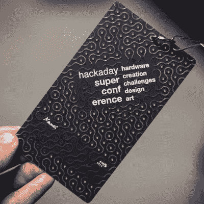
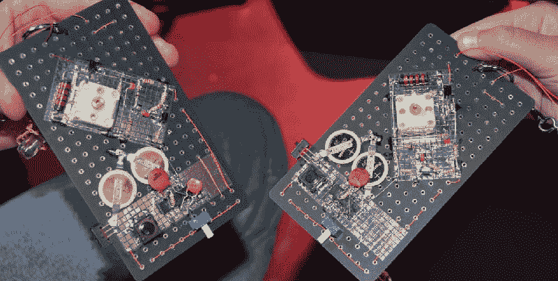
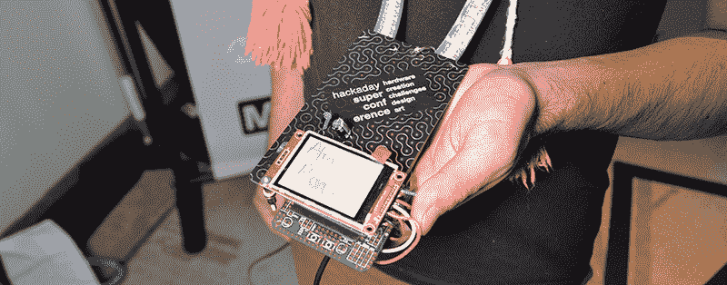
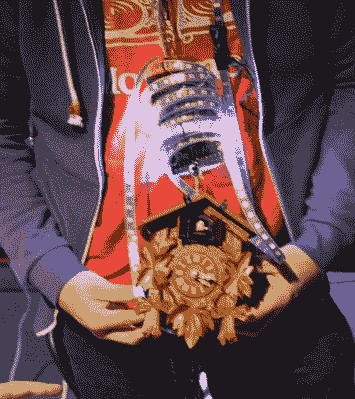
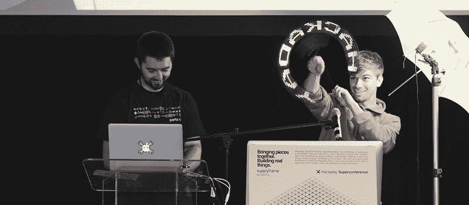
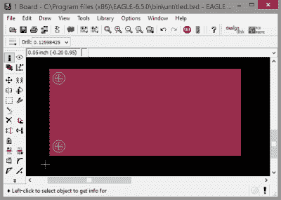

# 你见过的最好的会议徽章黑客

> 原文：<https://hackaday.com/2015/11/20/the-best-conference-badge-hacking-youve-ever-seen/>

 和任何合适的硬件骗局一样，[黑客超级公司](http://hackaday.io/superconference)需要一个徽章，最好是电子徽章。本次大会围绕硬件创作展开，徽章也不例外。

设计时间紧迫，有可能为与会者提供 PCB 徽章，但不包括微控制器、FPGAs 或软件定义无线电。这个空白的石板是一个完全不受约束的自由式电子焊接会议的基础。

徽章的正面包括一个哑光黑色阻焊膜，带有 [Truchet tiles](https://en.wikipedia.org/wiki/Truchet_tiles) 迹线。将多个徽章并排放置，这种模式会无限延续下去。每个弯曲轨迹的内部是一个通孔，这些通孔构成了徽章背面的孔网格。在背面也有两个矩形网格，为黑客焊接组件提供了一个很好的区域。

很多人接受了黑客攻击他们徽章的挑战，尽管通孔的间距很奇怪(0.230 英寸)，而且没有任何痕迹，但还是有一些惊人的构建。我要说的是，超级电脑的徽章黑客是我见过的最好的，包括 DEFCON 和 CCC。

 [https://www.youtube.com/embed/pJO0WaFeIxk?version=3&rel=1&showsearch=0&showinfo=1&iv_load_policy=1&fs=1&hl=en-US&autohide=2&wmode=transparent](https://www.youtube.com/embed/pJO0WaFeIxk?version=3&rel=1&showsearch=0&showinfo=1&iv_load_policy=1&fs=1&hl=en-US&autohide=2&wmode=transparent)

* * *

### 调幅收音机、无线电源和神经元

[Shanni]和[David]找到了足够的零件来制造两个 AM CW 无线电收发器。该电路由一个四通道 NAND 芯片构成。接收器是老式的，带有一个电容和一个带锗二极管的电感，这是我在零件箱中没有看到的。

[![[zakqwy]'s neurotic badge hack](img/90d99bdcfc7e41dc4e83f9d7a9eeaba7.png)](https://hackaday.com/wp-content/uploads/2015/11/x3gbrfh8wdnzc0noiyvzffxakd56-ansn-hfvj5bh-gakcokk7zbdr5yybaeu0yhngmfv5fqeo_4rta1tl52ny.jpg)

【zakqwy】的神经质徽章 hack

无线电力风靡一时，看来和【卢克】和【克里斯】造了一个可以短距离传输电力的装置。是的，它更像是一个 RFID 标签，几百英尺长的电磁线缠绕在一个徽章的边缘。有了这个线圈和一个电容器，这个徽章可以接收射频，并获得足够的能量让几个 led 闪烁。

在超级计算机上，[zakqwy]做了一个关于他的项目[神经细胞](https://hackaday.io/project/3339-neurobytes)的报告。这些小板子中的每一个都模拟一个神经元，带状电缆充当轴。将 302 个这些神经细胞连接在一起，你可能会有一个*秀丽隐杆线虫*四处蠕动。[zakqwy]并没有把他的大脑用在任何有用的东西上；他只是用它来闪烁几个发光二极管。一点用都没有，真的。

请注意，并非所有的徽章都有效。[Alan]拿了一个 ESP8266，TFT LCD，一个 Teensy，和一堆 APA 101 LEDs 在一个 WiFi 连接的徽章上显示他的名字。也许我们没有分配足够的时间来破解徽章，但在真正的完成时尚中，[艾伦]设法把他的名字写在他的徽章上。他用了一支记号笔。

### 死虫子和 Blinkies

[![[whosawhatsis]' dead bug badge](img/2919a99245006846af5ce45a1dc6def0.png)](https://hackaday.com/wp-content/uploads/2015/11/whosawhatsis.jpg)

【who sawhatsis】“死虫徽章

”徽章黑客评审部分分为三类:最佳死虫、最佳 blinkey 和最过分。鉴于最小徽章强加给我们的 mad 修改者的结构或形式的完全缺乏，死亡 bug 类别是迄今为止最多样的。[whosawhatsis]出现在 Supercon，并把最像死虫的死虫徽章放在一起。

一名疯狂的与会者将事情推向了极端，他成功地将所有东西都放在了徽章上。这个徽章始于一个巨大的 4S 10000mAh 脂电池和 5 米长的可单独寻址的 RGB 发光二极管。最初的计划是获得一个 50 瓦的紫外 LED，但这被零件箱的废物所遗忘。取而代之的是布谷鸟钟。

The Cuckoo Clock Badge

在“闪亮徽章”类别中不甘示弱，有人设法将他的徽章变成了旋转 POV 显示器。10 个 led 焊接在徽章的前面，一个小小的 9V 电池，线性调节器和一串代码，POV 徽章在空中旋转时可以显示“HACKADAY”。

这个 POV 徽章具有显示数字和字母的所有代码；一个整洁的工作，可能是由于有徽章黑客判断发生在会谈的第二天。那些额外的 12 个小时左右的深夜时间足够让很多人有时间写一些代码，找到一些硬件，或者偶然发现一个布谷鸟时钟。

总的来说，每个人的表演都很棒。

A POV badge in action

### USB 键盘和厨房水槽

多亏了[Paul Stoffregen]和他的[微控制器音频工作室](https://hackaday.io/project/8292-microcontroller-audio-workshop-had-supercon-2015)，有了足够多的微控制器板用于各种各样的徽章黑客。这些年轻人擅长 USB，而且[Bharathi]用他的徽章做游戏控制器。MMA7455 加速度计直接焊接在徽章上，位于零件区周围。通过倾斜徽章，[Bharathi]向他正在玩的任何游戏输出方向命令。

[![[Rocky McCleary]'s badge of junk](img/8e898250bfe5a1236c28db41382732fb.png)](https://hackaday.com/wp-content/uploads/2015/11/rocky.jpg) 

【洛奇·麦克利里】的垃圾徽章

【洛奇·麦克利里】不只是在他的徽章上建造一个项目，他建造了所有的项目。因为徽章黑客大赛有一个“最过分”的类别，[洛基]认为最简单的方法就是一卷透明胶带。我们也有鱼钩带。

[Rocky]的徽章由几个盒子组成，装满了来自 Hackaday supply cache 的开发板、一些电池、一些 Sparkfun 板，显然还有我们所有的一氧化碳气体传感器。无论用什么标准来衡量，这都不是最复杂的构建，但它是我们拥有多少东西的一个很好的例子。

### 未来囚犯的徽章

今年的 Supercon 徽章极其简单，大部分原因是时间紧迫；在向所有与会者分发数百枚徽章之前，我们有大约六周的时间将这个徽章从一个想法的概念变成产品。尽管今年的徽章只是一块 FR4 和几个通孔，但我们最终还是举办了我见过的最好的徽章黑客会议之一。

我们可能在这里发现了很棒的东西。因为 Supercon 徽章没有任何电子设备，每个想破解徽章的人都有一张白纸。有史以来最简单的电子徽章会产生如此多样的黑客，这是有道理的。如果你得到一个带有液晶显示器和螺旋桨芯片的徽章，你将会建造一个带有螺旋桨的东西。如果给你一个徽章，那就是[一个 HackRF 克隆](http://hackaday.com/2015/07/12/cccamp-2015-rad1o-badge/)，所有的徽章黑客都将与软件定义无线电有关。

The 2016 Hackaday SuperCon Badge

一个“空白石板”徽章被证明是一个伟大的想法，所以我们已经在为明年的 con 计划徽章。我会设计它。我会在 Eagle 设计它。明年的徽章就只是一块 FR4，两面都是铜的。将有几个孔用于系索，我们可能会在阻焊膜和丝网印刷上做些什么，但明年的徽章将继续这种“空白石板”的理念。

有人建议我们只给人们玻璃纤维、铜和树脂。

不知何故，Hackaday Supercon 无意中发现了徽章黑客的完美公式。“空白石板”徽章是为散发创造力的黑客设计的。