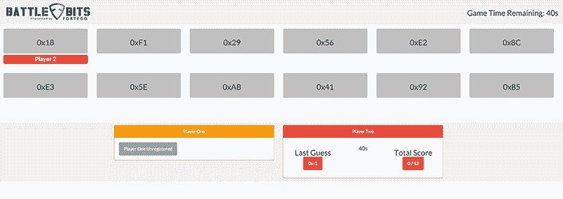

# Shmoocon 2016:你见过的最好的会议展台

> 原文：<https://hackaday.com/2016/01/17/the-best-conference-booth-youll-ever-see/>

Shmoocon 在这里，这意味着十几家安全公司已经买了一个展位，并开始宣传自己。一些人正在分发玻璃杯。一个是分发四轴飞行器。在人群中脱颖而出是极其困难的。

至少有一家公司想通了。他们为懂电脑的人设计了一个如此完美的游戏，如此新颖，如此有趣，以至于他们的摊位前都排起了长队。他们是谁？Fortego，但现在这并不重要。他们创造的游戏《战地》是完美的会议展台。

战场的游戏玩法就像数到二一样简单。你会看到一个八位十六进制数，目标是将它们键入一个控制器，控制器有八个按钮，分别代表 1、2、4、8、16、32、64 和 128。0x56 的答案是 01010110，0xFF 的答案是混搭所有按钮。

对于不熟悉 hex 的人来说，这个游戏其实有一个相当方便的窍门:你只需要记住 16 个不同的数字。十六进制数很容易被分成半字节，或四位一组。你需要做的就是一次解决一个十六进制数字。

控制器，或者说是“甲板”,是围绕一个 BeagleBone 和一个运行 Javascript 和 Python 的自定义 cape 构建的。当游戏开始时，玩家会看到十六进制格式的随机字节。在最短的时间内输入正确的位，你就能在排行榜上一路攀升。

这是迄今为止我见过的最好的会议展位。BattleBits 硬件的创造者[Riley Porter]说他将发布这个游戏的设计文件和代码，这样任何人都可以制作一个，这是我们非常期待的。

[Riley]还有一段视频显示有人以超快的速度进入 nibbles。