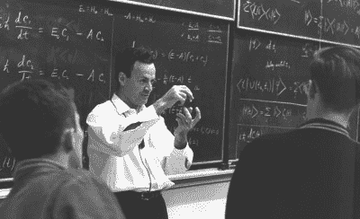
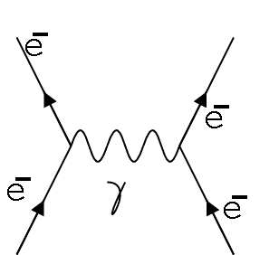

# 量子电动力学的诞生

> 原文：<https://hackaday.com/2017/01/24/the-birth-of-quantum-electrodynamics/>

第二次世界大战的爆发使量子理论研究陷入混乱。许多欧洲物理学家一起离开了欧洲，研究越过海洋来到了美国海岸。原子弹的出现将美国物理学家推到了聚光灯下，物理学家们开始在[避难所岛](https://en.wikipedia.org/wiki/Shelter_Island_Conference)会面，讨论量子理论的未来。到这个时候，有一件事是肯定的:量子理论的哥本哈根解释取得了胜利，对它的挑战基本上消失了。

这使得物理学家可以专注于一种不同的问题。在这个时候，量子理论还不能处理粒子在产生和毁灭时的过渡状态。众所周知，当一个电子与一个正电子接触时，这两个粒子被破坏，并形成至少两个具有非常高能量的光子，称为伽马射线。另一方面，伽马射线光子可以自发地变成正电子-电子对。

没有人能解释为什么会发生这种情况。对当时的物理学家来说，很明显需要麦克斯韦电磁场理论的量子版本来解释这一现象。这将最终导致 QED 的产生，它是量子电动力学的缩写。这是一个关于那是如何发生的非常浓缩的故事。

## 量子场

Richard Feynman (1918 – 1988)

很容易想象粒子是什么。可视化场并不容易，因为它们无法用肉眼看到。然而，它们在任何意义上都和粒子一样真实。我们都感受过磁铁两极的排斥力。我们中的许多人都在一张纸上撒上金属片，来想象它下面磁铁的磁场。当你把手放在桌子上时，你的手实际上并没有接触桌子。你手中的电子排斥桌上的电子——就像磁铁的两极排斥一样。这个力是你的手和桌子之间的一个障碍，或者任何你抓住或触摸的东西。田野是我们现实生活的一部分。

在 1947 年第一次庇护岛会议期间，人们假设电磁场、光子和电子/正电子都以某种方式相互关联。量子力学可以处理光子和电子，但还不能处理它们相互转化的问题。很明显，场实际上比粒子更基本，粒子可以被认为是与之相关的场的“量子”。例如，光子可以被认为是电磁场的量子。

量子场论的早期尝试遇到了重大障碍。这些方程基于[扰动展开。这是一个复杂的数学问题，远远超出了本文的范围。但是总结一下，你会对发生的事情有一个模糊的概念，一个方程是以零阶书写的，在这里它可以被精确求解。然后附加项相加形成一个幂级数，所以你有一阶，二阶，三阶…等等。每个系列对零阶结果提供越来越小的校正。当一切结束后，最终结果的准确性取决于阶数(扰动)。](https://en.wikipedia.org/wiki/Perturbation_theory_(quantum_mechanics))

早期的 QED 方程预测了某些情况下的无限修正。这是因为将粒子视为点，没有体积或形状，这对量子力学来说是必不可少的。没有明确的解决方案。只有一个古怪的美国物理学家才能为所有人描绘出一幅更清晰的画面。

## 费曼图

[Source](http://pfnicholls.com/physics/particles4.html)

理查德·费曼和其他几个物理学家竞相解决无限修正问题，让 QED 重回正轨。当其他人被严格的数学结构束缚时，费曼更喜欢一种更形象化的方法。基本上，他是用一种二维图表的方法来观察粒子-光子的相互作用。这让许多其他物理学家不太满意，因为费曼似乎不理解测不准原理。但是他的天才是显而易见的，因为他能够得出和其他人一样的结论，即使没有严格的数学，所以他们听他的。他的图示方法被称为费曼图，其中之一可以在右边看到。

它们有两个维度:时间和空间。时间是 y 轴，空间是 x 轴。有粒子进来，它们朝着图的中心倾斜。当它们变成其他东西或与另一个粒子相互作用时，它们会改变角度远离中心。粒子的变化是由携带力的粒子引起的，这种粒子被称为虚光子或规范玻色子。力载体粒子用曲线表示。

举例来说，为了解释电子的排斥，我们有两个相互靠近的电子。当它们足够接近时，它们之间会交换一个虚拟光子，给它们排斥的信息。然后他们彼此远离。

## 虚粒子？

虚拟粒子是量子电动力学的关键组成部分。它们是虚拟的，因为它们无法被检测到。它们是携带粒子的力，允许电子排斥，并允许质子在原子核中结合在一起。一个自由电子实际上被虚拟粒子所包围，这些粒子是由它自己的电磁场内的相互作用产生的。由于海森堡的测不准原理，虚拟粒子可以在没有守恒定律约束的情况下被创造和毁灭。光子和电子/位置对可以“凭空”产生，只要能量可以在由不确定性决定的时间框架内被解释。

QED 就是这样起步的。理查德·费曼和他的图表，虚粒子和微扰展开。QED 由粒子和虚粒子之间的相互作用组成，这些相互作用在数学上被表示为微扰展开中的修正，这可以通过费曼图更容易地理解。在下一篇文章中，我们将更详细地介绍粒子本身——六个夸克、六个轻子和四个力载体，它们构成了强大的规范玻色子。这对于更详细地理解 QED 至关重要。敬请期待！

### **来源:**

吉姆·巴戈特的《量子故事》。第 18 和 19 章 ISBN- 978-0199566846