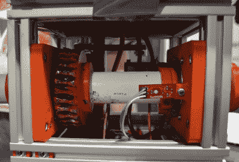
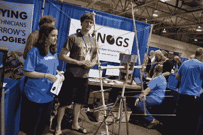
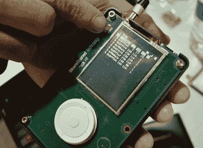

# 发明的摊位

> 原文：<https://hackaday.com/2016/05/25/the-booths-of-hamvention/>

上周末在俄亥俄州的代顿举行了一次聚会。上周末也是湾区制造商集会，如果你想要成千上万真正制造东西的人，那真的只有一个地方可去。额外收获:你还可以参观位于赖特帕特森 AFB 的美国空军博物馆。“太空”机库已经关闭，所以那将是明年的另一次旅行。

最吸引人的是交易会。每年，数以千计的汽车停下来，搭起一些桌子和帐篷，典当他们的货物。从 20 世纪 20 年代的收音机到 80 年代的电脑，所有的东西都能在旧货交易会上找到。这篇文章不是关于交易会的；我仍然有几百张图片需要浏览、组织、标记和上传。相反，这篇文章是关于预防的摊位。从普通的 ARRL 人，到出售过期 MRE 的预备人员，甚至一些开放硬件的英雄，可以在 Hamvention 找到任何可以想象的东西。

### SatNOGS

The elevation axis of a SatNOGS ground station

2014 年，Hackaday 做了一件惊人的事情。我们推出了 Hackaday 奖，让每个人都有机会构建开放硬件，并有机会为此获得报酬。Hackaday 奖的第一位大奖得主是 SatNOGS ，这是一个全球卫星地面站网络。

SatNOGS 是在认识到有数百颗立方体卫星和其他业余卫星被扔进低地球轨道后成立的。这些立方体卫星大多数来自大学，少数来自世界各地的高中。从这些卫星获取数据需要一个地面站，如果每个立方体卫星只有一个地面站，那么该卫星每天只有几分钟在经过总部时可用。

 SatNOGS 就是解决这个问题的办法。这是一个相对简单的设备——只有几个天线安装在一个电动平台上，并通过树莓皮或比格犬骨连接到互联网。通过将全球各地的天线连接到互联网，SatNOGS 团队可以为每个单独的地面站安排观测时间。这意味着更多的数据和更好的科学为每个业余立方体卫星。

当大多数 SatNOGS 团队忙于自由太空基金会(Libre Space Foundation)的时候，这个由 Hackaday 奖金建立的非营利组织有足够的现金让一些 SatNOGS 爱好者去参加 Hamvention。来自印第安纳州布卢明顿市的科瑞，又名 KB9JHU 和来自 T2 的二号卫星站 T3 带领团队出发了。他已经运营他的工作站有一段时间了，他从几年来操作 3D 打印机器人天线的经历中获得了一些经验。在解放军工厂打印零件，令人惊讶。3D 打印齿轮真的没有太多退化。防风雨相对容易，但防虫就不容易了。在意识到我不知道自己是否对蜜蜂过敏后，我逐渐退出了这个话题。会有更多的卫星站上线，当自由空间基金会将他们的卫星送入轨道时，应该会对大多数人口中心有合理的覆盖。

### 来自科罗拉多的 SDR 魔法

电子奇才和 SDR 潮人[Michael Ossman]出席了此次大会，展示了他最新的 SDR 产品。

The PortaPack for the HackRF One

[Ossmann]在这些地区以 [HackRF One](https://greatscottgadgets.com/hackrf/) 而闻名，这是一款软件定义无线电，工作频率范围为 1MHz 至 6GHz。你想要的一切都在这个频段，HackRF 也能传输。他和他的伙伴们展示了 PortaPack，一个“盾牌”，因为没有更好的术语，HackRF 允许对 SDR 进行便携式控制。这是一个显示器，一个旧的 iPod 滚轮，还有一个保护一切的外壳。

有时你不需要一个好的 SDR，它可以一直进入 GHz 的领域，为此[Ossmann]有一个[码棒](https://greatscottgadgets.com/yardstickone/)。基于 IM-Me 无线电电路，频率低于 1GHz。在展台演示中，Great Scott Gadgets 的工作人员将一个自行车打气筒连接到一个带有丙烯酸盖子的中密度纤维板盒子上。插入一个轮胎压力监测器，你就有了[一个接收亚 GHz 无线传输的优秀演示](https://twitter.com/michaelossmann/status/733795623422550017)。