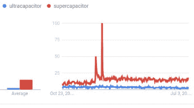

# 电容器营销的漫画世界

> 原文：<https://hackaday.com/2016/11/03/the-comic-book-world-of-capacitor-marketing/>

《经济学家》是一份有趣的出版物，是一份英国周报，它像杂志一样关注整个世界，并包含对世界政治和经济运动的精辟见解。这是为数不多的印刷新闻出版物之一，尽管它每周出版一次，但它还是设法向顽固的网络新闻爱好者提供新的见解。

他们最近发表了一篇关于超级电容器世界的文章，特别关注爱沙尼亚的骨架技术，这是他们广泛报道世界工业的典型表现。这是一个令人兴奋的领域，在这个领域中，产品正在朝着与传统电池的能量密度相当的方向发展，新制造设施上线的消息应该会引起许多黑客读者的兴趣。

尽管令人兴奋，但并不是德国一家新的电容器厂的消息为这篇文章提供了动力。相反，这是经济学家作者微妙地回避了“超级电容器”和“超级电容”之间的区别。当超级队长和超人与一个大反派战斗时，穿着鲜艳斗篷的飞行犯罪战士的图像立即浮现在脑海中，这个大反派毫无疑问正悠闲地将一块燃烧的氪石弹向墙壁，准备迎接最后的结局。

[![The Big Bang Thery doesn't feature a capacitor store, maybe it should. Chester from Toronto, Canada [CC BY 2.0 )], via Wikimedia Commons.](img/509dcb425d1e76ba76ea7ad169e0e8d1.png)](https://hackaday.com/wp-content/uploads/2016/10/the_big_bang_theory_comic_book_store_the_comic_center_of_pasadena_6196384919.jpg)

*生活大爆炸*没有电容器商店，也许它应该有。来自加拿大多伦多的切斯特[CC BY 2.0]，经由[维基共享](https://commons.wikimedia.org/wiki/File:The_Big_Bang_Theory,_Comic_Book_Store_%22The_Comic_Center_of_Pasadena%22_(6196384919).jpg)。

其实漫画书大战是一个很好的类比。正如漫威的《超级队长》和 DC 的《超人》在上个世纪的最后几十年里在各自的同辈中为货架空间和青少年的心灵而斗争一样，储能电容器领域的工业巨头们也在为控制看不见但同样有利可图的非易失性存储器电源市场而斗争，这是他们当时的主要应用。

一个角落是 NEC 和松下的超级电容器，另一个角落是品尼高研究所和麦克斯韦尔的超级电容器。嗖！，砰！让战斗开始吧，即使“嗖！”在充满电的大容量电容器周围听到的不一定是你想要的声音。

这两个术语最初都是由该技术的连续迭代的发明者创造的，但是当它们在市场上相遇时，它们都被应用于执行基本相同功能的基本相同的产品。你甚至不能在前缀的定义之间滑动任何比香烟纸厚的东西:

**超级**:以上；结束；超出

**超**:超越；在…的另一边

因此，这两个术语是相同产品的等价词，今天唯一的区别在于与你交谈的制造商的营销策略。接下来的问题是如何避免在非技术读者的头脑中引起混乱，因为在语言问题上，这是一个不容易回答的问题。

语言上的差异有时会因当地的习俗而产生，例如，你可能会说“手电筒”，而我会说“火炬”。在其他时候，它们来自舌头的孤独仲裁者的决定，例如在像塞缪尔·约翰逊或诺亚·韦伯斯特这样的开创性词典编纂者的工作中。当现代词典编纂者遇到竞争语言时，他们会采取更谨慎的方法，避免这种规定主义，而是采取描述性的方法，在这种方法中，他们从语言的使用角度来看待语言。他们维护着巨大的语料库，大量的书面语言，在此基础上他们进行统计分析，为他们的语言学研究提取坚实的证据。

[Google Trends](https://www.google.com/trends/explore?q=ultracapacitor,supercapacitor) is rather unequivocal in its verdict.

遗憾的是，在 Hackaday，我们没有当代英语语料库来帮助我们的作者进行研究。然而，由于网络的存在，我们拥有了一种资源，在比较两个独立的词时，这种资源同样有用，这就是谷歌趋势。比较这两个词在谷歌搜索中的表现是一种非常便捷的方法，可以快速看出哪一个占了上风，在这种情况下，答案就非常明显了。“超级电容器”的搜索量是“超级电容器”的五倍，因此在使用方面是明显的领先者。

纵观地区故事，很明显“超级电容”在美国比在世界其他地方更有吸引力，但即使在那里，它仍然是输家。为了避免混淆，称它们为“超级电容器”可能是最安全的，除非你指的是一种专门被称为超级电容器的产品。

关于语言的问题经常演变成在大头针头上跳舞的语义争论，但是这种讨论有实际的一面。如果你曾经把你的一件作品变成一个产品，它的成功或失败可能取决于像措辞不当这样简单的事情。我们曾经遇到一家制造小型集料破碎机的公司——一种非常酷的产品，可以压碎任何东西！—当他们放弃了他们喜欢的术语“紧凑型破碎机”而采用了业内喜欢的“迷你破碎机”时，他们的销售发生了转变。因此，做这样的研究是值得的，如果你的语言崇拜对象没有达到标准，你就要准备好把它们从神坛上扔出去。

Elna 超级电容图片:Elcap(自己的作品)[CC0]，via [维基共享](https://commons.wikimedia.org/wiki/File:Polarität-EDLC-P1070160.JPG)。