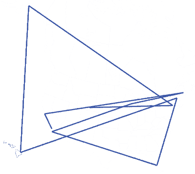

# 一个将被窃取的项目的持续冒险

> 原文：<https://hackaday.com/2016/04/09/the-continuing-adventures-of-a-project-that-will-be-stolen/>

想象一下，如果 Snap-on 工具车没有装满手动工具。想象一下，如果那辆 Snap-on 卡车是一家移动电子剩余品商店。这就是[旅行黑客盒子](https://hackaday.io/project/7373-travelling-hacker-box)背后的想法。这是一个盒子，从一个黑客运到另一个黑客，里面装满了怪异和深奥的组件，足够建造一台 3D 打印机的零件，以及足够让大象心脏停止跳动的电容器。

如果这是你第一次听说旅行黑客盒子，这里有一个快速的常见问题解答可以帮助你快速了解。以前做过吗？是的，是的。电子垃圾的巨大互联网迁移箱是邪恶的疯狂科学家在过去做的一件事。哈卡戴(或者更确切地说是老总司令艾略特)收到了其中一个盒子，并把它寄给了[Bre Pettis]。请记住，这是在 2008 年。有不止一个旅行黑客盒子主动旅行吗？不。因为我不想组织第二次。不管怎样，旅行黑客盒子有两个目标:旅行的距离和访问的人数。只需一个盒子，我们就能最大限度地实现这两个目标。目前有哪些旅行计划？那是下一段。

The travels of the Travelling Hacker Box Mk. 2

截至目前，旅行黑客盒子的第二个版本——[第一个盒子在佐治亚州被一些氧气浪费偷走](http://hackaday.com/2016/01/03/this-project-will-be-stolen-again/)——已经在美国旅行了至少 21，838 英里，访问了怀俄明州、纽约州、阿拉斯加州、夏威夷州、新罕布什尔州、佛罗里达州、威斯康星州、缅因州和加利福尼亚州的 11 位多产的 [hackaday.io](https://hackaday.io/) 贡献者。最初十几次横跨美国的旅行的目标是在箱子上贴上英里数。25，000 英里相当于仅使用美国邮政服务统一费率箱环游世界。由于[劳埃德·T·卡农]用帆布、泡沫、凯夫拉尔纤维和奶油冻加固了一个中等扁平率的箱子，这种旅行黑客箱子的迭代表现得非常出色。

接下来两个月的目标是围绕美国进行一次旅行，以最大限度地增加为这个盒子做出贡献的美国黑客的数量。这次旅行将从加州的帕萨迪纳开始，沿着西海岸到达西雅图，绕过加拿大边境到达新英格兰，沿着东海岸，穿过德克萨斯州，越过沙漠，回到帕萨迪纳的大本营。从那里，旅行黑客箱被送往英国、欧盟、亚洲、印度，也许还有非洲和澳大利亚。

虽然已经有一些人计划了这次最后的美国之旅，但还需要更多的人。有兴趣的话，[在 hackaday.io](https://hackaday.io/project/7373-travelling-hacker-box) 上查看项目，请求加入项目，在团队聊天上发消息，一般在 hackaday.io 聊天上 bug 我。在美国和[的最后一次旅行中，有很多空间可以填充。目前的库存相当可观。对于一个最终会被偷的项目来说，还不错。](https://hackaday.io/project/7373-travelling-hacker-box/log/35285-the-travelling-hacker-box-visits-home-base)