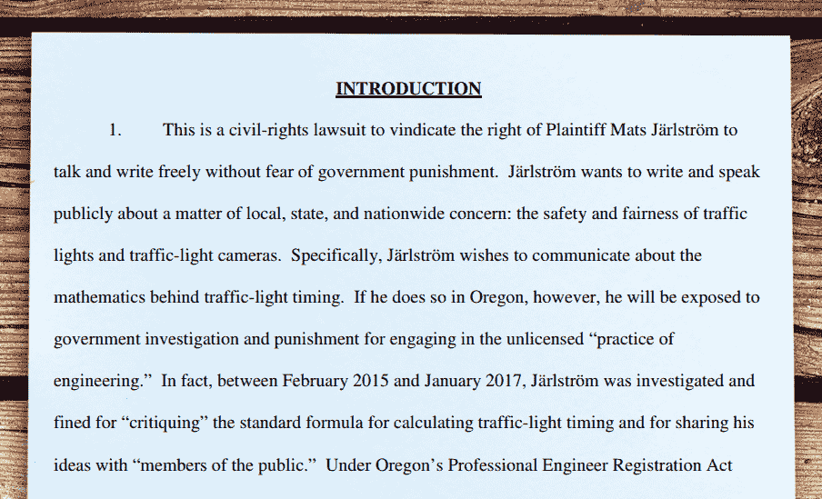

# 无证工程的危险性

> 原文：<https://hackaday.com/2017/05/08/the-dangers-of-engineering-while-unlicensed/>

公民工程师们，当心海狸州。如果你想在公共场合讨论工程学，你最好有执照。如果你不这样做，你可能会像俄勒冈州居民 Mats jrlstrm 一样——支付 500 美元的罚款，并受到更大的民事处罚和监禁的威胁。

关于 rlströ如何陷入这一系列不幸事件的故事开始时非常天真，这是一个任何黑客读者都可能感同身受的故事。在他的妻子从比弗顿镇的一个闯红灯摄像头收到一张交通罚单后，rlströ开始思考交通信号计时的数学问题。经过一番挖掘，他发现了用于计算交通信号停留在黄色阶段的时间的公式。此外，他发现公式中的一个缺陷，可以追溯到 1959 年，这可能导致自动交通摄像头发出不正确的违规信息。

rlströ开始广泛传播他的发现，就像我们任何人试图纠正不公正一样。但是，俄勒冈州工程学的第一条规则显然是，如果你不是专业工程师(PE ),就不要在俄勒冈州谈论工程学，而 rlströ不是。这位 20 岁的俄勒冈州居民在他的祖国瑞典获得了电气工程学士学位，但他没有资格在该州从事工程工作，至少从俄勒冈州工程和土地勘测考试委员会的角度来看是如此。我们之前已经讨论过[未经许可的工程问题](http://hackaday.com/2016/10/10/beware-common-sense-engineering/)，现在来看看实践中的一个例子很有意思。

董事会通过一个非常直接的途径得到了 rlströ邪恶的无执照工程活动的风声:他告诉了他们。他要求委员会调查比弗顿的交通工程实践，坚持认为该市的工程师滥用了交通灯计时公式。他们的回应是要求他停止无证从事工程工作，并停止在没有适当认证的情况下自称为工程师，以免被罚款和采取其他行动。

尽管 rlströ同意遵从理事会的要求，但他继续在这个问题上施压，这次是在一个更大的舞台上。国家工程和测量考试委员会、华盛顿郡治安官办公室、当地电视新闻，甚至 *60 分钟*都与他的发现有联系。当时，董事会进行了刑事调查，开出了 500 美元的罚单，Jr lstr m 支付了罚款。

Mr. Järlström has [filed a federal civil rights lawsuit](http://media.oregonlive.com/portland_impact/other/ECF%20No.%201_Complaint_FINAL%20(IJ087434xA6322).pdf) (PDF) to speak and write freely about traffic light timing while using the word Engineer without a state license.

这个故事还有更多的内容，包括 rlströ正在经历的上诉程序。大众媒体报道了这个故事，以至于在谷歌上搜索“Mats jrlstrm”只能在首页找到关于这个具体故事的链接。但对于普通读者来说，紧迫的问题是:这种明显的官僚主义越权行为会影响到我吗？

### 学位与执照

正如我指出的，rlströ所做的分析是我们任何人都可能做过的。但是尽管我之前刻薄地提到了“搏击俱乐部”,我认为他的问题并不是从谈论他的发现开始的，我们任何人都可能以这样或那样的方式谈论他的发现。我认为他挑战考试委员会调查他们中的一个人，从而违反了制度。

这是老生常谈的笑话规则和限制放置在“蓝领”领域的工会，窃笑规则说，哪个学徒可以携带什么材料通过工作现场或类似。但是不要欺骗自己——像俄勒冈州立工程和测量检查委员会这样的权威机构制定的规则是为了保护付费会员的工作，就像任何工会的规则一样。

从某种程度上来说，这是一件好事——我们都不希望假冒的工程师建造桥梁，或者想要成为电工给家里布线。但是回想一下 Pournelle 的官僚主义铁律，并意识到最终，官僚主义的全部意义变成了保护自己。在 rlströ的案例中，他挑战委员会调查城市工程师是对官僚机构的公开侮辱，而他们的反应就像官僚机构经常做的那样:以牙还牙。rlströ是有学位的工程师，但没有执照。在这件事上，这种区别是有争议的。

所以，是的，亲爱的 Hackaday 读者和同胞们，科学家和工程师们，有一天你也可能会发现自己因为你的非授权活动而被勒令停止。小心黑客，知道你的极限，知道你如何向公众展示自己的合法性。最重要的是，当你拽老虎尾巴时，你应该有一个处理牙齿的计划。

[通过[r/not theon](https://www.reddit.com/r/nottheonion/comments/68ek0w/i_feel_violated_engineer_who_pointed_out_traffic/)