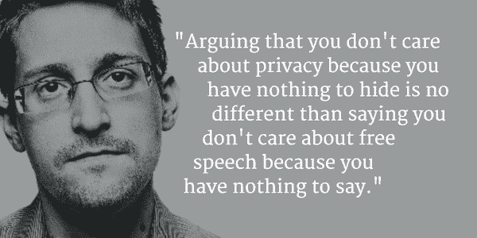
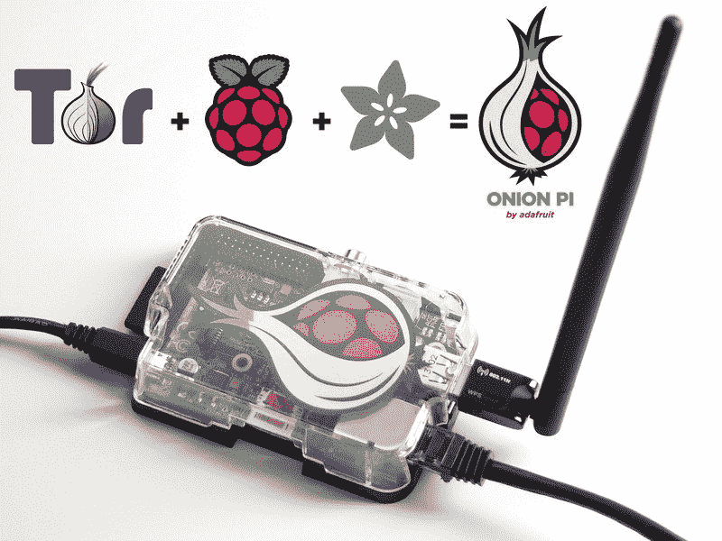

# 黑暗艺术:匿名

> 原文：<https://hackaday.com/2016/05/03/the-dark-arts-anonymity/>

爱他或恨他，爱德华·斯诺登对匿名略知一二。2013 年 6 月，他揭发了美国国家安全局的失控项目，这些项目几乎可以针对任何进入数字时代的人。这位前中情局雇员是美国国家安全局的承包商，在那里他可以接触到许多这些普通民众监控项目的高度机密文件。他最终飞往香港，向少数记者透露了这些文件。其中一份文件是美国国家安全局的一份 power point 演示文稿，其中抱怨道, [TAILS](https://tails.boum.org/) 操作系统是他们的一大眼中钉。自然，斯诺登坚持记者和他自己只能通过 TAILS O/S 进行交流。他使用了 PGP，这是一种加密方法，具有高度复杂的标题[“非常好的隐私”](http://www.businessinsider.com/how-to-send-encrypted-messages-using-pgp-like-edward-snowden-2015-6)，并要求不要详细引用，因为害怕通过[风格学](https://en.wikipedia.org/wiki/Stylometry)识别。

在这篇文章中，我们将回顾匿名的基本知识，并向您介绍在线时保持匿名的方法。

## 匿名与隐私

**虚拟专用网**

让我们想象用一个封闭的信封在全国各地寄信。一旦信封离开你的房子，它就在外面了。谁都能看出来。任何人都可以阅读发送和接收地址。然而，他们看不到信封的内容，因此也看不到信中包含的信息。在这种情况下，你有隐私，但没有匿名。

虚拟专用网络(VPN)可以为你提供隐私。就像我们信中的例子一样，你的计算机和 VPN 端的服务器的 IP 地址是可见的。两者之间交换的数据是加密的。请记住，VPN 将为您提供隐私，但不是匿名。我们在本系列第一篇文章[中谈到的许多 LulzSec 黑客](http://hackaday.com/2016/01/26/the-dark-arts-meet-the-lulzsec-hackers/)利用了流行的 [hidemyass](https://www.hidemyass.com/) VPN。这使得他们的活动不受执法部门的窥探。为了保持匿名，他们使用假账户，并用匿名比特币支付 VPN 服务。

**TOR**

回到我们的信的例子，让我们想象我们发送没有信封的信。信中的信息可供任何人免费阅读。但是我们发送它的方式使得它在到达最终目的地之前要经过几个不同的地方。我们这样做是为了让接收者不可能知道发送者的地址。他们可以看到发给他们的房子，但看不到你的房子。现在你匿名了。但是因为信里面的信息是暴露的，你没有隐私。

TOR 代表洋葱路由器，通过 TOR 中继之间的各种跳跃路由互联网流量，以隐藏源和目的 IP 地址。但是它不加密任何数据，任何从出口中继截获数据的人都可以读取它。他们只是不知道它是从哪里来的。

## 成为网络中的幽灵

Adafruit’s open source TOR router

你应该问问自己，是否可以同时使用 VPN 和 TOR，从而为自己提供匿名和隐私。答案是肯定的。甚至还有使用 TOR 的 VPN 服务。问题是按什么顺序——VPN 到 TOR 还是 TOR 到 VPN。这是一个激烈辩论的话题，两者各有利弊。通过 VPN 使用 TOR 会让您的 ISP 不知道您在使用 TOR。通过 TOR 使用 VPN 将对 TOR 出口节点隐藏您的数据。无论哪种方式，你都应该用匿名的方式来支付你的 VPN 服务。当英国政府施压时，LulzSec 的发言人[Jake Davis]，又名[Topiery]，被他的 VPN 揭发。如果他匿名支付了他的 VPN，很可能他永远不会被抓住。有一个原始的 LulzSec 黑客至今仍不为人知——[ av unit]。我们只能假设他或她能够保持完全匿名…一个真正的网络幽灵。

也有启用 TOR 的路由器，它将通过 TOR 网络发送所有流量。如果你不相信商业选择，你可以给自己烤一个洋葱皮。

## 别犯傻了

任何形式的保持匿名的电子对抗手段都无法将你从愚蠢的决定中拯救出来。几年前，一名哈佛学生给学校发了一封炸弹威胁邮件。他通过 TOR 网络发出威胁，但用的是大学的 WiFi 系统。联邦调查局只是将威胁发送给当时唯一使用 TOR 的学生的时间联系起来。我们很高兴他被抓住了，想要隐私和匿名是一回事，为了伤害而滥用这些美德是另一回事。

如果你想保持匿名，你不能放弃你的常识。不要使用社交媒体程序，禁用 Javascript，确保你的浏览器是沙箱化的。Tor 和 VPN 可以给你一件隐形斗篷，但如果你用一个愚蠢的动作在它身上撕开一个洞，它可以在一毫秒内变得毫无用处。

**来源**

黑暗网:匿名在线初学者指南，作者兰斯·亨德森，ISBN-13: 978-1481931380

[Tor 和 VPN |同时使用以增强安全性](https://thetinhat.com/tutorials/darknets/tor-vpn-using-both.html)

[黑客免于牢狱之灾指南 7:VPN vs . TOR](http://privacy-pc.com/articles/hackers-guide-to-stay-out-of-jail-7-vpns-vs-tor.html)