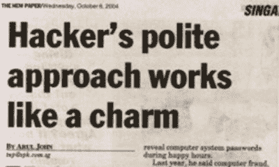

# 黑魔法:黑人类

> 原文：<https://hackaday.com/2016/06/10/the-dark-arts-hacking-humans/>

对于一家拥有宝贵数据的公司来说，最大的挑战之一是保护这些数据。起初，这项任务看起来相当简单。将数据保存在只能通过内部网络访问的加密服务器上。服务器的物理安全可以通过锁和其他不同程度的物理安全来实现。然而，人们必须仔细考虑安全是如何构建的。为了让公司正常运转，你需要允许经过授权的人访问数据，这就是问题所在。熟练的黑客敏锐地察觉到这些人，并会利用社会工程[和她的专业技能来获取你的数据。](http://hackaday.com/2015/10/13/you-can-learn-a-lot-about-social-engineering-from-a-repo-man/#more-173208)

想知道你的房子有多安全？把自己锁在外面。测试安全性的最好方法之一就是尝试闯入。大公司通常会雇佣被称为渗透测试员的黑客来做这件事。在本文中，我们将剖析一个被雇佣的渗透测试人员是如何能够访问如此有价值的数据，以至于可能会毁掉它所属的公司。

## 情报收集

[Source](http://www.lawtechnologytoday.org/2015/03/information-security-threat-social-engineering-and-the-human-element/)

任何黑客攻击的开始都包括信息收集。对于大公司来说，这通常很容易。他们的网站和几个电话可以透露相当多的有用信息。然而，你可以放心，任何公司谁聘请了笔测试人员已采取必要的预防措施，以限制这种信息。

这就是我们的黑客试图进入 ACME 公司服务器的情况。她的第一个目标是垃圾箱——过去的经验证明，翻垃圾箱能挖掘出大量有价值的信息。但是垃圾箱是在大楼里面，由一家签约保安公司看守。通过一些网站探听和几个电话，她找到了负责公司垃圾清理的部门。然后她给这个部门打了一个电话。她使用一种被称为[伪装](https://en.wikipedia.org/wiki/Social_engineering_(security)#Pretexting)的社会工程(SE)技术，假装是一家垃圾清理公司的员工，想要提交一份报价来为他们的业务提供服务。使用另一种被称为[诱导](https://www.fbi.gov/about-us/investigate/counterintelligence/elicitation-techniques)的 SE 技术，她能够发现:

*   垃圾收集在周三和周四进行
*   垃圾箱的总数
*   有一个专门放纸张和科技垃圾的垃圾箱
*   当前废物清除公司的名称——废物管理
*   负责清除垃圾的员工姓名–[ Christie Smith]

## 垃圾箱潜水

有了这些信息，她去了废品管理网站，抓取了他们的 JPEG 标志。不出几天，她就有了一件印有商标的衬衫和帽子。她打电话给安全部门，说她是废物管理部门的，而且[克里斯蒂·史密斯]告诉她其中一个垃圾桶损坏了，她需要在下次清理垃圾之前看一下。

第二天，穿着她在网上订购的衬衫和帽子，她从安全部门得到了一个徽章，并被允许进入垃圾箱。现在，任何一个在 PIC16F84 中与她体重相当的黑客都已经知道她跳进了哪个垃圾箱。她没花多长时间就拿走了几个硬盘、几个 u 盘和一些有用的文档。她能够了解到即将到来的 IT 合同工作、首席财务官的姓名以及具有一定重要性的服务器的名称——prod 23。

## 入侵服务器

通过更多的 SE，她能够找出 IT 工作的计划时间。已经下班了。她迟到了一会儿，声称自己在一家 it 合同公司工作，然后就能大摇大摆地走进去。然后她转换角色，假装成一名员工。她找到一位真正的 IT 合同人员，说她为首席财务官(Shiraz 先生)工作，并问他是否知道要小心 prod23 服务器。通过更多的 SE，她发现 prod23 服务器是禁止访问的、加密的，只有特定的管理员才能访问。

[Source](http://thednetworks.com/2011/04/05/what-is-social-engineering-well-it-is-not-what-it-reads-social-engineering-examples-and-prevention/)

她可以进入管理办公室，在那里她会戴上她的黑帽子。她通过 USB 启动了计算机，并安装了一个键盘记录器。她创建了一个到她的个人服务器的 SSH 隧道，在那里她可以转储键盘记录器的内容，以及一些其他的 shells。现在，事情变得有趣了。她打开虚拟盒子，用电脑的硬盘作为启动介质。虚拟机启动了操作系统，她隐藏了所有的屏幕装饰，让它看起来像是目标操作系统正在运行。管理员会在没有任何线索的情况下登录，而我们的黑客会通过键盘记录器获得他们的用户名和密码。

登录信息输入后，她就可以访问管理员的计算机，并从那里访问 prod23 服务器。你可以想象当我们的黑客把他们王国的钥匙交给 ACME 公司的高层管理人员时，他们脸上的表情。

社会工程是人类的黑客行为，本身就是一门黑暗的艺术。如果没有 se 技能，这个故事中的黑客根本不可能接近服务器。不管你做的东西有多安全，只要你允许人类接触它，它就很容易受到攻击。然后，这取决于您的员工在抵御此类入侵方面训练有素的程度。[只问目标](http://hackaday.com/2016/03/04/social-engineering-your-way-to-the-target-pa-system/)。

你可以在下面的资源中找到完整的故事。

**来源**

社会工程，人类黑客的艺术，第 8 章，作者克里斯托弗·哈德纳吉，ISBN-13: 860-1300286532