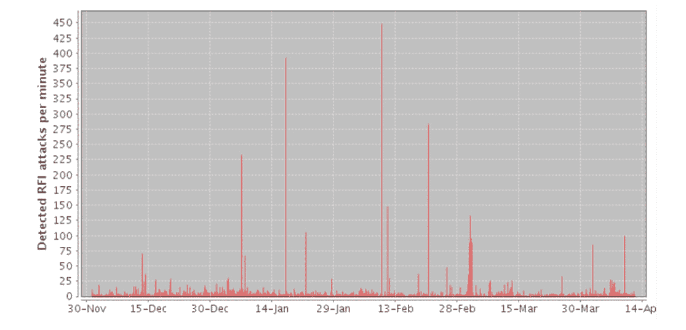

# 黑暗艺术——远程文件包含

> 原文：<https://hackaday.com/2017/07/31/the-dark-arts-remote-file-inclusion/>

在 2010 年的最后几个小时，一个名为 Lulzsec 的黑客组织在互联网上肆虐，留下了一条被入侵的服务器路径，一系列被篡改的主页，泄露的电子邮件和登录信息。他们最终因人为失误而被逮捕，该组织的领导人成为了联邦调查局的线人。这一小撮相对年轻的黑客把事情搞得一团糟。在数字尘埃落定之后，研究人员、记者和编码人员开始剖析这些看似无害的孩子是如何能够驾驭如此强大的力量并控制万维网的。他们的发现不仅让网站管理员和编码员大开眼界，也让大家看到了我们所有的数据是多么的脆弱。它开创了一个重新关注安全性和如何编写安全代码的时代。

在这个黑魔法系列中，我们仔细观察了 Luzsec 黑客用来非法访问服务器的主要技术。我们已经讨论了其中的两个——[SQL 注入(SQLi)](https://hackaday.com/2016/03/09/the-dark-arts-sql-injection-and-secure-passwords/) 和[跨站点脚本(XSS)](http://hackaday.com/2016/03/23/the-dark-arts-cross-site-scripting/) 。在本文中，我们将讨论最后一项技术，称为远程文件包含(RFI)。

**免责声明**:幸运的是，Lulzsec 垮台后，安全意识编码实践的激增(在很大程度上)已经从整个互联网上消除了这些漏洞。这些技术是非常过时的，不会在任何维护和/或防火墙后的服务器上工作，并且您的 IP 可能会因为尝试它们而被标记和记录。但是可以随意在家里设置服务器，到处玩。

## PHP，是的，你应该更了解我

RFI 攻击不像 SQLi 和 XSS 攻击那样广为人知。然而，这是让恶意代码在易受攻击的目标服务器上运行的非常有效的方法。它的工作原理是在 HTTP 请求中包含一个远程文件。它的基本形式是附加一个 URL 以包含来自远程服务器的文件。例如，你可以在地址栏中输入类似于`[http://www.ilurvmesomearduino.com/index.php?page=http://www.hackaday.com](http://www.ilurvmesomearduino.com/index.php?page=http://www.hackaday.com)`的内容，而不是输入`[http://www.ilurvmesomearduino.com/](http://www.ilurvmesomearduino.com/)`？

如果您获得了黑客日网页，那么`[http://www.ilurvmesomearduino.com](http://www.ilurvmesomearduino.com)`很容易受到 RFI 攻击。你所做的是在 Arduino 站点服务器上运行`[http://www.hackaday.com/index.php](http://www.hackaday.com/index.php)`。没有什么能阻止你做像`[http://www.ilurvmesomearduino.com/index.php?page=http://www.dosomethingbad.php](http://www.ilurvmesomearduino.com/index.php?page=http://www.dosomethingbad.php)`这样的事情

这种可能性最普遍的原因是，web 编码人员通常会像这样构建指向其站点内其他页面的链接:

```
	------| index.php?page=uno.php
	------| index.php?page=mega.php
	------| index.php?page=due.php

```

这样，index.php 主页中的链接将简单地调用另一个。php 文件。为此，他们将使用 include()函数来调用 uno、mega 和 due.php 的子页面。考虑一下我们在网上发现的[稍加修改的代码](http://tech-blog10.blogspot.com/2011/09/remote-file-inclusionrmi.html)(写于 2011 年)来自一个化名为[B.K.]的黑客:

```

&lt;?php if(isset($_GET['page'])) //vulnerable to RFI 
{
$page=$_GET['page']; 
include($page.&quot;.php&quot;); 
} 
else{ 
?&gt;
&lt;html&gt;

&lt;h1&gt;I Love Arduino&lt;/h1&gt;
click here for &lt;a href=&quot;/index.php?page=uno&quot;&gt;Uno&lt;/a&gt;
click here for &lt;a href=&quot;/index.php?page=mega&quot;&gt;Mega&lt;/a&gt;
click here for &lt;a href=&quot;/index.php?page=due&quot;&gt;Due&lt;/a&gt;
&lt;/html&gt;
&lt;? } ?&gt;

```

你能看出问题出在哪里吗？当 HTML 块中的链接被点击时，它被传递给`GET`变量。如果你点击“Uno”链接，`include()`功能会将网址解析为`[http://www.ilurvmesomearduio.com/index.php?page=uno](http://www.ilurvmesomearduio.com/index.php?page=uno)`。这里没有什么可以阻止某人包含域外的文件。没有什么能阻止你把`?page=uno`改成你想要的。

这就是基本 RFI 攻击的工作原理。当然也有变化。在评论中让我们知道你的最爱吧！

## 自动工具

如您所见，这种攻击非常简单，只需构建一个程序，就可以查找易受 RFI 攻击的页面，然后运行代码从易受攻击的服务器中提取信息。这正是本世纪初发生的事情。下图显示了 2010-2011 年记录的 RFI 攻击。这些峰值主要是针对单个用户的，这表明有一种自动化工具在起作用。



[Source via Imperva](https://www.imperva.com/docs/HI_Remote_File_Inclusion.pdf)

## 防止 RFI 攻击

幸运的是，阻止 RFI 攻击相对容易。绝对最好的方法是进入你的`php.ini`文件，设置`allow_url_fopen`和`allow_url_include`为关。如果你保持你的服务器更新，它们应该是默认关闭的，但是还是要检查。另一种方法是净化输入，就像防止 SQLi 一样。这可以通过创建一个可以在您的服务器上运行的文件白名单来实现。总有一个好的防火墙可以在这种攻击开始之前阻止它们。

最重要的是，我们应该总是从黑客的角度来看代码，寻找弱点，当然，当发现新的漏洞时，要尽快修补漏洞。与 SQLi 一样，RFI 的问题是向任意用户输入开放系统。这是互联网从惨痛的教训中学到的。我们希望。