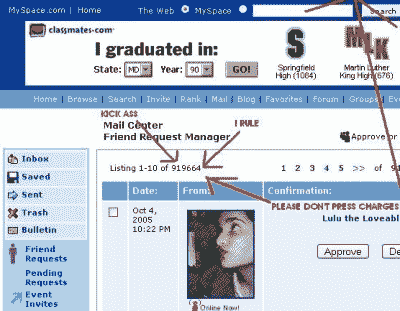

# 黑暗艺术:SQL 注入和安全密码

> 原文：<https://hackaday.com/2016/03/09/the-dark-arts-sql-injection-and-secure-passwords/>

随着 2005 年接近尾声，一个名为 Myspace 的网站开始走红。该网站拥有数百万用户，是世界上最受欢迎的社交网站。它的独特之处在于它允许用户使用 HTML 代码定制他们的 Myspace 页面。我们大多数人，拜托…承认吧…有一个 Myspace 页面。编码部分很有趣！但是并不是所有的事情都可以用代码来改变。您最多只能上传 12 张图片，并且关系状态下拉菜单只有几个选项可供选择。这些限制让[Samy Kamkar]很不爽，他是一个来自洛杉矶的 19 岁黑客。



[Source](http://motherboard.vice.com/read/the-myspace-worm-that-changed-the-internet-forever)

没多久[Samy]就想出了如何欺骗网站，让他上传更多图片，并将他的关系状态改为定制的“处于*热恋*关系中”。在用一些简单的技巧欺骗了 Myspace 网站之后，他意识到他可以用它做任何他想做的事情。这就是事情变得有趣的地方。花了一周多一点的时间开发了一个脚本，可以迫使访问他页面的人将他添加为好友。但这还不够。然后，他编写了脚本，将自己复制到访问者的页面上。[萨米]发明了一种自我繁殖的蠕虫。

当[萨米]上床睡觉时，剧本开始播放。第二天早上醒来，他收到了 200 条好友请求。一小时后，人数增加了一倍。[Samy]很担心，给网站管理员发了一封匿名邮件，警告他有蠕虫。它被忽略了。到当天下午 1:30，他已经有超过 6000 个好友请求。就像任何优秀的黑客一样，他的幽默感让他编写了脚本，将自己的名字添加到每个访问者的英雄列表中。这激怒了许多人，他们把他从自己的页面上删除了，但不久之后当他们访问另一个(被感染的)页面时，又被重新感染了。

[萨米的]剧本失控了。随着夜幕的降临，他的好友人数已经达到了 919，664 人。就在 Myspace 让他们的服务器离线以弄清楚发生了什么之前，它将突破 100 万大关。两小时后，网站恢复了。[Samy 的]个人资料页面已被删除。

[萨米]使用了一种被称为跨站脚本(XSS)的技术来完成他的黑客攻击。我们将在以后的文章中谈到 XSS。现在，我们将坚持最基本的——正确的密码和 SQL 注入。

## 密码安全性

首先，我们需要触及一些基本问题。无效的密码会使你所采用的所有黑客保护措施变得毫无用处。在我们的[上一篇文章](http://hackaday.com/2016/01/26/the-dark-arts-meet-the-lulzsec-hackers/)中，我们谈到了一群被称为Lulzsec 的黑客是如何入侵软件安全专家【亚伦·巴尔】的公司网站的。他的主要密码是“kibafo33”。据[密码安全检查人员](https://howsecureismypassword.net/)称，破解大约需要 11 分钟。添加一个特殊字符并大写一个字母，如 Kiba#fo33，需要 275 天。

破解密码包括使用常用短语和暴力攻击。在暴力攻击中，所有字母、数字和特殊字符的组合都会按顺序尝试。因此，选择更长的密码和更多的字符类型会使破解变得更加困难。这就是为什么许多网站坚持要求你至少使用一个特殊字符，并且要大写字母，因为这样可以大大提高密码的安全性。创建一个本质上牢不可破的密码并不需要太多的努力。所以在你检查你的网站漏洞之前，先从你的密码开始。

## SQL 注入

SQL 注入(SQLi)是一种允许攻击者在输入字段中执行 SQL 语句的技术。Lulzsec 黑客们非常成功地使用了这种技术。一个名为[Kayla]的成员编写了一个自动程序，梳理成千上万的网址，并返回那些容易受到攻击的网址。通常，恶意的 SQL 语句会与正常输入一起传递给数据库。例如，用户可以在用户名/密码登录提示的密码字段中键入:

```
password’ OR 0=0
```

产生的 SQL 查询类似于:

```
SELECT id FROM users WHERE username=’username’ AND password=’password’ OR 0=0
```

添加的语句“0=0”始终为真。如果没有适当的检查，这将导致绕过身份验证过程，登录到数据库上第一个人的帐户，这个人通常是数据库管理员。现在，你不太可能找到一个有这种漏洞的现代网站，但是检查一下也无妨。经常被忽视的是简单的黑客行为。


[Source](https://xkcd.com/327/)

SQLi 的一种更高级的形式叫做基于 *union* 的 SQL 注入。它涉及一个类似的过程，但是使用 UNION SQL 操作符来访问 HTTP 响应中的数据。一家安全公司建立了一个[假冒测试网站](http://testphp.vulnweb.com)，该网站容易受到这种类型的攻击，我们将利用该网站进行演示。

键入以下内容:

```
http://testphp.vulnweb.com/artists.php?artist=1
```

这是一个完全正常的查询，但容易受到 SQL 注入的攻击。您可以通过在字符串末尾加一个撇号(')并观察 SQL 错误消息来判断。这只是一个测试网站，所以去试试吧！我们将通过请求一个不存在的记录来利用它，比如“artist = -1”。它可以是数据库中不存在的任何数字。然后我们将使用 UNION 操作符将我们的恶意语句加入到请求中。恶意语句将被选择。

```
http://testphp.vulnweb.com/artists.php?artist=-1 UNION SELECT 1, 2, 3
```

这证明了如果我们友好地请求，数据库将返回数据。现在让我们得到一些有用的数据，比如一个(假的)信用卡号。

```
http://testphp.vulnweb.com/artists.php?artist=-1 UNION SELECT 1,pass,cc FROM users WHERE uname='test'
```

## 更深入


[Source](https://www.reddit.com/r/ProgrammerHumor/comments/2jczfg/got_my_new_license_plate_today/)

在测试网站上运行流氓 SQL 语句是一回事，在真实网站上运行是另一回事。到目前为止，您应该已经意识到，您需要温习您的 SQL 技能，以真正理解任何真正的渗透测试。找到有漏洞的真实网站是第一步，但与我们的例子没有太大区别。PHP 站点容易成为攻击目标，因为它们更容易受到 SQLi 攻击。一种叫做 [Google Dorking](https://info.publicintelligence.net/DHS-FBI-NCTC-GoogleDorking.pdf) (pdf)的方法是用来找到这些网站的一种方法。这里有一个例子可以输入到你最喜欢的搜索引擎中:

```
*inurl:article.php?id=*
```

这显示了大约 160 万个结果，和以前一样，在 URL 后面加上撇号是简单的测试。如果返回 SQL 错误，则该站点容易受到 SQL 攻击。从这一点出发，攻击者将继续使用 SQL 语句来计算数据库中有多少列，然后开始利用它。

## 防止 SQL 注入攻击

现在，您已经有了足够的信息来开始测试您的站点，看看它是否容易受到 SQLi 攻击。在许多情况下，黑客最终会得到数据库密码的 MD5 散列。然后他们会使用各种破解程序来获取密码…这也是你应该使用安全密码的另一个原因，不要在不同的账户上使用相同的密码。

防止 SQLi 可以通过[净化网页上的输入](https://css-tricks.com/snippets/php/sanitize-database-inputs/)来实现。这将防止任何人在不需要数字的地方输入“0=0”。绝大多数页面的输入都将被净化。但是只要一个失误就会使整个网站暴露在攻击之下。如果你碰巧遇到一个没有对输入进行消毒的网站，请友好地给网站管理员发一封电子邮件。把你的黑客技能留给建设性的努力。

 [https://www.youtube.com/embed/rHcQPWLIuEE?version=3&rel=1&showsearch=0&showinfo=1&iv_load_policy=1&fs=1&hl=en-US&autohide=2&wmode=transparent](https://www.youtube.com/embed/rHcQPWLIuEE?version=3&rel=1&showsearch=0&showinfo=1&iv_load_policy=1&fs=1&hl=en-US&autohide=2&wmode=transparent)


**来源**

[Acuntix](http://www.acunetix.com/websitesecurity/sql-injection/)