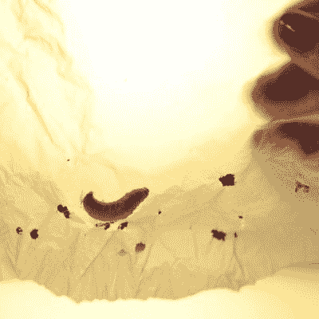

# 要处理塑料垃圾，你需要的只是虫子

> 原文：<https://hackaday.com/2017/04/27/the-deal-with-trash-plastic-all-you-need-is-bugs/>

现在在一些地方被宣布为非法，或者只能以很高的价格购买，每年使用的数十亿个“t 恤”袋带来了严重的废物管理问题。无论是像人造风滚草一样吹过大地，像假水母一样漂浮在海洋中，还是堵塞城市废物流，找到一种处理它们的方法真的会有所不同。找到一种吃聚乙烯和排泄防冻剂的细菌可能是生物修复混乱的第一步。

 正如许多科学发现一样，了解更大的蜡螟幼虫阶段有用的和意想不到的饮食习惯*大蜡螟*可以归因于偶然的发现。它开始于生物化学家[费德里卡·伯托基尼]从她的蜂箱中清理一只蜡螟。她把喜欢吃蜂蜡的害虫放在塑料袋里，后来发现它们咬出了一条路。出于好奇，她和 Paolo Bombelli 用这些虫子做了一些实验。他们表明这种机制不仅仅是机械的，蠕虫也在消化聚乙烯，12 小时内 100 只蠕虫消耗了 92 毫克。这比用细菌进行生物修复要快 1000 倍。

此外，这种细菌在这个过程中会分泌乙二醇，一种有用的工业化学物质。最后，为了看看这个过程是否可以规模化，研究人员展示了一种蜡螟幼虫的匀浆可以消化 PE 片。如果相关的酶能够被分离和改造，这可能会导致一个工业过程。描述这一过程的信令人着迷。

虽然这可能不是处理塑料回收的经典方式，但这种方法的潜力是巨大的。我们期待看到这种情况的发展。

[图片:塞萨尔·埃尔南德斯/ [CSIC](http://www.csic.es/)