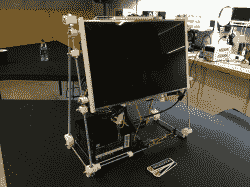
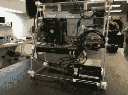
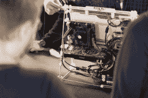
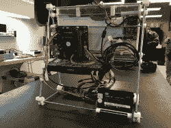

# DIY 便携式电脑

> 原文：<https://hackaday.com/2017/01/28/the-diy-luggable-pc/>

如果你最近没有去买过笔记本电脑，当你去的时候，你会大吃一惊。最近的消费笔记本电脑很薄，功能强大，价格便宜得惊人，苹果最新的 MacBook Pros 甚至有一个神奇的“触摸栏”——一个触摸感应有机发光二极管显示器，功能键应该在那里。有史以来最棒的笔记本电脑已经在 T2 上市，而且也不贵。

不幸的是，笔记本电脑作为一个平台本质上是一种妥协。如果你想要一个独立的 CPU，或者如果你只是想选择你自己的部分，你会降级到桌面构建。机箱制造商并没有真正考虑到可扩展性和可移植性之间的中间地带，即使是罕见的“局域网党”机箱也很少有手柄。

[罗杰]正在采取措施解决这个问题。他设计了一台 3D 可打印便携式电脑。是的，现在您可以拥有一台 GTX 1080 和一台 22 核至强处理器，而且外形小巧，便于携带。它可以放在你下一次航班的行李架上，是的，显示器也包括在内。

任何在 2011 年制造 3D 打印机的人都应该熟悉这种 DIY 便携式电脑的构造。它由螺纹杆制成，带有液晶面板、ATX 电源、主板和固态硬盘的支架。由于这是一个有效的模块化系统，您可以加载硬件。[Roger]的内置显示器取自一台旧笔记本电脑，通过易贝的“LCD 控制板”驱动。

虽然便携式电脑可能是一个非常小众的使用案例，但它仍然是一个服务远远不足的案例。我最近建造了一个新的战斗站，在搜索[几个月后，我最终放弃了，屈服了，买了 Linus 让我买的任何东西。你根本买不到一个侧面固定有显示器的 ATX 保护套，而[Roger]的制作是我们见过的第一个 DIY 解决方案。](http://www.ariesys.com.tw/ARP640.htm)

复制这个项目的所有文件都链接到[Roger]的 Hackaday.io 项目，这将是一个基于社区的项目构建一个开放的硬件便携式 PC 机箱的良好基础。几天前，[Roger] [将这台电脑带到了 Hackaday LA 一月聚会](https://hackaday.io/project/19583/log/52444-luggable-pc-at-hackaday-la-january-meetup)。他在火车上带来了聚会，提供了足够多的证据证明这是一台真正的便携式电脑。看看下面聚会上的照片。

