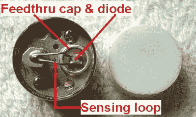

# 早起的鸟儿有虫吃

> 原文：<https://hackaday.com/2017/10/13/the-early-bird-repairs-a-slug/>

当面对有问题的鸟鼻涕虫时，[查克·马丁]没有放弃。他啄走了蛞蝓，带着我们一起去兜风。如果你不理解这句话，请继续读下去！任何去过 hamfest 的人都见过鸟表。Bird 瓦特计是测量发射机功率的实际标准。鸟米不只是从 DC 到光工作。其实 43 型本身就是一点传输线，一米机芯。神奇的事情发生在可更换的测量元件内部。这些元件被亲切地称为“slugs ”,针对一个频带和功率范围进行了校准。例如 4410-6 型，工作频率为 50–200 MHz，最大功率为 1 kW。大多数火腿有一个这些鼻涕虫的集合，以配合他们传输的波段。

[Chuck 的]问题儿童是 100E 型元件，适用于 400-1000 MHz 的 100 瓦。不过，仪表输出似乎不稳定。使用第二个仪表和一个已知良好的内存块进行了一些故障诊断，将问题隔离到 100E。问题被隔离到 slug，但是如何修复它呢？

Slugs 是密封的黄铜容器，每个都在工厂校准到 5%的精度。它们是你在火腿世界里能找到的最接近“内部无用户可维修零件”的东西。尽管如此，[查克]没有什么可失去的。他将金属块浸泡在少量二甲苯溶剂中，以松开固定金属标签的胶水。在那后面是一个油漆过的螺丝和一个校准罐的孔。我们猜测油漆是伯德的篡改检测的想法。

拔出螺丝，去掉子弹背面的尼龙盖，真相就大白了。该块包含一个校准的传感回路、一个二极管、校准罐和一个终端电阻。在(查克的)案例中，他所要做的就是清洁鼻涕虫上的触点，一切都很好——但只有 11 年。之后，鼻涕虫又开始捣乱了。这次清洗没有解决问题。[Chuck]最终用 Digi-key 的类似型号替换了校准电位计。他根据已知的良好仪表重新校准了弹头。这可能不是实验室质量校准，但这种子弹应该在[查克的]窝棚里再用几十年。