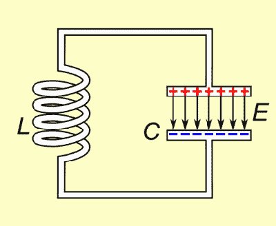
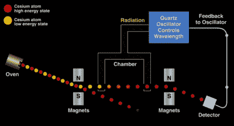

# 振荡的演变

> 原文：<https://hackaday.com/2015/11/03/the-evolution-of-oscillations/>

我正在使用的笔记本电脑是在秋叶原的垃圾箱里以 50 美元的价格找到的，它的 CPU 运行频率为 2.53GHz。每秒钟有 25.3 亿次电子系统地短暂脉冲。对人类来说，这是不可想象的，然而 200 年前人类对电振荡一无所知。

当然，振荡有明显的自然来源，太阳也许是最明显的。毕达哥拉斯学派首先提出地球的自转导致了太阳的日循环。他们的系统比我们现在所知的真相更加深奥和复杂，包括一个假定的[反地球，](https://en.wikipedia.org/wiki/Counter-Earth)隐藏在中央火焰后面看不见。不管他们的理论包含什么错误，在旋转和振荡之间建立了一个中心联系。

早期的电子振荡器利用了旋转运动。这两种交流发电机，类似于现在使用的那些，以及更深奥的设备，如[断续器](https://en.wikipedia.org/wiki/Interrupter)。由 [Charles Page](https://en.wikipedia.org/wiki/Charles_Grafton_Page) 于 1838 年发明，断续器使用摇摆或旋转运动将金属丝浸入水银槽中，周期性地断开电路以产生简单的振荡。

随着我们向工业发电机发展，交流电变得很普遍。但是无线电发射机也需要越来越高的频率。第一批发射机使用了[火花隙](https://en.wikipedia.org/wiki/Spark-gap_transmitter)。这些简单的发射器使用 DC 电源给电容器充电，直到电容器达到两根导线之间间隙的击穿电压。然后电流电离了间隙中的空气分子。从而允许电流流动，使电容器快速放电。电容器再次充电，重复这一过程。

 [https://www.youtube.com/embed/6dx1sf2gVig?version=3&rel=1&showsearch=0&showinfo=1&iv_load_policy=1&fs=1&hl=en-US&autohide=2&wmode=transparent](https://www.youtube.com/embed/6dx1sf2gVig?version=3&rel=1&showsearch=0&showinfo=1&iv_load_policy=1&fs=1&hl=en-US&autohide=2&wmode=transparent)

An [Alexanderson Alternator](https://en.wikipedia.org/wiki/Alexanderson_alternator)

正如你在上面的视频中看到和听到的，火花隙产生一个嘈杂的，远离正弦输出。因此为了更有效的振荡，工程师们再次求助于旋转。

Alexanderson 交流发电机使用一个切割了数百个槽的轮子。这个轮子放在两个线圈之间。由直流电供电的一个线圈产生磁场，在第二个线圈中感应出电流。开槽圆盘周期性地切割该磁场，产生交流电。亚历山大交流发电机用于产生 15 至 30 千赫的频率，主要用于海军应用。令人惊讶的是，一台 Alexanderson 交流发电机一直使用到 1996 年，并且仍然处于工作状态。

哈蒙德风琴也采用了类似的原理。你可能不知道这个名字，但你会认出这种早期电子乐器的声音:

 [https://www.youtube.com/embed/7Qqmr6IiFLE?version=3&rel=1&showsearch=0&showinfo=1&iv_load_policy=1&fs=1&hl=en-US&autohide=2&wmode=transparent](https://www.youtube.com/embed/7Qqmr6IiFLE?version=3&rel=1&showsearch=0&showinfo=1&iv_load_policy=1&fs=1&hl=en-US&autohide=2&wmode=transparent)

哈蒙德风琴使用了一系列的[音轮](https://en.wikipedia.org/wiki/Tonewheel)和拾音器。拾音器由线圈和磁铁组成。为了发出声音，拾音器被推向一个旋转的轮子，轮子表面有突起。这些类似于 Alexanderson 交流发电机的插槽，并有效地调制磁铁和线圈之间的磁场以产生音调。

### 放大振荡

The operation of a tank circuit (from wikipedia)

到目前为止，我们完全依赖于机电技术，然而放大是所有现代振荡器的关键，为此你当然需要有源器件。最简单的方法是使用一个电感和电容组成一个储能电路。在储能电路中，能量在电感和电容之间来回流动。没有放大，损耗将导致振荡迅速消失。然而，通过引入放大(例如在[科尔皮兹振荡器](https://en.wikipedia.org/wiki/Colpitts_oscillator)中)，该过程可以无限地持续下去。

振荡器稳定性在无线电传输等许多应用中非常重要。更好的振荡器可以让传输信号在频谱上更加紧密，而不用担心它们会漂移和重叠。因此，对更好、更稳定的振荡器的追求仍在继续。这样，晶体振荡器被发现并生产出来。这是一项巨大的努力。

### 生产晶体振荡器

下面的视频展示了 20 世纪 40 年代生产晶体振荡器的典型过程:

 [https://www.youtube.com/embed/b--FKHCFjOM?version=3&rel=1&showsearch=0&showinfo=1&iv_load_policy=1&fs=1&hl=en-US&autohide=2&wmode=transparent](https://www.youtube.com/embed/b--FKHCFjOM?version=3&rel=1&showsearch=0&showinfo=1&iv_load_policy=1&fs=1&hl=en-US&autohide=2&wmode=transparent)

在巴西开采的天然石英晶体被运到美国进行加工。我总共计算了 13 个重要的加工/蚀刻步骤和 16 个测量步骤(包括严格的质量控制)。其中许多技术相当先进，例如使用类似于 [X 射线晶体照相术](https://en.wikipedia.org/wiki/X-ray_crystallography)的技术在 X 射线下校准晶体。

如今，我们的晶体振荡器生产工艺更加先进。自 20 世纪 70 年代以来，晶体振荡器已经在光刻工艺中制造。为了进一步稳定晶体，已经采用了额外的技术，例如温度补偿(TCXO)或在通过使用加热元件(OCXO)控制的温度下操作晶体。对于大多数应用来说，这已经被证明足够准确…但是对于时间螺母来说不够准确。

### 超时使用原子

Typical timenut wearing atomic wristwatch

对于[时间螺母](http://leapsecond.com/time-nuts.htm)来说，没有“足够精确”。这些黑客努力创造最精确的计时系统，当然这一切都依赖于他们能设计出的最精确的振荡器。

许多计时器依赖原子钟来进行测量。原子钟比最好的温控晶体振荡器还要精确一个数量级。

比尔·哈马克有一个很棒的视频，描述了铯束振荡器的操作。基本过程如下图所示。症结在于铯气体以两种能量状态存在，在一个磁场下可以分离。低能原子暴露于辐射源，辐射源的波长由晶体振荡器决定。只有 9，192，631，770 赫兹的波长才能将低能铯原子转换成高能形式。高能原子被引向检测器，检测器的输出用于控制晶体振荡器，使得如果振荡器的频率漂移并且铯原子不再被引向检测器，则其输出被推至正确的值。因此，一个基本的物理常数被用来校准原子钟。

The basic operating principle of a cesium atomic clock

虽然铯标准是已知最精确的振荡器，铷振荡器(另一种“原子”时钟)也为许多时间螺母提供了一种精确而相对便宜的选择。由于电信行业的大规模生产(它们是 GSM 和其他移动无线电系统的关键),这些振荡器的价格已经被压低，而且现在在易贝很容易买到。

有了精确的计时器，时间螺母进行了许多有趣的实验。在我看来，其中最有趣的是测量由相对论效应引起的时间差。一个时间迷带着他的家人和一车原子钟去雷尼尔山度周末。当他回来时，他能够测量出他在旅途中带走的时钟和留在家里的时钟之间有 20 纳秒的差异。这种时间膨胀效应几乎完全符合相对论的预测。令人印象深刻的结果和惊人的家庭出游！

想想 1905 年爱因斯坦提出特殊相对理论的时候，连原始的晶体振荡器都还没有呢，真是太神奇了。火花隙，亚历山大交流发电机将仍然在日常使用。我怀疑他能想象有一天他的理论的成果会被一个人证实，这个人会带着他的孩子去公路旅行，作为一个周末爱好项目。全世界的黑客们，欢呼吧。