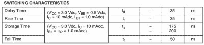
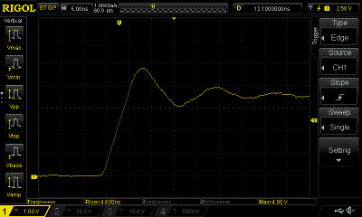
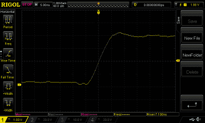
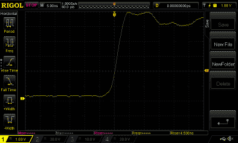
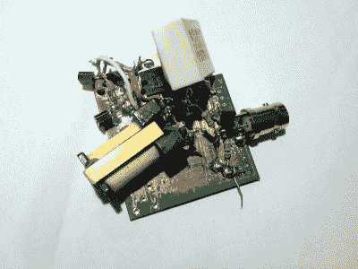

# 西方最快的上升时间:形成真正快速的脉冲边沿

> 原文：<https://hackaday.com/2016/10/03/the-fastest-rise-time-in-the-west-making-a-truly-quick-pulse-edge/>

当我们作为新手工程师学习振荡器时，我们会在示波器或教科书上看到各种波形。他们说，这是正弦波，这是锯齿波，这是方波，等等。我们被教导要将屏幕上的线条视为理想状态，方波是真正的方波，从低电压到高电压的转换是瞬间的。

在大多数情况下，这种假设是无害的。如果我们更深入地研究这个问题，我们会发现看似瞬间的悬崖表面实际上是一个非常陡峭的斜坡，但当电路以毫秒为单位工作时，忽略以纳秒为单位测量的转换时间通常没有坏处。Arduino 项目的粘合逻辑可以慢慢来。

不过，有时逻辑转换的上升时间很重要。促成这篇文章的应用是示波器带宽的测量，例如，通过观察示波器多快赶上超过其带宽的脉冲。当仪器可以愉快地测量所有常用脉冲发生器的跃迁时间时，就需要一些不同寻常的东西了。因此，我们有必要看看日常电路的上升时间，研究一些产生更快上升时间的技术。

## 在我的时代，这被认为是很快的

Switching characteristics of a 2N3904, taken from the [ON Semiconductor 2N3904 data sheet](http://www.onsemi.com/pub_link/Collateral/2N3903-D.PDF).

如果你查看典型晶体管的数据手册，你会发现有一节专门讨论开关特性。以 [2N3094](http://hackaday.com/2016/04/26/pillaging-the-wealth-of-information-in-a-datasheet/) 流行的通用晶体管为例，你会发现它的最大上升时间为 35nS。因此，如果对其基极应用完美的方形转换，其集电极的相应变化将在最多 35 nS 后完成。这听起来可能很快，但它对应的是略高于 7.14 MHz 的正弦波的上升时间。当然，2N3904 能够在小信号模式下以更高的频率工作，但如果它必须遍历整个范围，则只能工作在 7.14 MHz。

A 4.6 nS rise time from a mercury-wetted relay

谈到更快的转换时间，你可能会认为我们的路径直接通向为方波转换设计的元件，如逻辑门。但是在我们开始这个旅程之前，有一个非常快的上升时间的惊人来源，它甚至不是电子的，而是机械的。[水银湿式继电器](https://en.wikipedia.org/wiki/Mercury-wetted_relay)是一种簧片继电器，其触点通过毛细作用被水银覆盖。这产生了瞬时接触，因为其机制是液态汞滴相互结合，而不是弹簧接触。这一接触时间远低于一纳秒，这意味着继电器周围的其余电路和被切换的电压决定了上升时间，因此可以实现极快的时间。我们非常幸运，能够为本文借用一个水银湿继电器，当通过示波器探头测量将逻辑电平切换到 10 K 电阻时，我们能够测量到令人印象深刻的 4.6 nS 上升时间。这需要注意引线长度和陶瓷去耦电容，以清理并缩短到该长度的转换，进一步的措施可能会从该数字中节省更多时间。

Rise time measurement for a SN7410N, 7.1nS

逻辑门针对快速转换进行了优化，应该比我们之前考虑的 2N3904 更快。典型的逻辑门家族当然是 74 系列 TTL 器件，自从该系列在 20 世纪 60 年代首次问世以来，已经有了许多具有不断改进特性的变体。我们找到了唯一的原始 74 系列设备，一个 7410 3 输入与非门芯片。它的[数据表](http://www.ti.com/general/docs/lit/getliterature.tsp?genericPartNumber=SN74LS10&fileType=pdf)引用了典型的 11 nS 的低到高上升时间，也许我们的设备是更好的设备之一，因为示波器测量的时间为 7.1 nS。这相当于正弦波在 35.2 MHz 左右的上升时间，但这个数字是 7410 性能包络的理论上限，实际可用数字要小得多。尽管比 2N3904 要好，但我们肯定能取得更大的成就。

Rise time measurement for a 74HC240, 4.1nS

在试验台上寻找更高速度的 74 逻辑变体，下一个是 74HC240 八进制缓冲器。再往上大约 20 年，测得上升时间为 4.5 nS。比 7410 好得多，但仍相当于 55 MHz 左右正弦波的上升时间。

更近的 74 系列产品提供了改进的上升时间，但浏览大量数据手册表明，它们仍难以实现显著低于 2 nS 的上升时间。随着我们进入皮秒的领域，很明显我们需要一些更特别的东西。

## 速度并不便宜…是吗？

其他针对非常快速的电压转换而优化的器件并不难找到，我们习惯于使用比较器来根据两个模拟电压的比率产生快速的逻辑电平变化。当然，并非所有比较器都属于上述元件类别，例如，无处不在的通用 [LM139](http://www.ti.com/general/docs/lit/getliterature.tsp?genericPartNumber=lm139&fileType=pdf) 及其衍生产品在 TTL 逻辑电平之间的转换时间几乎为 300 nS。但正如 74 逻辑经历了连续几代的技术改进一样，比较器也是如此，一些更奇特的设备将最快的 74 逻辑上升时间远远甩在了身后。例如，ADI 公司的 [ADCMP580](http://www.analog.com/media/en/technical-documentation/data-sheets/ADCMP580_581_582.pdf) 是一款 SiGe 发射极耦合逻辑器件，其上升时间低得惊人，只有 35 pS。不过有一个问题:每个芯片将花费你大约 18 美元，评估板只差令人垂涎的 300 美元。每皮秒 8.30 美元。

This mess of wires produces picosecond pulses.

如果你正在为跃迁本身寻找皮秒级的上升时间，如在我们的“示波器带宽”应用中，而不是为传递一些信息的定时，很高兴有一个更便宜的选择。[雪崩击穿](https://en.wikipedia.org/wiki/Avalanche_breakdown)是一种现象，由于加速的自由电子驱逐更多电子的连锁反应，电场下的绝缘体可以非常迅速地变得导电。当应用于晶体管时，它可以比以传统方式使用时更快地打开设备，正是这一特性可以用来创建具有极快脉冲上升时间的张弛振荡器[。据称，2N3904 可以通过这种方式实现 500 pS 的上升时间，比上面提到的 2N3904 的 35 nS 有所改进。](http://hackaday.com/2013/08/06/avalanche-pulse-generator-design/)

当然，雪崩脉冲发生器有一个问题。双极晶体管的雪崩击穿电压很高，对于 2N3904 来说，远超过 100 V。因此，虽然振荡器本身很简单，但您可能还需要构建某种形式的升压电源。如果推动升压转换器超越其通常的界限还不是你的专业领域，那么你可以填补你的知识空白。然而，很难找到一种设计能够在不求助于特殊设备或特殊技术的情况下突破电子领域的极限，正如我们上图中相当混乱的原型所示，这是一个应该在许多黑客读者能力范围内的项目。当我们检查它的应用程序时，我们将在以后的文章中更详细地介绍它，但同时，如果没有它的图片，这篇文章将是不完整的。

实现最快的上升时间是令人满意的，这与实现最精确的频率基准或原子时计没有什么不同。我们希望我们已经向您介绍了一些关于逻辑转换中上升时间的问题，并且惊讶地发现，使用您可能不得不使用的元件可以实现最快的转换之一，然后您可能想亲自尝试一下。