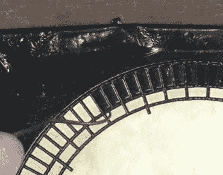

# 酸蚀黄铜的艺术

> 原文：<https://hackaday.com/2018/02/17/the-fine-art-of-acid-etching-brass/>

如果你要再造一个詹姆斯·瓦特测微计，你会从哪里开始？如果你是[拉斯普]，答案会是:“花一年时间试图找到制作蚀刻黄铜片的最佳方法。”对我们来说幸运的是，他已经准备好与世界其他地方分享这些信息。虽然不太可能有其他人在从事这个*特有的*项目，但他详述的在黄铜上获得博物馆质量结果的方法绝对令人着迷。

 这个过程从打磨裸露的黄铜开始，然后在金属上贴上一层透明的包装带。[锉刀]然后用[激光胶带](https://ikonicsimaging.com/lasertape.html)覆盖工件，这是一种特殊的胶带，用于制作喷砂用的激光切割掩模。但是掩蔽原理同样适用于绘画或化学蚀刻。

有了激光胶带后，将碎片放入激光中，切割出掩模。一旦切好，就有一项单调乏味的任务，那就是用牙签将所有切好的胶带片剥离下来。一旦零件被拉下，黄铜就可以进行酸洗了。

任何用氯化铁蚀刻过自己的 PCB 的人都会认识到这些后续步骤。将切片放入酸浴中，每隔 10 分钟左右搅动一次。有趣的是,[rasp]将工件倒置在浴缸中，使用 3D 打印的小“脚”将黄铜片悬挂在容器底部。这使得蚀刻过程中的碎屑落下并远离工件。在阳光下晒了大约一个小时后，将该片从浴中取出，小心地洗去。

 一旦清理干净，就用黑色喷漆将被蚀刻的地方涂黑。当油漆干了，胶带层被小心地剥开，露出蚀刻画时，真相大白的时刻就来了。然后用 1000 和 2000 粒度的砂纸对工件进行湿砂处理，最后一遍用抛光剂使表面光亮如镜。这是相当多的体力劳动，但最终结果真的很壮观。

在休息后的视频中，[rasp]分解了整个过程，包括将这些黄铜片变成最终机器的功能组件所需的额外机器工作。作为一个额外的奖励，他甚至包括了许多他失败的尝试，以努力防止其他人犯同样的错误。这是我们希望在 Hackaday 看到的。

这里使用的工艺[类似于我们今年早些时候展示的时髦的黄铜铭牌](https://hackaday.com/2018/01/25/three-ways-to-etch-snazzy-brass-nameplates/)，并且[甚至没有使用光致抗蚀剂](https://hackaday.com/2015/06/24/etching-a-clock-face-with-pcb-techniques/)的激光。

[通过 [/r/DIY](https://www.reddit.com/r/DIY/comments/7xa7x1/acid_etching_brass_the_easiest_way_ive_found/)

 [https://www.youtube.com/embed/ZbidR3z2YJ4?version=3&rel=1&showsearch=0&showinfo=1&iv_load_policy=1&fs=1&hl=en-US&autohide=2&wmode=transparent](https://www.youtube.com/embed/ZbidR3z2YJ4?version=3&rel=1&showsearch=0&showinfo=1&iv_load_policy=1&fs=1&hl=en-US&autohide=2&wmode=transparent)

