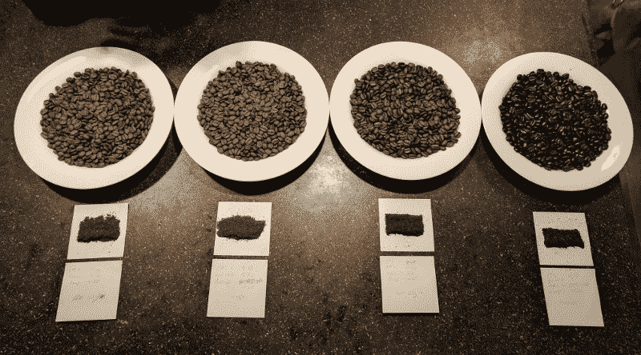
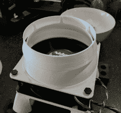

# 加热和冷却咖啡豆的艺术

> 原文：<https://hackaday.com/2017/10/16/the-fine-art-of-heating-and-cooling-your-beans/>

他们说，如果一件事值得做，就值得把它做对。这些都是很好的生活准则，但在 Hackaday，我们偶尔会坚持这句话的一个细微变化:“如果值得做，就值得做得太多”。所以，当我们看到罗布·林奈(Rob Linnaeus)为了烘焙咖啡豆所做的令人难以置信的大量工作和细致的研究时，我们知道他有所发现。

他的咖啡烘焙器的核心是一个涡流室，侧面有一个开口，用于放置标准热风枪，顶部有一个孔，用于放置八杯面粉筛。[Rob]在 Fusion 360 中模拟了燃烧室，并使用 RealFlow 的流体模拟验证了其特性。然后，他制作了一个密室的负片，并在他的独家制造商 Select 3D 打印机上打印出来。

他用 1:1 的耐火水泥和珍珠岩混合物填充模具，并在模具凝固时用往复锯的背面振动模具，这样任何气泡都会上升到表面。固化一天后，[罗布]然后通过加热和剥离来移除模具。在接下来的几个小时里，铸件在烤箱中以越来越高的温度进行烧制，从 200°F 一直到 500°F。这一部分非常重要，因为如果零件立即受到高温的影响，截留的水可能会变成蒸汽并导致爆炸。如果这听起来很像制造一个小熔炉的过程，[那是因为它基本上是](https://hackaday.com/2012/08/27/build-your-own-forge-inside-a-gallon-paint-can/)。

随着该项目的物理部分基本完成，[Rob]下一步进入了实验阶段，这样他就可以准确地确定热风枪需要运行多长时间。有了一份看起来像是他为胡安·瓦尔迪兹技术学院写的论文的演示，他能够微调他的过程，直到他得到精确到秒的理想烘烤时间。

最后，因为烘焙咖啡豆的复杂方法需要同样复杂的冷却方法，所以[Rob]创造了一个 3D 打印适配器，可以用螺栓固定在 120 毫米的风扇上。乍一看，他的冷却器看起来很简单，但仔细观察，你可以看到侧面有一排开口，在冷却的咖啡豆数量限制气流的情况下，这些开口有助于排出背压。这防止风扇达到失速状态，失速状态是轴流式压缩机中的故障模式，在轴流式压缩机中，气流实际上可以反向。

[Rob]说他对目前的实验结果很满意，并相信他可以通过改进水泥混合物来提高铸件的质量。他还在考虑用硅胶模具取代 3D 打印模具，硅胶模具可以重复使用，允许他扩大生产规模。由于他还没有决定这是否会成为一个商业产品，所以[Rob]决定暂时将他的零件的 STL 文件保密，但是如果你想尝试和复制他的工作，他到目前为止分享的细节应该足以让你开始。

这不是第一次有人用热风枪烘烤咖啡豆，但这无疑是最完美的尝试之一。我们建议他用一台 [3D 打印咖啡研磨机](https://hackaday.com/2017/09/07/a-3d-printed-coffee-grinder/)来完成他的收藏，但是有人已经抢先一步了。