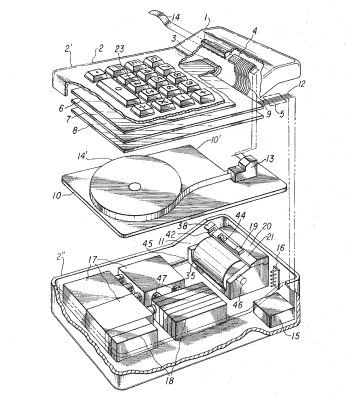
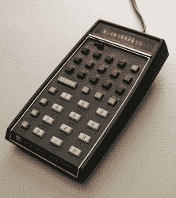
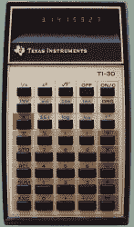
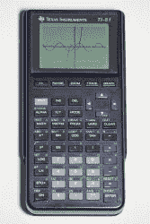

# 制造计算器并改变世界的飞行

> 原文：<https://hackaday.com/2017/11/27/the-flight-that-made-the-calculator-and-changed-the-world/>

那是 1965 年的秋天，德克萨斯仪器公司的杰克·基尔比和帕特里克·哈格蒂坐在一架飞机上，听哈格蒂解释他关于手掌大小的计算器的想法。这是一个巨大的挑战，因为在那个时候，计算器只有打字机那么大，而且是插在墙上的电源插座上的。Kilby，[七年前在 TI](https://hackaday.com/2017/11/07/how-the-integrated-circuit-came-to-be/) 时与人共同发明了集成电路，他活着就是为了解决问题。

Fig. 2 from US 3,819,921 Miniature electronic calculator

当他们着陆时，Kilby 已经决定他们应该推出一款可以放在你口袋里的计算器，价格不到 100 美元，可以加、减、乘、除，也许还可以做平方根运算。他为这一努力选择了代号“加州理工工程”,这似乎是合乎逻辑的，因为 TI 之前有一个“麻省理工工程”。

他们决定从头开始，而不是研究现有的计算器是如何工作的。这项任务被分成五个部分:键盘、内存、处理器、电源和某种形式的输出。处理部分归结为四个芯片的设计，比最初的希望多一个。当时的输出也很棘手。阴极射线管是不可能的，霓虹灯需要太高的电压，发光二极管仍然不够亮。最终，他们开发了一种热敏打印机，将图像烧进热敏纸中。

仅仅过了 12 个月，所有的零件都摊开在一张桌子上，它悄悄地吐出了正确的答案。提交了一份专利申请，产生了第[号美国专利第 3，819，921 号](https://www.google.ca/patents/US3819921)、*号微型电子计算器*，该专利概述了所有计算器的基本设计。这个想法是在飞机上的一次讨论中产生的，它是一个关键时刻，改变了我们教每个学生的方式，并将固态计算技术的力量带入了日常生活。

TI 向许多公司展示了 Cal Tech 原型，佳能对此很感兴趣。佳能将其作为 Pocketronic 推向市场，1970 年 10 月在日本发布，1971 年 4 月在美国发布，售价约为 150 美元(2017 年为 910 美元)。它有三个芯片和一个热敏纸带读出器。它仍然只是手持的，不是真正的口袋大小，但卖得很好。

那时，许多其他的手持计算器也进入了市场。1970 年 11 月，第一台单芯片计算器 Mostek MK6010 问世，随后在 1971 年 2 月，第一台真正的袖珍计算器 Busicom LE-120 a“Handy”使用了该芯片。同年，TI 公司也推出了他们自己的单芯片计算器。1972 年，TI 公司开始发布自己的计算器。

HP-35, the first scientific calculator, by [Seth Morabito](https://www.flickr.com/photos/35237091544@N01) CC BY 2.0

1972 年，惠普公司发布了第一台科学计算器 HP-35，它可以代替计算尺。它使用反向波兰符号([，我们自己的【Jenny List】最近写的关于](https://hackaday.com/2017/10/24/reverse-polish-notation-and-its-mildly-confusing-elegance/))，包括科学符号，有 35 个按钮，因此得名。尽管标价 395 美元(2017 年为 2320 美元)，但第一年就售出了 10 万台。HP-35 和 1974 年 TI 公司售价 150 美元的 SR-50 一起宣告了计算尺的终结。(SR 代表计算尺。)

通过真空荧光显示器、发光二极管和液晶显示器，显示技术也取得了进步。20 世纪 70 年代中期，扭曲向列型液晶显示器(TN)让计算器在明亮的背景上显示出现在无处不在的黑色数字，同时将功耗降低到可以在纽扣电池上运行的程度。

随着新功能的增加，价格下降，销售额每年翻一番。到 1976 年，一台四功能计算器只需要几美元。1972 年，美国售出了 500 万台计算器，十年后，美国的计算器数量超过了人口数量。

为什么计算器变得如此流行？这是一个为未知市场设计的消费品的明显例子。当哈格蒂在 1965 年构思这个想法的时候，计算器很重，在桌面上占据了很大的空间，所以也许你可以随身携带的便利性起到了一定的作用。他们也不需要设置，不需要编程——只需打开/关闭开关，进行一些计算。对于普通人来说，它们取代了学习乘法表的需要，而乘法表是计算一打苹果值 0.05 美元时所必需的。他们也让高中生在物理作业中做三角学变得更容易。不过，在 20 世纪 70 年代初，鉴于最初的高价，也许是工程师和公司首先购买了它们。

TI-30, by D. Meyer CC BY-SA 3.0

我可以证明是后者。大约在 1976 年，我刚刚成为一名青少年，当时我父亲花 25 美元买了一台 TI-30 计算器，相当于 2017 年的 107 美元左右。他作为电工工作的采矿公司提供了这些设备。在那之前，我记得我用长除法将一张很长的纸分割成一幅壁画，这幅壁画是学校戏剧的背景。我可能会继续学习使用计算尺，但从来没有。有了计算器之后，我只在没有计算器的时候在纸上做过一次长除法，虽然我只是为了好玩，看看我是否记得怎么做。

TI-81 graphing calculator, by Calcvids CC BY-SA 3.0

在接下来的几十年里，计算器继续获得功能。1974 年，惠普推出了第一台可编程计算器 HP-65。它有 100 种功能，用磁卡阅读器存储程序。从 1978 年开始，一家名为 Calculated Industries 的公司发布了非常小众的计算器，如用于房地产行业的贷款安排器，具有计算付款和未来价值的功能。后来出现了具有俯仰、上升、运行、英尺-英寸转换等编程功能的建筑大师。20 世纪 90 年代，TI 推出了 TI-81，这是一款用于代数和微积分课程的流行图形计算器，由 Zilog Z80 提供动力。

如果我没记错的话，那是一台带有单行公式显示器的可编程夏普 El-5040，我把它留在了一所大学的礼堂里，希望能在一位工程师的桌子上找到一个好归宿。现在，我的夏普 EL-531W，也有一个可以检索和编辑的单行公式，一直放在我的电脑显示器旁边，每天都在使用，而我以为已经丢失但后来找到的卡西欧 fx-3600P，则放在我的书桌抽屉里等待轮到它。

这是 Hackaday，你无疑有一个经常使用的计算器。或者你有自己的美好回忆，关于一个离家出走的人，或者一个和你一起长大的家庭。或者也许有一个你已经黑了，像[这个 ESP8266 连接的科学计算器](https://hackaday.com/2017/04/29/the-connected-calculator-with-esp8266/)？与我们分享你的故事，我们很想听听计算器是如何在你的生活中发挥作用的。我们还想知道，既然智能手机的无限适应性已经使计算器应用成为今天即将到来的工程候选人的首选，那么计算器作为一种独特的电子产品还能存在多久？

[通过[电子博物馆](http://www.dentaku-museum.com/calc/calc/3-canon/2-pktr/pocketronic.html)在主图像中使用 Pocketronic 照片]