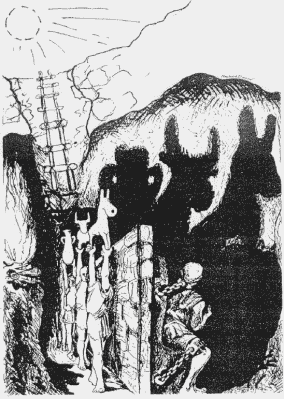
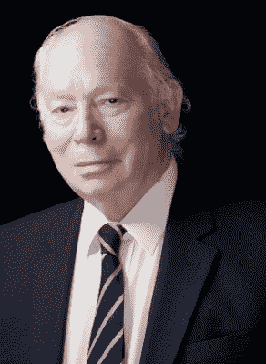
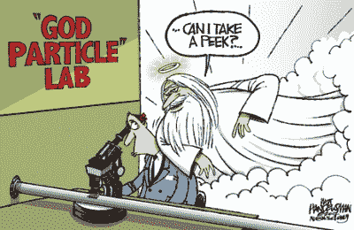

# 上帝粒子

> 原文：<https://hackaday.com/2017/03/13/the-god-particle/>

希腊哲学家柏拉图以他的寓言和隐喻而闻名。尤其令人感兴趣的是他的洞穴寓言，出现在公元前 380 年左右的《理想国》中。在这本书里，柏拉图描述了一群囚犯，他们被锁在山洞的一堵墙上，度过了一生。他们与洞穴外的世界没有直接的互动。他们只能通过投射在对面墙上的阴影来了解这个世界。对囚犯来说，阴影就是他们的现实。尽管你我都知道阴影只是现实的低分辨率表现。

[Plato’s “Allegory of the Cave”](https://en.wikipedia.org/wiki/Allegory_of_the_Cave#/media/File:Plato_-_Allegory_of_the_Cave.png), drawing by Markus Maurer

理论物理学家、诺贝尔奖得主史蒂芬·温伯格曾把自己比作柏拉图洞穴中的囚犯。我们永远被我们能做的测量和实验的[限制束缚在这个洞穴里。我们所能知道的只是存在于亚原子世界中的现实的影子。我们可以看到隐藏在我们的数学中的模糊的数字，以及在我们的](http://hackaday.com/2016/07/18/uncertainty-the-key-to-quantum-wierdness/)[云室](http://hackaday.com/2016/06/11/open-source-cloud-chamber/)中的一缕薄雾状的蒸汽轨迹。我们试图用我们的想象力去揭开面纱，画出漂亮的图表和动画来描绘我们大脑的眼睛认为它能看到的东西。但最终，我们都被困在一个山洞里…盯着影子。我们永远无法真正了解的现实的反映。

在我们上一篇量子力学文章中，我们向你介绍了[量子电动力学](http://hackaday.com/2017/01/24/the-birth-of-quantum-electrodynamics/)的概念，或者更简单地说——量子场论。在这篇文章中，我们将探索 QED 如何导致被称为希格斯玻色子，也被称为上帝粒子的东西的预测和最终确认。像往常一样，我们的目标是让事情尽可能简单，让任何有好奇心的人都知道这个上帝粒子讲座是关于什么的。像量子世界中的许多事情一样，这一切都始于一个意想不到的结果…

## 给无质量者以质量

20 世纪 60 年代初，量子物理学家开始直面他们称之为*无质量玻色子*的粒子。他们提出了一个相当大的问题，因为无质量的粒子往往与长程作用力有关，就像光子与电磁力有关一样。对于原子核内的短程力，粒子往往具有质量。这些无质量玻色子在理论上不断冒出来…它们完全不合适。因此，人们开始寻找如何赋予这些无质量粒子质量的方法。然而，同样多的物理学家试图证明无质量玻色子根本不存在。其中一个人是史蒂芬·温伯格。

[Steven Weinberg](https://web2.ph.utexas.edu/~weintech/weinberg.html)

在这个时间点上，没有人真正看到过无质量玻色子。量子理论只是预言了它的存在。只有量子理论才能拥有它——温伯格和他的同事杰弗里·戈德斯通致力于证明无质量玻色子不是真实的，他们最终证明它们确实是真实的。他们不仅是真实的，他们还知道如何给他们质量。问题是戈德斯通不得不假设空间的真空中充满了这种超级场的东西，它渗透了所有的空间和时间。由于这个假想的类似以太的场的对称性破缺，质量基本上来自“无”。它很快被称为戈德斯通定理；这个场后来被称为希格斯场。

希格斯场如何将质量赋予无质量玻色子的过程是一个数学上的怪物，因此我们修改了欧洲粒子物理研究所科学家(在与政治家打交道时)使用的一个类比来描述该过程如何工作:

想象一下，你正在俯瞰一个黑客空间，里面挤满了均匀分布的黑客，并在谈论最近的(阿尔·威廉姆斯)文章。黑客相当于希格斯场。然后走进来的不是别人，正是布莱恩·班考夫。[Brian]相当于无质量玻色子。他的出现在黑客空间引起了轰动，其他黑客开始向他靠拢，在他穿过房间时减慢了他的速度。把这个减速的过程想象成加速的阻力，阻力相当于质量。

## 规范玻色子

在上一篇文章中，我们强调了场是我们现实的一部分，就像物质是现实的一部分一样。事实上，如果一个场存在于真空中，它就不是真正的真空。能量场占据了那个空间。量子理论规定这些场不能是连续的，而必须是量子化的。在上一篇文章中，我们也向你介绍了虚拟粒子的概念。这些粒子是虚拟的，因为它们是不可探测的。它们存在于经典能量守恒定律之外。只要遵循测不准原理，它们可以突然出现又突然消失。所以当你想到 QED 时，想想场的量子化，场也可以被认为是由虚拟粒子的浓度组成的。就像电磁场可以被认为是由光子组成一样。这些虚粒子的另一个名字是规范玻色子。

## 希格斯场

“God Particle” by [Handelsman Cartoon](http://www.newsday.com/opinion/handelsman-cartoon-the-god-particle-1.3822918)

上面，我们讨论了场如何占据真空。QED 说规范玻色子也必须占据那个真空。然而，力场必须由*某物*产生。电子会在真空中产生电场。移除电子，场也会被移除。现在你有一个真正的真空。希格斯场很特别，因为它不是由任何东西产生的。它无处不在，不断渗透到整个空间。把这个事实和量子力学结合起来，现在你就有了充满所有空间的规范玻色子。因为它们无时无刻不在，它们被赋予了一个特殊的名字……希格斯玻色子。

随着希格斯场(以及相反的希格斯玻色子)负责赋予无质量玻色子质量的想法生根发芽，粒子物理学中一个革命性的想法开始出现。希格斯场可能是所有(静止)质量的原因吗？我们所知的质量只不过是在希格斯场中对加速的阻力吗？无论答案是肯定的还是否定的；毫无疑问，为什么希格斯玻色子被称为“上帝粒子”。

## 希格斯玻色子

让我们回到我们的黑客空间类比。每个人都均匀地分布在黑客空间中，分享他们对[Mike Szczys']姓氏的发音。黑客们共同代表了希格斯场，但单独可以被认为是无质量规范玻色子。(布莱恩·本乔夫)到来的谣言开始在人群中传播，人们开始聚集在一起，想看看这场骚动是怎么回事。人群的聚集是一种抵抗形式，即使[布莱恩]还没到。这个“阻力簇”可以被认为是大质量的希格斯玻色子。当其他“无质量”的人加入集群听到谣言时，他们通过与希格斯玻色子“集群”形成的阻力相互作用而获得质量。

如果(这是一个很大的假设)希格斯玻色子能满足能量守恒定律，它就能逃离海森堡的控制，进入可探测状态。探测上帝粒子将是我们下一篇 QED 文章的主题。

### **来源:**

*   吉姆·巴戈特的《量子故事》。第二十三章 ISBN- 978-0199566846
*   *' [上帝粒子:希格斯玻色子](https://www.youtube.com/watch?v=1_HrQVhgbeo)*——YouTube 上的科学频道