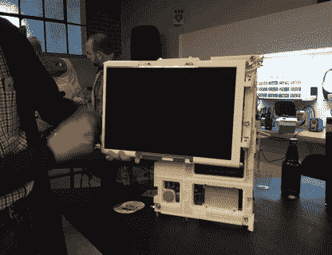

# 改进的便携式个人电脑

> 原文：<https://hackaday.com/2017/04/14/the-improved-luggable-pc/>

今天有两种类型的个人电脑。如果你需要强大的马力、强大的 GPU 或全功率的 CPU，你最终会得到一台台式机。如果你需要便携的东西，你会得到一台 CPU 和 GPU 都很弱的笔记本电脑。从历史上看，有第三种类型的个人电脑，即便携式电脑。luggable 是一台塞进箱子里的台式电脑，比台式机和显示器更便携。你现在买不到便携的电脑保护套。它们根本不是一种你可以把自己的硬件塞进去的商业产品。这是一个被整个行业遗忘的外形因素。

现在有了一台自己动手制作的便携式电脑。来自[Roger]的这个项目将标准的 ATX 主板、全尺寸 GPU、全尺寸电源以及使桌面 PC 强大的所有其他东西打包到一个可以存储在头顶行李箱中的箱子中。

 【罗杰】已经在这个项目上工作了一段时间，当[看起来像一个 RepRap 孟德尔](http://hackaday.com/2017/01/28/the-diy-luggable-pc/)时，它被放在 Hackaday back 上。在这个项目的早期迭代中有一些重大的改进，包括一个非常非常酷的铰链机制，允许显示器在电脑不使用时折叠起来。这是一个防止刮擦的机械奇迹。干净利落。表壳的其余部分由 2020 铝挤压而成，而*大约是*一个一公斤重的灯丝线轴。

由于这是一个便携的情况下，有一些妥协。没有 5.25″的舱，没有 3.5″的舱，也很少有 2.5″的舱。M.2 固态硬盘和 USB 驱动的光盘驱动器是存在的，所以这不是一个大问题。

这是一个真正的奇妙的情况下，在一个形式的因素，你不能买到任何其他地方。如果你有一个备用显示器和一点挤压坐在周围，这是一个建立自己。