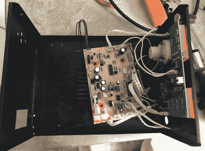

# 令人难以置信的收缩返工站

> 原文：<https://hackaday.com/2018/05/02/the-incredible-shrinking-rework-station/>

任何尝试过在狭小空间搭建工作台的人都知道其中的困难:你想把所有的测试设备和工具放在触手可及的地方，但是你没有足够的空间。如果你把整个长凳都塞满了工具，就没有地方可以工作了。所以，要么你有一个装满工具的长凳，用起来不舒服，要么你被迫选择哪些留在外面，哪些打包走。这两者都不利于实际完成工作，这就是为什么你首先要尝试设置一个合适的工作台。这是一个恶性循环。

 最近，当面临这个问题时，[EEPROM 芯片]决定选择核武器。他的 Kendal 853D 已经是小规模工作区的绝佳选择，因为它不仅是一个热风返工站，还在一个单元中提供了烙铁和台式电源。但是对他的板凳来说，这仍然有点太长了。解决办法？[用带锯把它锯成两半](https://imgur.com/a/srxbPkM)。说真的。

在打开 853D 时，[EEPROM 芯片]意识到内部布局不是非常有效。首先，机箱内有足够的额外空间，但如果将变压器从机箱底部移除并安装到后部，它将真正减少设备的占地面积。

在确保他记录了所有连接的地方后，他把所有的电子设备从金属外壳中拿出来，在带锯上切割成合适的尺寸。然后，他重新安装了电路板，这次安装了结实的变压器，这样它就挂在电路板上，而不是坐在电路板旁边。最终结果是 Kendal 853D 的版本比以前短了几英寸，但对功能没有影响。

将~~壁橱~~小空间变成黑客的巢穴[是我们之前讨论过的话题](https://hackaday.com/2017/09/06/ask-hackaday-how-small-is-your-shop/)。如果你希望[搬进粮仓](https://hackaday.com/2018/03/11/is-that-a-mars-habitat-a-submarine-a-spaceship-nope-its-home/)或[数控胶合板房屋](https://hackaday.com/2018/01/06/the-plypad-cnc-machine-yourself-a-tiny-house/)，节省每一寸都很重要。