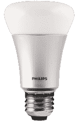
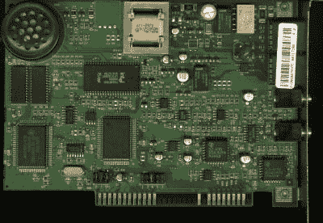
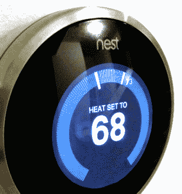

# 破事之网(或者说，我为什么这么冷？)

> 原文：<https://hackaday.com/2016/02/08/the-internet-of-broken-things-or-why-am-i-so-cold/>

尽管物联网(IoT)是一个相当新的术语，但这个概念其实并不那么新。多年来，许多工程师和黑客创造了网络化嵌入式系统。那么有什么不同呢？两件事:互联网无处不在，以及在消费者环境中使用连接的嵌入式系统。

The Philips Hue light bulb

像其他任何东西一样，物联网也有一系列的用途。前几天看*The expense*(顺便说一句，这是一个不错的节目)，我注意到如果你有合适的物联网灯，你可以运行一个应用程序，实时改变你的照明以适应演出。我没有那些灯，但我想当行动转移到一个黑暗的地下室时，你的灯变暗，当你在一艘宇宙飞船的反应堆房间时，它们变红，等等。有趣，但几乎没有用处或改变生活。

另一方面，有一些像 Nest 恒温器这样非常实用的物联网物品。想要从平板电脑上监控你的恒温器似乎有些懒惰，但是如果你经常不在家，或者你有多所房子，那么能够远程控制东西确实是一件好事。例如，随着最近美国东海岸的暴风雪，当你还在工作或在家的时候，打开 150 英里外的周末小屋的暖气会很棒。然而，Nest 最近在升级过程中出现了一个小问题，这让他们的许多客户都很生气(也很冷淡)。我一会儿会回到这个话题。首先，我想谈谈在许多不同的环境(比如人们的家)中部署控制真实事物的东西的问题。

## 善意

然而，当你考虑到程序员(有时是硬件人员)相对乐观时，问题就出现了。Windows update 在您的计算机上损坏了多少次？Linux 曾经更好，但最近，我害怕更新，尤其是重大的更新，因为它们有时会阻止我的机器启动，触发一个大的调试会话。我听说，Mac 电脑[也有过类似的升级恐怖故事](https://appletoolbox.com/mac-os-x-el-capitan-will-not-start-up-after-update-fix/)。

在过去，一个软件的错误更新可能意味着工资单不会按时发出。当然，对某些人来说这是一场灾难，但这是可以承受的。也许你有几个小时收不到电子邮件。你会活下来的。然而，一旦你开始接触到现实世界，事情就会变得更加复杂和危险。

## 总线上的芯片

Modems connected the IoT before the Internet was in everyone’s homes.

我们都有这样的故事，在开发过程中我们的假设与现实不符。几年前，我开发了一个有三个盒子的系统，一个在中心站，两个远程盒子。远程机器会定期(或根据命令)使用一些调制解调器呼叫中央机器(这肯定是几年前的事了)并发送它们的数据。

这个系统在我的工作台上运行得非常好，我派了一个团队到 500 英里外去安装它们。其中一个遥控盒确实非常偏僻，位于沼泽中央一根新设的电线杆上。安装人员就用那条电话线给我打电话，告诉我系统坏了。至少可以说，我很惊讶。我知道电话线有两个电路，他用一个野外电话从第二条线路打电话给我，所以我让他触发一个呼叫，把电话举到盒子旁边。

我听到了我期望的拨号音。然后我听到一连串的按键声。然后还是听到了拨号音。我恍然大悟:沼泽中间的电话线没有按键拨号(也不可能有)！控制拨号的 EPROM 中有字符串 ATDT，其中最后一个 T 代表音频拨号。它需要有 ATDP(用于脉冲拨号)。一个快速的解决方法，除了，在那些日子里，唯一的方法就是把它放在一辆公共汽车上。

我的观点是，当你被部署到现实世界中的陌生地方时，你的假设会受到考验。有时很难测试。

## 安全舞蹈

如果你在已知危险的系统上工作(比如武器或飞机)，你需要做很多努力来绝对确保事情按你期望的方式运行。这也适用于更新。你不能只是做一个改变，做一个快速测试，然后把它送到现场。即便如此，有时坏事还是会传出去。

即使您的系统在实验室中运行良好(像我的一样)，您仍然可能在安装过程中或环境中遇到意想不到的问题(比如我的电话线)。空客去年发现了这个问题。

在推出物联网系统时，正确开发并不是唯一的事情。当然，你必须测试。但是您还需要在广泛的环境和情况下进行测试。即便如此，您也不会得到所有的。您需要考虑如何以最不可能中断的方式进行更新。回滚到事物的原始版本是可以接受的，但是在更新期间中断是不可接受的。

## 安全舞蹈

然后是安全问题。如果您可以在现场更新某些东西——尤其是通过网络——您如何确定更新是合法的而不是攻击呢？数字签名、加密和其他技术可以做到这一点，但我们中有多少人担心这样的事情。

更新你的新视频游戏副本没什么大不了的。然而，根据操作系统的不同，理论上，恶意更新可能会窃取你的信用卡号码或密码。或者它可以安装一个特洛伊木马，将你的计算机放入一个发送垃圾邮件和攻击其他计算机的僵尸网络中。

这已经够糟了。当软件更新控制你的洗衣机时，会发生什么事情？现在，洗衣机会在半夜喷水，所以你的房子会被淹没？或者你的烘干机过热着火了？

作为最终用户，我们有既得利益知道我们的物联网设备是安全的，即使在更新之后。我们还应该担心更新是合法的。

## 空巢

The Nest thermostat could be the most useful IoT device so far

如果你认为这是夸大其词，请三思。我之前提到过鸟巢(顺便说一下，几年前我们看到它扎根于 T1)。最近的一次软件更新导致[恒温器在某些情况下耗尽](https://nest.com/support/article/What-to-do-if-your-Nest-Thermostat-has-become-slow-unresponsive-or-won-t-turn-on)电池，需要重启甚至充电才能恢复使用。这不是一个理论问题。它影响了[许多用户，他们醒来后发现房子很冷](http://www.nytimes.com/2016/01/14/fashion/nest-thermostat-glitch-battery-dies-software-freeze.html?_r=0)。那些不容易找到远程恒温器的人尤其恼火。

如果你因为拥有一个围绕 Arduino 构建的[定制非物联网恒温器](http://hackaday.com/2014/12/19/arduino-thermostat-includes-vacation-mode/)而沾沾自喜，不要这样。如果你有一辆装有现代无钥匙进入系统的汽车，那里也有[漏洞](http://www.syssec.ethz.ch/content/dam/ethz/special-interest/infk/inst-infsec/system-security-group-dam/research/spot/332.pdf)。如果你看到有人从冰箱里拿出车钥匙，你就会知道他们会读到这个。诚然，这不是一个错误，这是一种犯罪攻击，但它指出，物联网正在为许多意想不到的后果敞开大门。

Nest 案例不是第一个(也不会是最后一个)物联网更新破坏某些东西的案例。作为开发人员，在部署系统或软件时，我们必须超越我们的工作台。部署范围越广，就越难考虑所有情况、所有被利用的机会，以及发生时如何恢复。另一种选择是政府监管，就像某些行业已经做的那样。与遵守政府机构的严格规定相比，把事情做好的成本就相形见绌了。