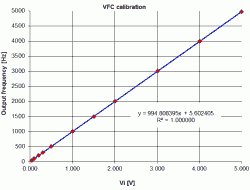

# 通过频率进行隔离电压测量

> 原文：<https://hackaday.com/2016/07/16/the-isolated-voltage-measurements-through-frequency/>

这不是一个华而不实的黑客，这是一个[伟大的作品](http://ardupiclab.blogspot.de/2016/05/an-isolated-analog-input-for-arduino-by.html)和一个很好的锦囊妙计。有时，您想要测量一个电压差，但要么地电位处于不同的水平，要么电压对于您的低级微控制器来说太高。

阻性分压器有很多花样可以玩。但是，如果想要与目标实现严格的电气隔离，只有一个办法——光耦合器。但是光耦合器实际上只传输数字信号，而[Giovanni Carrera]需要测量模拟电压。

进入电压频率转换 IC，它就像它所说的那样:产生一个方波，其频率与施加的电压成比例。将这个方波通过光耦合器，可以用接近雷击的电压击中一侧，而不会损坏另一侧的微控制器。通过测量微控制器数字 I/O 引脚上的频率，您仍然能够精确测量电压。

[Giovanni]建造并记录了一个很好的电路。他甚至测试了它的线性度。如果你曾经处于需要以非传统方式测量电压的位置，你会在以后感谢他。