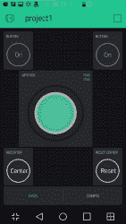
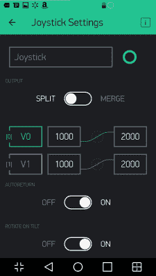

# ESP8266 和 Blynk 的快乐

> 原文：<https://hackaday.com/2016/12/01/the-joy-of-the-esp8266-and-blynk/>

我承认。我可以便宜一点。我也发现很难拒绝便宜货。所以当我在当地商店看到一个机器人套件从原来的 125 美元降到 20 美元时，我不得不咬了。只有一个问题。我把东西拿回家后，发现他们希望你提供自己的无线电控制发射器和接收器。

通常情况下，这不会是一个问题，但最近…让我们说，我的很多东西都在仓库里，我没有任何方便的东西。我当然不想去买一些会让这个机器人的成本翻倍的东西，我本来就不需要这些东西。

不过，我手边确实有一些 ESP8266 模块。Adafruit 也有不错的产品，具有选定的 5 V I/O 兼容性和板载调节器。我开始考虑为 ESP8266 编写一些东西，从 UDP 包中提取数据，并将其转换为 RC 伺服命令。

 看起来工作量相当大，然后我想起来我想试试 Blynk。如果你没有听说过 Blynk，它是一个用于 Android 和苹果手机的用户界面，可以通过互联网向嵌入式系统发送命令。您通常会想到将 Blynk 与 Arduino 配合使用，但您也可以直接在 ESP8266 上对嵌入式器件进行编程。我很快组装了一个小原型操纵杆。

在这篇文章和随后的一篇文章中，我将告诉你更多关于这一切是如何一起进行的，以及我对在 ESP8266 上使用 Blynk 的优缺点的了解。特定机器人的代码没有什么特别的。完成的项目看起来像一个标准的双通道 RC 控制器，发送长度为 1 到 2 毫秒的脉冲，以指示每个轴上的操纵杆位置。

## 这个计划

理论上操纵杆没什么。暂时忘记电话应用和网络。如果有两个传感器(比如电位计)，操纵杆的输出就是一对脉冲，每个轴一个。这些脉冲通常驱动[伺服系统](https://hackaday.com/2016/10/30/primer-on-servos-hits-all-the-basics/)。1.5 毫秒的脉冲意味着该轴的传感器位于中心。2 毫秒脉冲意味着它处于一个极端，1 毫秒脉冲意味着它处于另一个极端。其他都是按比例的。因此，如果 X 脉冲为 1.2 ms，Y 脉冲为 1.9 ms，那么 X 轴会稍微偏离中心，而 Y 轴则会偏离中心很多。

在这种情况下，我们的传感器是手机屏幕上的操纵杆部件。这是最难的部分，但是多亏了 Blynk，这真的一点也不难。

## Blynk 内部

Blynk 的 GUI 部分非常简单。你建立一个屏幕，添加小部件，点击它们进行配置。操纵杆有一些基本的配置项目(见下图)，您可以设置它的范围(我们将设置为 1000 到 2000，以在微秒内匹配脉冲)。

创建 Blynk 应用程序时，会生成一个长十六进制数来标识您的应用程序。这个数字是连接微控制器和用户界面的关键。

基本步骤很简单:

*   打开 Blynk 并创建一个新项目
*   选择项目名称和您将使用的硬件类型
*   该软件将向您显示一个“认证令牌”(长十六进制数)
*   你可以写下这个号码，或者按下一个按钮，把它发送到你的电子邮箱(简单多了)
*   点击创建按钮，你就完成了

 在屏幕上方你会看到一个+号。您可以使用它来添加各种小部件(开关、led，当然还有操纵杆控制)。您可以构建自己的界面，并在每个小部件上设置不同的属性来控制其外观和行为。

为了让这一切正常工作，您需要将 Blynk 嵌入式端代码加载到您的处理器中。您还必须添加 ID 号，并尽一切努力获得网络连接(例如，添加您的网络 SSID 和密码)。对于很多事情来说，这就是你要做的全部。

当你的程序运行时，它连接到 Blynk 服务器，因为它有那个 ID，它将连接到电话 GUI(假设它是打开的)。对于简单的事情，不需要其他的。您可以将 Blynk 小部件集中的按钮、led 和滑块以及类似项目直接连接到设备上的物理引脚。将一个按钮连接到与物理 LED 相连的引脚上，就可以打开和关闭 LED。将 LED 连接到微控制器上的输入开关，按下按钮就可以点亮虚拟 LED。

像滑块和仪表这样的东西可以使用模拟输出(PWM)和模拟输入。所以“pin”不一定是一个数字位。

有时，将小部件连接到物理 I/O 就是您所需要的。一些小部件可以做一些事情，比如缩放数字(例如，0-255 变成 0-100)，这减少了定制的需要。但是，有时您需要自定义代码。对于这些情况，您可以使用我稍后将描述的虚拟引脚。

顺便说一下，这个应用程序是免费的……算是吧。你被给予一定的“能量”去花费。当你使用一个小工具时，它会消耗一定的能量。如果你删除了一个小工具，你就能重新获得能量。如果你没有能量了，你就不能再添加任何插件了。除非，你买更多的能源。我知道互联网已经让我们习惯于认为一切都应该是免费的，但这是一个公平的妥协。操纵杆让我没有能量，所以部署它没有花费我任何东西，但除非我删除它，否则我不能在不支付更多能量的情况下制作更多的 Blynk 接口。

## 后续步骤

要完成操纵杆项目，您需要解决以下问题:

*   将 Blynk 固件编程到 ESP8266 中
*   从您的自定义代码与 Blynk 用户界面通信

这两个都不是特别难，下次我会展示给你们看。对于操纵杆，没有必要将数据从 ESP8266 发送回手机，尽管这当然是可能的。

在之前，我们已经介绍过 Blynk [，但是我想为 Hackaday 做一个完整的项目(并不是说我们还没有看到很多](https://hackaday.com/2016/03/10/app-control-with-ease-using-blynk/)[项目](https://hackaday.com/2016/03/25/yagdo-yet-another-garage-door-opener/))。如果您想跟进，请使用 ESP8266，下载 Blynk，并继续关注下一期。